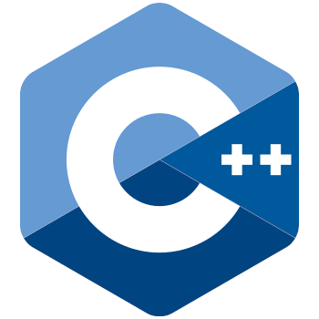

# Indice principale

Benvenuto!

In questa repository puoi trovare appunti sui linguaggi di programmazione o framework che ho avuto modo di studiare e approfondire per lavoro o per progetti personali.

- [Indice principale](#indice-principale)
  - [Link veloci](#link-veloci)
  - [Programmazione Web](#programmazione-web)
    - [html](#html)
    - [css](#css)
  - [Programmazione Desktop](#programmazione-desktop)
  - [Programmazione Microcontrollori](#programmazione-microcontrollori)

 

## Link veloci

## Programmazione Web

### html

|Corso| Prerequisiti | Completamento |
| :---: | :---: | :---: |
|| Nessuno | 70%|

In informatica l'HyperText Markup Language (traduzione letterale: linguaggio a marcatori per ipertesti), comunemente noto con l'acronimo HTML, è un linguaggio di markup.

> [vai al corso](./html/README.MD/)

### css

|Corso| Prerequisiti | Completamento |
| :---: | :---: | :---: |
|| html | 70%|

Il CSS (sigla di Cascading Style Sheets, in italiano fogli di stile a cascata), in informatica, è un linguaggio usato per definire la formattazione di documenti HTML, XHTML e XML, ad esempio i siti web e relative pagine web. 

> [vai al corso](./css/README.md)

| **[Javascript](./javascript/README.md)** | Attualmente quasi tutte le pagine web contengono JavaScript, un linguaggio di scripting che viene eseguito dal browser del visitatore | Html, Css | 80% |

| **[Node.js](./node-js/README.md)** | Node.js è un runtime system open source multipiattaforma orientato agli eventi per l'esecuzione di codice JavaScript, costruita sul motore JavaScript V8 di Google Chrome |Javascript| 10% |

| **[React](./react-js/README.md)** | React è una libreria JavaScript per la creazione di interfacce utente | Html, Css, Javascript, Node.js | 10%|

 

## Programmazione Desktop

| Corso | Descrizione | Prerequisiti | % Completamento |
| ---   | ---         | ---          | ---             |
| **[Java](./java/README.md)**  |In informatica Java è un linguaggio di programmazione ad alto livello, orientato agli oggetti e a tipizzazione statica, che si appoggia sull'omonima piattaforma ... | Nessuno | 70%|
| **[C++](./cpp/README.md)** | In informatica C++ è un linguaggio di programmazione general-purpose, sviluppato in origine da Bjarne Stroustrup nei Bell Labs nel 1983 come evoluzione del linguaggio C inserendo la programmazione orientata agli oggetti, col tempo ha avuto notevoli evoluzioni, come l'introduzione dell'astrazione rispetto al tipo. | Nessuno | 70% |
| **[Python](./python/README.md)** | Python è un linguaggio di programmazione di più "alto livello" rispetto alla maggior parte degli altri linguaggi, orientato a oggetti, adatto, tra gli altri usi, a sviluppare applicazioni distribuite, scripting, computazione numerica e system testing. | Nessuno| 50% |

 

## Programmazione Microcontrollori

| Corso | Descrizione | Prerequisiti | % Completamento |
| ---   | ---         | ---          | ---             |
| **[Arduino](./arduino/README.md)**  |Arduino è una piattaforma hardware composta da una serie di schede elettroniche dotate di un microcontrollore | Nessuno | 10%|

