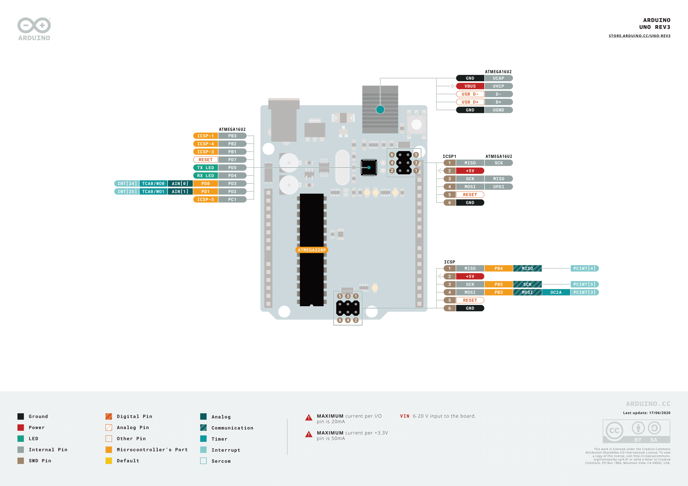
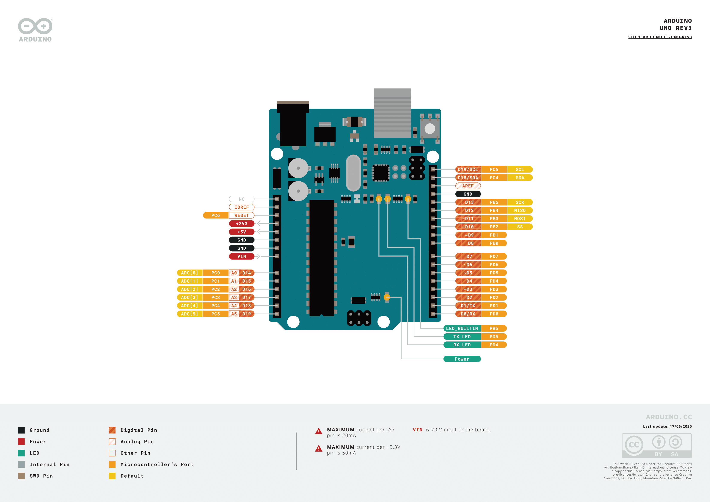
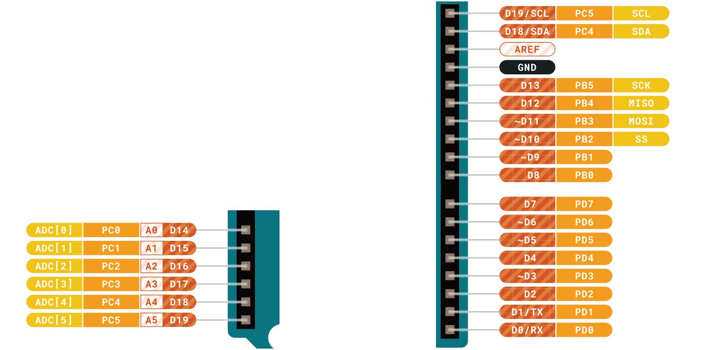
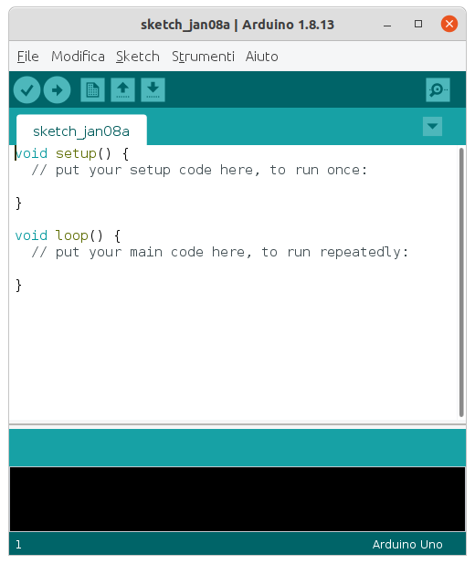

# Arduino

Arduino è una scheda elettronica per realizzare prototipi. Il cuore di arduino è il **microcontrollore**. Il modello **Arduino UNO R3** utilizza il microcontrollore **Atmega328P**. 


Un microcontrollore (in inglese microcontroller in acronimo MCU ovvero MicroController Unit), in elettronica digitale, è un dispositivo elettronico integrato su singolo circuito elettronico, nato come evoluzione alternativa al microprocessore e utilizzato generalmente in sistemi embedded ovvero per applicazioni specifiche di controllo digitale.


La scehda di Arduino, attraverso il microcontrollore, comunica con il mondo esterno attraverso i suoi PIN. Un microcontrollore in genere svolge un compito molto specifico come leggere il valore di certi sensori collegati in ingresso o settare le uscite collegate a qualche attuatore. Ci sono molti componenti elettronici interfacciabili direttamente con Arduino


## Alimentare arduino

Puoi alimentare Arduino con il connettore DC con una tensione nel range `6-20V`


Puoi inoltre utilizzare il cavo usb collegato a PC o un a un caricatore per smartphone. Il cavo USB è inoltre indispensabile per il caricamento del programma da PC alla memoria interna del microcontrollore



Puoi alimentare Arduino *manualmente* attraverso il pin `Vin` con una tensione esatta di `5V`.



Una volta alimentato Arduino puoi prelevare le tensioni di `5v`, `3.3v` e il riferimento `GND` dagli omonimi pin.

Esiste inoltre un tasto `RESET` che consente il riavvio di Arduino.

E' possibile inoltre riavviare Arduino attraverso il pin `RESET` con un apposito *segnale di reset*.

## Pin I/O

**Pin Digitali**<br>
Ci sono 14 PIN digitali numerati da `0 - 13` per l'interfacciamento digitale con il mondo esterno. Possono essere utili per collegare LED, tasti, display LCD, matrici di LED e molto altro. In generale è possibile collegare ogni dispositivo digitale ovvero componenti che ricevono o trasmettono solo due possibili valori di tensione `5V`, `0V`. Alucuni pin sono marcati con una `~`. Sono dedicati al modulo `PWM` che studieremo più avanti.

**Pin Analogici**<br>
Ci sono inoltre 5 PIN numerati da `14 - 19` per l'interfacciamento con segnali analogici in **ingresso** come sensori di temperatura, microfoni o in generale qualsiasi segnale elettrico che varia in modo continuo nel range `[0v - 5v]`.




## Sketch

Lo `Sketch` è il programma, la logica. Arduino utilizza come linguaggio di programmazione il `C++` ma fornisce anche delle funzioni di interfacciamento o meglio delle **classi** e dei **metodi** per l'accesso in modo semplificato all'Hardware. Per far ciò, all'accensione del microcontrollore, Arduino configura i registri interni dei moduli del microcontrollore con un settaggio standard e "maschera" queste operazioni all'utente finale mostrando solo due macroblocchi:


- **setup** 
- **loop** 



In linea generale possiamo affermare che:

- **setup:** i comandi scritti all'interno di questo blocco vengono eseguiti una sola volta all'avvio di Arduino.
- **loop** i comandi scritti all'interno di questo blocco vengono eseguiti ciclicamente dopo l'avvio di Arduino fino al riavvio o spegnimento della board. 

### Primo sketch - LED Blink

Come primo Sketch vedremo come far lampeggiare un LED. Useremo il LED connesso direttamente ad arduino al `pin 13`. Per far ciò dovremo:

in  `void setup {}`:
- Impostare il `pin 13` come `output` 

in `void loop(){}`:
- Scrivere il valore logico `HIGH` sul `pin 13` per fornire `5v` ed accendere il led tramite l'istruzione `digitalWrite()`
- Inserire un ritardo che esprime il tempo in cui il `pin` starà acceso con l'istruzione `delay()`
- Scrivere il valore logico `LOW` sul `pin 13` per togliere l'alimentazione e spegnere il led tramite l'istruzione `digitalWrite()`
- Inserire un ritardo che esprime il tempo in cui il `pin` starà spento con l'istruzione `delay()` 
  
Poichè il `void loop(){}` esegue in loop le istruzioni, realizzerai un lampeggio del LED infinito.

Il codice completo:

```arduino
void setup() {
  // initialize digital pin LED_BUILTIN as an output.
  pinMode(13, OUTPUT);
}

// the loop function runs over and over again forever
void loop() {
  digitalWrite(13, HIGH);   // turn the LED on (HIGH is the voltage level)
  delay(1000);                       // wait for a second
  digitalWrite(13, LOW);    // turn the LED off by making the voltage LOW
  delay(1000);                       // wait for a second
}
```

Adesso è sufficiente:
- Premere il tasto `Verifica` che controllerà la sintassi e ti avviserà se hai inserito qualche comando non valido nella finestra nera in basso
- Premere il tasto `Esegui` che andrà a inserire il codice all'interno della memoria di Arduino e a procedere con l'esecuzione dello sketch

E' possibile trovare questo sketch esempio su `File/Esempi/01.Basics/Blink`

Apparirà come:

```arduino
/*
  Blink

  Turns an LED on for one second, then off for one second, repeatedly.

  Most Arduinos have an on-board LED you can control. On the UNO, MEGA and ZERO
  it is attached to digital pin 13, on MKR1000 on pin 6. LED_BUILTIN is set to
  the correct LED pin independent of which board is used.
  If you want to know what pin the on-board LED is connected to on your Arduino
  model, check the Technical Specs of your board at:
  https://www.arduino.cc/en/Main/Products

  modified 8 May 2014
  by Scott Fitzgerald
  modified 2 Sep 2016
  by Arturo Guadalupi
  modified 8 Sep 2016
  by Colby Newman

  This example code is in the public domain.

  http://www.arduino.cc/en/Tutorial/Blink
*/

// the setup function runs once when you press reset or power the board
void setup() {
  // initialize digital pin LED_BUILTIN as an output.
  pinMode(LED_BUILTIN, OUTPUT);
}

// the loop function runs over and over again forever
void loop() {
  digitalWrite(LED_BUILTIN, HIGH);   // turn the LED on (HIGH is the voltage level)
  delay(1000);                       // wait for a second
  digitalWrite(LED_BUILTIN, LOW);    // turn the LED off by making the voltage LOW
  delay(1000);                       // wait for a second
}
```

L'unica differenza che trovi è `LED_BUILTIN`. E' una **costante** il cui valore è pari a `13`.

Il valore di tutte le costanti di Arduino le puoi trovare sulla documentazione ufficiale: [Arduino - constants](https://www.arduino.cc/reference/it/language/variables/constants/constants/)


## PWM

In elettronica e telecomunicazioni la modulazione di larghezza di impulso (o PWM, acronimo del corrispettivo inglese pulse-width modulation) è un tipo di modulazione digitale che permette di ottenere una tensione media variabile dipendente dal rapporto tra la durata dell'impulso positivo e dell'intero periodo (duty cycle). Allo stesso modo, è fondamentalmente utilizzato per protocolli di comunicazione in cui l'informazione è codificata sotto forma di durata nel tempo di ciascun impulso. Grazie ai moderni microcontrollori, è possibile attivare o disattivare un interruttore ad alta frequenza e allo stesso modo rilevare lo stato e il periodo di un impulso.


Poichè arduino è alimentato a `5V` se volessi ottenere un valore medio pari a `2.5V` in uscita da un pin digitale dovrei generare un segnale `PWM` con le seguenti caratteristiche:

- Frequenza: fissa. Valori standard di frequenza per i segnali PWM vanno da qualche centinaia di `Hz` a qualche `Khz`. Il valore di frequenza è stabilito internamente da Arduino quindi per adesso non dovrai preoccupartene. 
- Duty cicle: `50%`. Per impostare il duty cicle si imposta un valore nel range `0-255` all'interno della funzione `analogWrite()`. Attraverso la proporzione:
```math
dutyCicle% : 100% = value: 255
```
Poichè vogliamo `dutyCicle% = 50%`, allora `value = 127`

Nel prossimo esempio genererò un segnale `PWM` con `duty cicle = 50%` per controllare la luminosità di un LED.

Per far ciò è necessario:
- collegare un LED a un PIN qualsiasi con uscita PWM. Sono quelli identificati dal simbolo `~`. Utilizzerò il pin `9`
- chiamare il comando `analogWrite()` specificando come primo parametro il pin sul quale si desidera generare il segnale `PWM`, quindi il pin `9` e come secondo parametro il `duty cicle` espresso con un numero da `[0 - 255]`. Per ottenere un `duty cicle` del `50%` scriverò `127`

Lo sketch completo è:

```arduino
void setup() {

}

void loop() {
  analogWrite(9, 127);
}
```

Arduino fornisce un esepio più compelto all'interno della cartella degli esempi `File/Esempi/01.Basics/Fade`

```arduino
/*
  Fade

  This example shows how to fade an LED on pin 9 using the analogWrite()
  function.

  The analogWrite() function uses PWM, so if you want to change the pin you're
  using, be sure to use another PWM capable pin. On most Arduino, the PWM pins
  are identified with a "~" sign, like ~3, ~5, ~6, ~9, ~10 and ~11.

  This example code is in the public domain.

  http://www.arduino.cc/en/Tutorial/Fade
*/

int led = 9;           // the PWM pin the LED is attached to
int brightness = 0;    // how bright the LED is
int fadeAmount = 5;    // how many points to fade the LED by

// the setup routine runs once when you press reset:
void setup() {
  // declare pin 9 to be an output:
  pinMode(led, OUTPUT);
}

// the loop routine runs over and over again forever:
void loop() {
  // set the brightness of pin 9:
  analogWrite(led, brightness);

  // change the brightness for next time through the loop:
  brightness = brightness + fadeAmount;

  // reverse the direction of the fading at the ends of the fade:
  if (brightness <= 0 || brightness >= 255) {
    fadeAmount = -fadeAmount;
  }
  // wait for 30 milliseconds to see the dimming effect
  delay(30);
}
```
 In questo esempio il LED, connesso al PIN `9` si accenderà e si spegnerà in modo graduale. Per ottenere questo effetto si agisce su parametro che regola il `duty cicle` che in questo programma è definito dalla variabile `brightness`. 

- In pratica il software imposta una `brightness` pari a `0` aumenta la variabile `brightness` del valore pari a `fadeAmount` (impostata a `5`) secondo l'espressione `brightness = brightness + fadeAmount` che diventa quindi `brightness = brightness + 5`

- Ripete questa operazione ogni `30 millisecondi`.

In questo modo il LED aumenterà la sua luminosità in modo graduale

- Una volta che `brightness` è arrivata al valore massimo, `brightness >= 255`, inverte il valore di `fadeAmount`. In questo caso quindi l'espressione diventa `brightness = brightness - 5`.

- Ripete questa operazione ogni `30 millisecondi`.

 Il risultato è che il LED diminuirà la sua luminosità in modo graduale.

- Una volta che `brightness` è arrivata al valore minimo, `brightness <= 0`, inverte il valore di `fadeAmount`. In questo caso quindi l'espressione torna a essere `brightness = brightness + 5`.
- Ripete questa operazione ogni `30 millisecondi`.
  
E continua fino al reset di Arduino.

**Domanda:**<br>
Quanto impiega il ciclo di accensione?<br>
vista l'espressione `brightness = brightness + fadeAmount` e visto il ritardo pari a `30ms`, si ha che `brightness` passa da 0 `255` in `51` step ( `255/5` ) e quindi il ciclo di accensione graduale dura `30ms*51 = 1.53 secondi`. Poichè il ciclo di spegnimento è simmetrico, se ne deduce che il ciclo completo (accensione + spegnimento) dura poco più di `3 secondi`

**Puoi provare:**<br>
Puoi provare a cambiare il ritardo di `30ms` o il `fadeAmount` per cambiare la velocità di accensione/spegnimento.

Puoi anche impostare un valore minimo di `brightness` e un valore massimo

Ecco un esempio:

```arduino
/*
  Fade

  This example shows how to fade an LED on pin 9 using the analogWrite()
  function.

  The analogWrite() function uses PWM, so if you want to change the pin you're
  using, be sure to use another PWM capable pin. On most Arduino, the PWM pins
  are identified with a "~" sign, like ~3, ~5, ~6, ~9, ~10 and ~11.

  This example code is in the public domain.

  http://www.arduino.cc/en/Tutorial/Fade
*/

int led = 9;           // the PWM pin the LED is attached to
int brightness = 0;    // how bright the LED is
int fadeAmount = 2;    // how many points to fade the LED by
byte maxBrightness = 200;
byte minBrightness = 10;

// the setup routine runs once when you press reset:
void setup() {
  // declare pin 9 to be an output:
  pinMode(led, OUTPUT);
}

// the loop routine runs over and over again forever:
void loop() {
  // set the brightness of pin 9:
  analogWrite(led, brightness);

  // change the brightness for next time through the loop:
  brightness = brightness + fadeAmount;

  // reverse the direction of the fading at the ends of the fade:
  if (brightness <= minBrightness || brightness >= maxBrightness) {
    fadeAmount = -fadeAmount;
  }
  // wait for 3 milliseconds to see the dimming effect
  delay(1);
}
```

**Piccolo Approfondimento - Frequenza PWM**<br>
Come già detto, Arduino imposta un valore di frequenza per il segnale PWM ma quale?
Per Arduino UNO il valore è `490.20 Hz` per i pin `D3,D9, D10, D11` e il valore `976.56 Hz` per i pin `D5 & D6`.

Cosa cambia al variare della frequenza? <br>
Provo a darti una spiegazione molto qualitativa.. <br>
IL PWM agisce sul'inerzia elettromeccanica dei componenti. Puoi intuire che abbassando la frequenza il componente possa diventare meno fluido. Se si parla di un LED, a una frequenza molto bassa vedrai lampeggiare il LED.
Allo stesso tempo puoi intuire che alzando troppo la frequenza sia difficile per il componente leggere valori di duty cicle troppo piccoli. Nel caso del LED, lo vedrai sempre spento.
Per determinare i valori minimi e massimi di frequenza PWM è necessario eseguire un'analisi dei componenti capacitivi/indutti parassiti e studiare la caratteristica al variare della frequenza. Per adesso comunque ti basta sapere che in linea generale, le frequenze possono andare nei casi più comuni tra `[100Hz - 100Khz]`. Avrai frequenze piuttosto basse se il componente ha una *capacità di reazione* lenta e frequenze più alte per componenti che hanno una *capacità di reazione* alta

## Documentazione Linguaggio Arduino

Arduino utilizza il linguaggio `C++` ma esporta una serie di funzioni molto semplici per il controllo dell'Hardware.
[Qui](https://www.arduino.cc/reference/it/) puoi trovare la documentazione ufficiale del linguaggio di Arduino.


Qua sotto riporto comunque qualche costrutto fondamentale del linguaggio `C++` e qualche funzione esportata da Arduino.

**Le variabili**

| Tipo di Dato | Dimensione  | Descrizione  |
| -----------  | ----------- | ----------- |
| char         | 1 Byte         | Contenitore per caratteri e valori alfanumerici (e.g., ‘a’, ‘b’, ‘1’, etc)      |
| bool   | 1 Byte        |Contenitore per valori booleani (e.g., true, false)
| int   | 2 Byte        |Contenitore per numeri interi nel range numerico, da -32768 a 32767.
| unsigned int  | 2 Byte        |Contenitore per numeri interi senza segno nel range numerico, da 0 a 65535.
| long  | 4 Byte        |Contenitore per numeri interi nel range numerico, da -2147483648 a 2147483647
| unsigned long  | 4 Byte        |Contenitore per numeri interi nel range numerico, da 0 to 4,294,967,295 (2^32 – 1)
| float  | 4 Byte        |Contenitore per numeri interi nel range numerico, da 0 to 4,294,967,295 (2^32 – 1)
| double  | 4 Byte        |Contenitore per numeri interi nel range numerico, da 0 to 4,294,967,295 (2^32 – 1)
| String  | -       |Contenitore per testo (e.g., “Resistenza”)