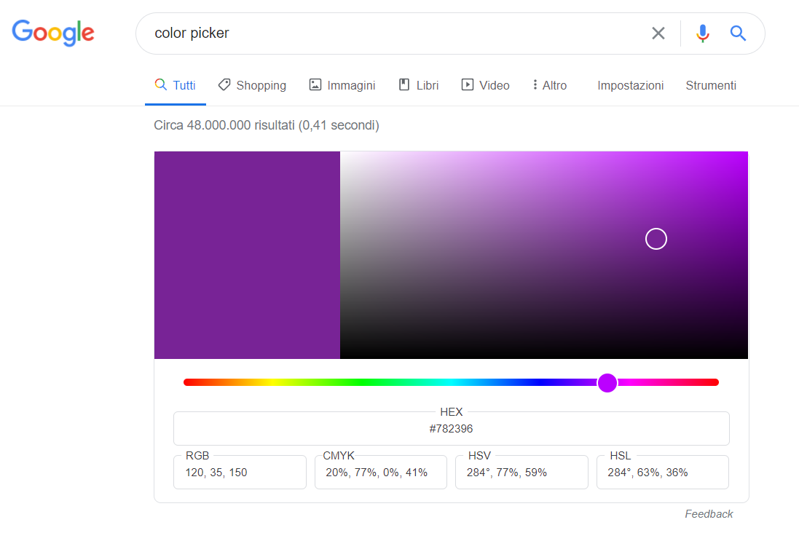

# Corso HTML CSS Javscript

## Strumenti Necessari:
Brower Web: Google Chrome <br>
Editor di testo: Visual studio code

## FrontEnd, BackEnd
In HTML, CSS, JAVASCRIPT, il frontend rappresenta tutto ciò che vediamo e tutto ciò con cui interagiamo. Il backend invece rappresenta il mondo che c'è dietro il frontend ovvero tutta la logica di programmazione che permette alla pagina in HTML di funzionare. Il backend fornisce degli strumenti che possono essere utilizzati dal frontend. Per pensare al backend è possibile pensare ai database, ai server etc.. Il Backend si programma con linguaggi tipo python, ruby, PHP. Il frontend invece si programma con HTML, CSS, JAVASCRIPT.

## HTML
Hyper Text Markup Language. <br>

## CSS

Cascading Style Sheet. <br>
Definisce l'aspetto (lo stile), dimensioni, colori, animazioni. <br>
Il CSS lavora "sopra" l'HTML.

## JAVASCRIPT

Linguaggio di scripting. <br>
Definisce l'interazione in una pagina, anima HTML, CSS

## Storia

L'HTML viene creato nel 1989-1990, per la formattazione e impaginazione di documenti ipertestuali. E' un linguaggio di markup. Nasce insieme ad altri due standard: URL (uniform resource locator), HTTP (hypertext transfer protocol). Lo standard URL definisce gli indirizzi dei server e documenti online. Lo standard HTTP invece permette di fare collegamente ipertestuali tra documenti. Lo standard HTML invece permette di generare documenti.

## Struttura HTML

La struttura dell'HTML si basa su contenuti testuali all'interno di "tag". I "tag" definisco proprio il tipo di struttura che avrà il contenuto all'interno che potrà essere un titolo, un'immagine, un paragrafo, un collegamento esterno.. e molto altro.

``` HTML
<tag> contenuto </tag>
```
Esempi:
``` HTML
<h1> il tag h1 definisce un titolo </h1>
<p> il tag p definisce un paragrafo </p>
```

## Boilerplate HTML

Vediamo quindi quale deve essere la struttura iniziale di una pagina HTML.

```HTML
<!DOCTYPE html>
<html>
<head>

<!-- METADATA QUA -->

    <title> Titolo </title>
</head>
<body>


<!-- CONTENUTO QUA -->

</body>
</html>
```

Il tag `head` rappresenta l'intestazione, `title` il titolo della pagina HTML, `body` rappresenta il contenuto della pagina HTML mentre all'interno di `<!-- -->` è possibile inserire un commento al codice.


**Nota: Titolo della pagina HTML**

Il titolo della pagina html è quello che si visualizza nel motore di ricerca come collegamento alla pagina HTML. Se vogliamo ad esempio entrare sul sito "la Repubblica", cliccheremo sul collegamento *la Repubblica - News in tempo reale - Le notizie e i video di politica, cronaca, economia, sport*. Questo, rappresenta il titolo della pagina HTML.


Con lo strumento *Visualizza sorgente pagina* di google chrome è possibile visualizzare il codice sorgente e verificare quindi che al tag `title` corrisponda il titolo della pagina del sito "La repubblica" ovvero: *la Repubblica - News in tempo reale - Le notizie e i video di politica, cronaca, economia, sport*


**Warning!** Non confondere il titolo della pagina HTML rappresentato tramite il tag `title` con il titolo del contenuto della pagina HTML che è rappresentato tramite uno dei tag della famiglia `h` come ad esempio `h1`.

## Tag HTML

In questo documento non troveremo la descrizione dettagliata di tutti i tag HTML anche perchè sono un po' sparsi ovunque su internet. Un ottimo sito dove poter consultare la descrizione dettagliata dei tag è:
https://developer.mozilla.org/en-US/docs/Web/HTML/Element <br>
Inoltre è da preferire un approccio pratico alla programmazione piuttosto che teorico.

## Attributi HTML

Specificano una funzione o una tipologia dell'elemento del tag in considerazione.

Sono sempre nella forma `chiave/valore` con una sintassi del tipo:

```HTML
<tag attributo1="valore1" attributo2="valore2">
```
E' possibile con gli attributi aggiungere immagini o collegamenti a siti esterni.

Un esempio è `href`, un link tag:

```HTML
<a href="http://www.google.it">vai su google</a>
```
Questo tag creerà un collegamento a un sito, una pagina esterna o interna (in questo caso google.it quindi una pagina esterna) con il nome "vai su google". Cliccando quindi su "vai su google" verremo reindirizzati su www.google.it

**Warning!** Il tag appena creato non funzionerà senza il protocollo `http`. Scrivendo quindi semplicemente "www.google.it" non troverà la pagina. 

E' possibile linkare pagine locali del nostro progetto. Per linkare una pagina locale di nome "pagina2.html" con tutti i suoi contenuti basterà scrivere:

```HTML
<a href="pagina2.html">vai su pagina2</a>
```

Un altro esempio è il tag `img` per l'inserimento di immagini. Anche in questo caso le immagini possono essere locali o link web.

```HTML


```
Come si nota, nel primo caso c'è un link a un'immagine web mentre nel secondo caso l'immagine è locale ed è al path relativo `..\LinkLocali\ImmagineGatto.jpg`"

Esistono centinaia di attributi. Il consiglio è sempre quello di cercare e indagare per approfondire e scoprire gli utilizzi in base all'applicazione.

## Tabelle HTML

Andiamo direttamente a vedere una struttura completa per la creazione di una tabella tramite il tag `table`.

```HTML
<table border="1" width="50%">
    <tr>
        <th>Animali</th>
        <td>cane</td>
        <td>gatto</td>
        <td>elefante</td>
    </tr>
    <tr>
        <th>Social media</th>
        <td>facebook</td>
        <td>linkedin</td>
        <td>instagram</td>
    </tr>
</table>
```

Il tag `table` accetta come attributi `border` e `width` (e molti altri).
`border` rappresenta di fatto il bordo, come valore accetta un numero decimale che rappresenterà la grandezza del bordo. `width` invece rappresenta la grandezza della tabella e può essere espressa con un numero decimale il quale verrà interpretato come numero di pixel con il quale si desidera realizzare la grandezza tabella o con un numero percentuale e in questo caso la tabella sarà grande in modo relativo alla grandezza della pagina in base alla percentuale inserita. Se scrivo `width="200"` la tabella sara grande 200 pixel. Se scrivo `width="50%"` la tabella occuperà meta' pagina. <br><br>
`tr` e `td` stanno rispettivamente per "table row" e "table data". Con `tr` sarà possibile inserire una riga, con `td` sarà possibile inserire un elemento all'interno della riga. `th` invece sta "table header" e sta per il titolo della tabella. A seconda di dov'è inserito rappresenterà il titolo della colonna o della riga. Nell'esempio sopra riportato la tabella è scritta in modo tale che il titolo venga generato all'interno della riga.

## Input, Button, Label, form

Qua sotto vedremo un esempio concreto di un form per la compilazione dati necessario quando si effettua una nuova registrazione su un sito come potrebbe essere ad esempio un social network.

```HTML
 <form>
    <label for="nome"></label>
    <input id="nome" type="text" placeholder="Nome" required>
    <label for="cognome"></label>
    <input id="cognome" type="text" placeholder="Cognome" required>
    <div>
        <label for="email"></label>
        <input id="email" type="email" placeholder="email" required>
    </div>
    <div>
        <label for="password"></label>
        <input id="password" type="password" placeholder="nuova password" pattern=".{5,10}" required title="5-10 caratteri" required>
    </div>       
    <p>
        Data di Nascita:
    </p>
    <div>
        <label for="giorno"></label>
        <select id="giorno" required>
            <option disabled selected>Giorno</option>
            <option>1</option>
            <option>2</option>
            <option>..</option>
        </select>
        <label for="mese"></label>
        <select id="mese" required>
            <option disabled selected>Mese</option>
            <option>Gennaio</option>
            <option>Febbraio</option>
            <option>...</option>
        </select>
        <label for="anno"></label>
        <select id="anno" required>
            <option disabled selected>Anno</option>
            <option>1990</option>
            <option>1991</option>
            <option>...</option>
        </select>
    </div>
    <div>
        <label for="uomo">Uomo</label>
        <input name="genere" id="uomo" type="radio" required>
        <label for="femmina">Femmina</label>
        <input name="genere" id="femmina" type="radio" required>
    </div>
    <div>
        <label for="condizioni">Accetto le condizioni di utilizzo</label>
        <input type="checkbox" name="codizioni" id="condizioni" required>
    </div>
    <div>
        <button>Iscriviti</button>
    </div>
</form>
```
----------

 <form>
    <label for="nome"></label>
    <input id="nome" type="text" placeholder="Nome" required>
    <label for="cognome"></label>
    <input id="cognome" type="text" placeholder="Cognome" required>
    <div>
        <label for="email"></label>
        <input id="email" type="email" placeholder="email" required>
    </div>
    <div>
        <label for="password"></label>
        <input id="password" type="password" placeholder="nuova password" pattern=".{5,10}" required title="5-10 caratteri" required>
    </div>       
    <p>
        Data di Nascita:
    </p>
    <div>
        <label for="giorno"></label>
        <select id="giorno" required>
            <option disabled selected>Giorno</option>
            <option>1</option>
            <option>2</option>
            <option>..</option>
        </select>
        <label for="mese"></label>
        <select id="mese" required>
            <option disabled selected>Mese</option>
            <option>Gennaio</option>
            <option>Febbraio</option>
            <option>...</option>
        </select>
        <label for="anno"></label>
        <select id="anno" required>
            <option disabled selected>Anno</option>
            <option>1990</option>
            <option>1991</option>
            <option>...</option>
        </select>
    </div>
    <div>
        <label for="uomo">Uomo</label>
        <input name="genere" id="uomo" type="radio" required>
        <label for="femmina">Femmina</label>
        <input name="genere" id="femmina" type="radio" required>
    </div>
    <div>
        <label for="condizioni">Accetto le condizioni di utilizzo</label>
        <input type="checkbox" name="codizioni" id="condizioni" required>
    </div>
    <div>
        <button>Iscriviti</button>
    </div>
</form>

----------


### Input:

l'elemento `<input>` permette di inserire un input che sia una casella di testo, una checkbox, una scelta multipla, una droplist e molto altro.

Input testuale: <br>

`<input type="text">` <br>
<input type="text">

input checkbox: <br>
  
`<input type="checkbox">` <br>
<input type="checkbox">

input droplist menu': <br>
```HTML
<select>
    <option>Anno</option>
    <option>1990</option>
    <option>1991</option>
    <option>...</option>
</select>
```
<select id="anno" required>
    <option disabled selected>Anno</option>
    <option>1990</option>
    <option>1991</option>
    <option>...</option>
</select>

<br>
<br>

input selezione multipla: <br>

```HTML
A <input type="radio">
B <input type="radio">
```

A <input type="radio">
B <input type="radio">

#### Alcuni attributi degli input
Vediamo alcuni attributi principali degli input. Ricordiamo che gli attributi in un tag vanno a specificare il comportamento del tag andandolo a personalizzare.

Attributo `Placeholeder`: <br>
Utilizzato per inserire una stringa di testo da visualizzare di default in una casella di testo input in modo tale da aiutare l'utente a capire cosa dovrà scrivere. Ecco un esempio:

`<input type="text" placeholder="nome">` <br>
<input type="text" placeholder="nome">

Attributo `Required`: <br>
Utilizzato quando l'input in questione è necessario per la compilazione del form. Supponiamo di dover creare un account per un sito, sicuramente non ci farà procedere se non si è inserita un'email e una password. In questo caso l'input relativo alla casella testuale "email" e quello relativo alla casella testuale "password" avranno l'attributo `Required`.

Attributo `name`: <br>
Utilizzato per rendere unico e mutuamente esclusivo un input. Piu' avant vedremo come applicare questo concetto alla selezione multipla nel capito delle label.

#### Button
Per inserire un bottone è possibile utilizzare il tag `<button>` o l'input `<input type="submit">`.

```HTML
<button>clicca qui</button>
<input type="submit">
```

<button>clicca qui</button>
<input type="submit">

C'è da precisare che tali bottoni hanno senso in contesto di un form e se a tali bottoni è associata un'azione ma vedremo piu' avanti.

### Label
le label servono per associare un nome, un'etichetta a un input in modo tale che sia associata univocamente a tale input. La label avrà un nome identificativo, rappresentato all'interno dell'attributo `for` e un testo che in generale potranno differire. Per associare la label all'input, l'input dovrà avere un attributo `id` che dovrà coincidere con l'attributo `for` della label. Se ciò avviene si sarà creata un associazione tra l'etichetta e l'input.

```HTML
<label for="nome_PC">Nome PC:</label>
<input id="nome_PC" type="text" placeholder="Cognome" required>
```
<label for="nome_PC">Nome PC:</label>
<input id="nome_PC" type="text" placeholder="es: DELL-7450" required>

Cliccando su "Nome PC" il focus viene spostato sulla casella di testo.

**Nota:** E' sempre bene inserire una label per ogni input anche se non c'è nessuna etichetta. Sarà più chiaro in futuro. 

Vediamo un'altro esempio di utilizzo della `label` in combinazione con l'attributo `name`. In questo esempio si renederà unica la scelta di un input nella selezione multipla.

```HTML
<label for="uomo">Uomo</label>
<input name="genere" id="uomo" type="radio" required>
<label for="femmina">Femmina</label>
<input name="genere" id="femmina" type="radio" required>
```

<label for="uomo">Uomo</label>
<input name="genere" id="uomo" type="radio" required>
<label for="donna">Donna</label>
<input name="genere" id="donna" type="radio" required>

### Form
Si apre un tag `<form>` quando vogliamo inserire una serie di input che fanno parte dello stesso contesto. <br> Se non si aprisse un form e inserissimo gli input, l'effetto visuale sarebbe lo stesso ma non sarebbero collegati di contesto. Cio' implica ad esempio che qualora schiacciassimo un tasto che vorremo fosse associato a determinati input con la funzione di "assegnazione degli input" non succederebbe niente, verrebbe interpretato chiaramente come un tasto non "agganciato" a nessuna serie di input. Inserendolo invece in un form con input di varia natura invece si associa l'azione del tasto collegata in qualche modo agli input testuali.

#### Form validation

Importanti sono i form validation ovvero controlli piu' o meno accurati che vengono fatti in caso di errori nella digitazione degli input. <br>
Alcuni esempi sono i vari gradi di password validation, cioè alert che compaiono quando la password inserita è troppo corta o troppo lunga o le email validation che effettuano controlli sul campo testuale contenente l'email.

password Validation:

```HTML
<form>
    <input id="password" type="password" placeholder="nuova password" pattern=".{5,10}" required title="5-10 caratteri" required>
    <button>OK</button>
</form>
```
<form>
    <input id="password" type="password" placeholder="nuova password" pattern=".{5,10}" required title="5-10 caratteri" required>
    <button>OK</button>
</form>

<br>

 
email Validation:

```HTML
<form>
    <label for="email"></label>
    <input id="email" type="email" placeholder="email" required>
    <button>OK</button>
</form>
```
<form>
    <label for="email"></label>
    <input id="email" type="email" placeholder="email" required>
    <button>OK</button>
</form>
<br>
 
----------

### Altro conclusioni:

Vediamo altri attributi e tag per concludere questa prima parte con HTML.

#### Attributo `disabled selected`:

Con l'attributo `disabled` seguito dall'attributo `selected` è possibile inserire un placeholder non selezionabile nelle droplist

```HTML
<select id="giorno" required>
    <option disabled selected>Giorno</option>
    <option>1</option>
    <option>2</option>
    <option>..</option>
</select>
```

<select id="giorno" required>
    <option disabled selected>Giorno</option>
    <option>1</option>
    <option>2</option>
    <option>..</option>
</select>

<br>
<br>

#### Tag `<div>`
Il tag `<div>` ha piu' o meno lo scopo del tag `<p>` ma serve a separare gli oggetti come caselle di testo di input/output. E' possibile verificare la differenza tra i due tag.

```HTML
<select>
    <option disabled selected>Giorno</option>
    <option>1</option>
    <option>2</option>
    <option>..</option>
</select>
<select>
    <option disabled selected>Mese</option>
    <option>Gennaio</option>
    <option>Febbraio</option>
    <option>...</option>
</select>
<select>
    <option disabled selected>Anno</option>
    <option>1990</option>
    <option>1991</option>
    <option>...</option>
</select>
```

<select>
    <option disabled selected>Giorno</option>
    <option>1</option>
    <option>2</option>
    <option>..</option>
</select>
<select>
    <option disabled selected>Mese</option>
    <option>Gennaio</option>
    <option>Febbraio</option>
    <option>...</option>
</select>
<select>
    <option disabled selected>Anno</option>
    <option>1990</option>
    <option>1991</option>
    <option>...</option>
</select>

----------

```HTML
<div>
    <select>
        <option disabled selected>Giorno</option>
        <option>1</option>
        <option>2</option>
        <option>..</option>
    </select>
</div>
<div>
    <select>
        <option disabled selected>Mese</option>
        <option>Gennaio</option>
        <option>Febbraio</option>
        <option>...</option>
    </select>
</div>
<div>
    <select>
        <option disabled selected>Anno</option>
        <option>1990</option>
        <option>1991</option>
        <option>...</option>
    </select>
</div>
```
<div>
    <select>
        <option disabled selected>Giorno</option>
        <option>1</option>
        <option>2</option>
        <option>..</option>
    </select>
</div>
<div>
    <select>
        <option disabled selected>Mese</option>
        <option>Gennaio</option>
        <option>Febbraio</option>
        <option>...</option>
    </select>
</div>
<div>
    <select>
        <option disabled selected>Anno</option>
        <option>1990</option>
        <option>1991</option>
        <option>...</option>
    </select>
</div>

<br>
<br>

# CSS

Come abbiamo già detto, CSS sta per Cascading Style Sheet e serve quindi per "abbellire" lo stile nativo della pagina HTML.

```css
selettore{
    proprietà1: valore;
    proprietà2: valore;
}
```

Esempi:

Nell'esempio seguente attribuirò al selettore `h1` il colore "blue" e un font di "30 pixel".
```css
h1{
    color: blue;
    font-size: 30px;
}
```
In questo esempio invece all'attributo immagine associerò un bordo giallo di grandezza di 3 pixel.
```css
img{
    border-color: yellow;
    border-width: 3px;
}
```

### Dove inserire il codice CSS?
E' possibile aggiungere il codice CSS sia all'interno del file HTML, sia in un file esterno.

### Inserire CSS all'interno della pagina HTML
Per questo metodo ci sono due modi:

- Inserire la stilizzazione CSS all'interno della riga da stilizzare con l'attributo `style`. Questo metodo è sconsigliato, si faceva una volta quando il CSS non esisteva ma oggi è ancora valido.
<br>

```HTML
<p style="color: red;">
    sono un paragrafo rosso
</p>
```
<p style="color: red;">
    sono un paragrafo rosso
</p>

- Inserire la stilizzazione CSS con il tag `<style></style>` messo all'interno del tag `<head></head>` del boilerplate html. Questo è consigliato poichè in questo modo avremo tutto ciò che riguarda lo stile all'interno di questo tag.

```HTML
<!DOCTYPE html>
<html>
<head>

<style type="text/css">
    h1{
        color: blue;
    }
</style>

</head>
<body>

<h1>Ciao, sono un h1</h1>

</body>
</html>
```

### Inserire CSS in un file esterno all'HTML
**Questa è sicuramente la soluzione migliore**, è la più pulita e ordinata poichè separa il contenuto HTML che stabilisce la struttura della pagina dallo stile della stessa tramite CSS.

Una volta creato poi sarà necessario creare un collegamento tra i due file usando il `<link>` tag.

Ecco un esempio: <br>
`File CSS (06_HTML_CSS_Style.css)
`
```CSS
h1{
    color: darkslategray;
}
li{
    color: forestgreen;
}
```
`File HTML (06_HTML_CSS_ElementiBaseCSSEsterniAdHTML.html)`
```HTML
<!DOCTYPE html>
<html lang="en">
<head>
    <title>HTML - CSS Elementi Base</title>
    <link rel="stylesheet" href="06_HTML_CSS_Style.css">
</head>
<body>
    <h1>HTML - CSS Elementi Base</h1>
    <ul>
        <li>Primo ELemento</li>
        <li>Secondo Elemento</li>
    </ul>
</body>
</html>
```
Notare il `<link>` tag con `<href>` che linka il file CSS. Questa è sicuramente la soluzione migliore.

## Alcune proprietà CSS

In questo esempio riporterò alcune proprietà come l'inserimento di colori, bordi, immagini di background. Alcune proprietà sono rappresentate in modo diverso ma equivalenti.

```CSS
h1{
    color: darkslategray;
    border: 2px rgb(173, 255, 47) solid;
    background: grey;
}
li{
    color: rgba(34, 139, 34, 0.9);
    border-color: #000000;
    border-width: 2px;
    border-style: groove;
}
body{
    background: url(https://i.pinimg.com/originals/60/19/89/601989ff441ddc92bc0fa2e05040f9e7.jpg);
    background-repeat: no-repeat;
    background-size: cover;
}
```

## Colori in CSS

Vediamo come è possibile esprimere i colori in CSS.
Il metodo che abbiamo visto per adesso è un metodo "amatoriale" ma non è il metodo che i programmatori utilizzano.

Un altro metodo è utilizzare il *valore corrispondente esadecimale del colore*.

### Colore CSS Esadecimale

Ogni colore può essere espresso tramite una terna di valori esadecimali: <br> 
`RED-GREEN-BLUE` <br>
`a1 - f6 - 18`

Ad ogni elemento della terna sono associati due numeri esadecimali in modo tale che il numero vada da 0 a 255. Cio' esprime l'intensità del colore appartenente alla terna.

Con tale terna è possibile rappresentare ogni tipo di colore.

Per rappresentare in CSS il colore in esadecimale è necessario anteporre al numero di sei cifre che rappresenta il colore il simbolo `#`

Es: `red = #ff0000` (ovviamente)


In questo modo otterremo il rosso per l'elemento `h1`.

### Perchè è utile questo metodo?

Supponiamo di voler un colore specifico da creare utilizzando un qualsiasi color picker



Scegliendo tramite il color picker il colore desiderato e prelevando il valore esadecimale è possibile ottenere esattamente il valore creato. <br>
Molto utile e versatile rispetto a una serie di colori preimpostati.

Colore CSS RGB/RGBA

Un altro metodo è utilizzare la terna `rgb()` . Funziona in modo molto simile ai colori in esadecimale, solo che in questo caso inseriremo una terna decimale nel range `0 -255`. Esempio: `rgb(173, 255, 47)`.

La funzione `rgba()` invece introduce l'elemento trasparenza (alpha). L'ultimo elemento infatti va da `0.0 - 1.0`
e rappresenta la trasparenza dell'elemento. Esempio: `rgba(34, 139, 34, 0.2)`, in questo caso la trasparenza sarà al 20%.

Background CSS

Con la proprietà `background` è possibile specificare il colore del background dell'elemento.

Utile la proprietà `background` per impostare un colore della pagina. Per far ciò è possibile impostare la proprietà `background` per l'elemento `body`:

E' possibile impostare anche un'immagine. Per far ciò si usa la funzione `url()`. All'interno della funzione url inseriamo il link dell'immagine che vogliamo rappresentare come sfondo background della pagina.


E' possibile impostare anche alcune proprietà aggiuntiva come la `background-reapeat` o la `background-size`.

`background-repeat: no-repeat;`

Con questa proprietà è possibile specificare se ripetere o meno l'immagine. Infatti di default, se l'immagine è piccola viene ripetuta, se è grande viene adattata alla pagina. Con questa proprietà  quindi possibile specificare se ripetere o meno l'immagine. 

`background-size: cover;`

Con questa proprietà l'immagine selezionata andrà a riempire tutto lo schermo e se è piu' piccola la adatterà.

### Bordi CSS
Per inserire il bordo all'elemento html è necessario introdurre la proprità `border`. Sarà necessario impostare almeno `border-color` per inserire il colore del bordo, `border-width` per la grandezza del bordo e `border-style` per scegliere lo stile del bordo.

Oppure è possibile inserire la proprità bordo tramite una terna di valori che comprendono la grandezza, lo stile e il colore direttamente con la proprietà `border`

### Quindi ..
Abbiamo imparato a stilizzare modificando proprietà come la grandezza del font, il colore, inserendo un bordo, un'immagine di proprietà e abbiamo visto che ciò si applica ad ogni elemento appartenente alla stessa categoria (detta anche classe), ad esempio l'elemento `<li>`. Questo significa che se assegnerò certe proprietà all'elemento `<li>` queste verranno applicate a tutti gli elementi `<li>`

### Se volessi stilizzare in modo diverso un elemento appartenente alla stessa categoria?

Supponiamo quindi ad esempio di scegliere uno stile di default per l'elemento `<li>` ma di voler cambiare lo stile di un particolare elemento. Come si fa?

### Si può fare attraverso l'id.

Ecco un esempio: <br>
 `File HTML`
 ```HTML
<ul>
    <li>Primo ELemento</li>
    <li id="speciale">Secondo Elemento speciale</li>
</ul>
 ```
 `File CSS`
 ```CSS
#speciale {
    color: hotpink;
}
 ```
In questo modo, solo cio' che avrà l'id `speciale` avrà quella classe di proprietà. 
Nota che l'id deve essere unico nel codice! Il nome simbolico che fornisco deve essere unico per tutto il codice

### Si può fare anche attraverso la classe..

Questo è un metodo migliore. In questo caso attribuendo un elemento a una classe con un certo nome è possibile impostare lo stile solo agli elementi di quella data classe.

 `File HTML`
 ```HTML
<ul>
    <li>Primo ELemento non appartenente a nessuna classe</li>
    <li class="bluColor">Secondo Elemento appartenente alla classe "bluColor"</li>
    <li class="bluColor">Terzo Elemento appartenente alla classe "bluColor"</li>
</ul>
 ```
 `File CSS`
 ```CSS
.bluColor {
    color: indigo;
}
 ```
In questo caso verrano colorati di colore "indigo" solo gli elementi appartenenti alla classe "bluColor". <br>

**Nota** In CSS gli `id` si identificano inserendo `#` + il nome dell' `id` mentre le classi si identidicano tramite `.` seguito dal nome della classe.

## Altri selettori CSS

Ricordiamo che il selettore permette appunto di selezionare l'elemento ch vogliamo stilizzare.

Per adesso abbiamo visto i selettori generici per ogni elemento html, i selettori definiti da una classe e da un id ma ne esistono altri.

`*` Selector
Con questo selettore è possibile selezionare ogni elemento della pagina HTML.

Descendant Selector.
Con questo selettore è possibile selezionare elementi complessi ovvero elementi contenuti in altri elementi, elementi discentendi da altri appunto. Immaginiamo di creare una lista di elementi e immaginiamo che ogni elemento è un anchor tag. Con questo selettore è possibile selezionare solo gli anchor tag all'interno del list item. Sono possibili diverse combinazioni.

Attribute selector.
Con questo selettore è poissibile scegliere un elemento tramite un attributo ed avere quindi anche in questo caso una selezione più specifica.

```css
/* "*" Selector */
*{
    border: 1px rgb(25, 25, 112) solid;
}
/*Descendant selector*/
li a {
    color: lavenderblush;
}
/*Attribute selector*/
a[href="https://git-scm.com/"]{
    color: lightskyblue;
    border: 2px khaki outset;
}
input[type="email"]{
    border: 4px #f5f5dc dotted;
}
input[type="password"]{
    border: 4px gold dotted;
}
```

Ci sono moltissimi altri selettori in CSS espressi in questo formato:
```CSS
a:visited{
    color: green;
}
```
l'operatore `:` ci permette di accedere alla classe `a` per l'anchor tag e di selezionare l'elemento `visited`. In poche parole questo selettore colorerà di verde soltanto i siti già visitati. Vedremo che con l'operatore `:` o l'operatore `::` è possibile entrare in elementi e funzioni specifiche della classe. Molte di queste verranno suggerite dallo stesso editor di testo.


## Google developer tool

Un importante strumento di debug e studio di codice html è il tasto "Ispeziona elemento" presente su browser google chrome.

Con questo tasto è possibile vedere e modificare il codice html come il testo, il font, il colore, la formattazione e tutto quello che riguarda html/css.

**Nota:** Tutte le modifiche che vengono fatte con questo strumento rimangono temporanee.

Una volta aperto lo strumento si aprirà una finestra con cui è possibile visualizzare il codice.


Premendo sul tasto "select an element to inspect.. " Lo strumento diventa ancora piu' interattivo. cliccando sugli elementi della pagina verranno evidenziati nel codice e viceversa.

## Eredità e Specificità in CSS
### Eredità
Spiega le regole con cui, in CSS, vengono ereditate le proprietà. Ad esempio, se assegno come proprietà il colore rosso all'elemento `ul` ogni elemento della `ul` avrà il colore rosso poichè la proprietà è ereditata dalla classe `ul` visto che è di livello superiore.
Un esempio simile può essere fatto applicando questo concetto al `body`. Se assegno una certa proprietà al `body` verrà applicata a tutti gli elementi all'interno del `body`, cioè tutta la pagina html. Questo è per dire che certe proprietà non importa specificarle perchè verranno ereditate da altre.
### Specificità
Spiega le regole con cui, in CSS, vengono applicate le proprietà in base alla priorità. Meglio far riferimento ad un esempio.
```CSS
body{
    color: gold;
}
ul{
    color: grey;
}
```
Consideriamo l'esempio di sopra. In questo esempio lo stile degli elementi `ul` è in conflitto con lo stile del `body` che ricordiamo raggruppa tutti gli elementi della pagina html. Allora quale colore "vince"?
Vince il colore dell'elemento `ul` poichè è più specifico. Quindi la regola dice che più l'elemento è specifico più ha priorità per la stilizzazione. Elementi di specificità sono anche le classi e gli id.
**Nota**: Gli id sono quelli a priorità piu' alta in termini di specificità. 

## CSS Fonts
Vediamo alcune proprietà per i font CSS.

- font-family
- font-weight
- font-size
- line-height
- text-align
- text-decoration

Con queste proprietà è possibile impostare il font, lo spessore, la distanza tra le linee testuali, la grandezza del font, la formattazone testuale e alcune elementi decorativi testuali come ad esempio la sottolineatura. E' possibile trovare qualche esempio nelle esercitazioni.

### Google fonts
I font forniti di default sono pochi e poco interessanti. Vediamo un modo per linkare fonts esterni come nel caso di "google fonts".
Da https://fonts.google.com/ è possibile per prima cosa scegliere un font che ci piace. E' possibile filtrare in base alle proprietà del font che stiamo cercando.


Una volta scelto un font è possibile scaricarlo, verrà scaricata una cartella zip oppure linkarlo. Un volta entrati all'interno del font desiderato, in alto a destra è possibile selezionare "Download Family" oppure, accanto si aprirà un quadratino con le istruzioni per linkarlo.


In pratica si tratta di aggiungere un link nell `<head>` del codice html e di inserire il font nella sezione CSS che adesso lo riconoscerà.

### CSS Box Model
Ogni elemento in html presenta questa struttura:

C'è quindi un contenuto (`content`), un bordo (`border`), uno spazio tra contenuto e bordo (`Padding`) e uno spazio tra il bordo e gli altri elementi (`Margin`).
Questo box-model può essere modificando andando a impostare queste proprietà:

```CSS
p{
    border: 2px yellow solid;
    padding: 10px;
    margin: 60px;
    width: 50%;
    height: 40px;
}
```
Inoltre è possibile impostare la grandezza del box tramite `width`, grandezza che può essere espressa in modo relativo o percentuale e l'altezza del box attraverso `height`.

E' possibile avere una granularità superiore andando a impostare anche, per ogni elemento del box, la dimensione di ogni lato del box. 

E' infatti possibile avere proprietà come `border-right` o `margin-bottom` che andranno a impostare rispettivamente il bordo destro e il margine basso del box. Con questo si presenta infatti un altro modo per la formattazione del testo tramite il suo box.

Usare `margin-top`, `margin-right`, `margin-bottom`, `margin-left` è utile per selezionare spazi e formattare il contenuto dell'elemento da stilizzare. Esiste un modo per inserirli tutti e 4 insieme. Scrivendo direttamente `margin` è possibile infatti inserire ogni grandezza del margin a partire dal `margin-top` e terminando con `margin-left` cioè seguendo il bordo box in senso orario.

```css
p{
    margin: 10px, 2px, 4px, 1px;
}
```
Equivale a:
```css
p{
    margin-top: 10px;
    margin-right: 2px;
    margin-bottom: 4px;
    margin-left: 1px;
}
```
Oppure se vogliamo il `margin-top` / `margin-bottom` uguali e `margin-right` / `margin-left` uguali è possibile utilizzare sempre la proprietà `margin` con due parametri. In questo caso, il primo parametro verrà interpretato come il `margin-top` / `margin-bottom` mentre il secondo parametro verrà interpretato come il `margin-right` / `margin-left`

```css
p{
    margin: 10px, 2px;
}
```
Equivale a:
```css
p{
    margin-top: 10px;
    margin-bottom: 10px;
    margin-right: 2px;
    margin-left: 2px;
}
```
Un ulteriore importante attributo del `margin` è l'attributo `auto`. Con auto è possibile centrare l'elemento.
Nell'esempio sotto, visto che `margin-top` / `margin-bottom` è pari a `0px` e visto che `margin-right` / `margin-left` è impostato su `auto`, il paragrafo verrà centrato in alto.
```css
p{
    margin: 0px auto;
    width: 50%;
}
```
E' importante tuttavia impostare la grandezza del box tramite la proprietà `width` per dar modo di centrare rispetto alle dimensioni del box. E' chiaro che se il box ha una dimensione del 100% e quindi occupa tutta la pagina l'effetto di centratura non si ha perchè di fatto il box è già centrato.

## Alcune Estensioni per VSCode

- Live Server: Permette di aprire la pagina HTML e aggiornare automaticamente le modifiche salvando il file

- Prettier: Permette di formattare il testo

## Block element

Gli elementi html hanno degli attributi di default che dipendono dal tipo di elemento.

Si distinguono in:

- Block-level Elements: Elementi che partono sempre su una nuova riga. Alcuni tra questi che conosciamo sono `<div>`, `<li>`, `<h1> - <h6>`, `<p>`, `<form>`, `<ol>`, `<table>`.

- Inline Elements: Sono elementi che non partono in una nuova riga. Tra questi troviamo ad esempio `<bottom>`, `<select>`

## Responsive Deign

Come faccio ad ottenere una pagina che a seconda del dispositivo in uso ha una render diverso? <br>
Le pagine internet fatte come si deve hanno stili diversi che si tratti di uno smartphone, un PC o un tablet. Vediamo come si fa.
Questo problema si risolve con le "media queries". Con "@media" è possibile inserire delle proprietà come "max-width" o "min-width che definiscono lo stile solo per particolari dimensioni della pagina. E' quindi possibile creare dei range e definire diversi stili a seconda della pagina.

```HTML
@media (max-width: 500px){
    /*inserisco lo stile che preferisco*/
}
```

Dove e come si mettono le media queries?
Possomo metterle all'interno della pagina HTML dove sta lo stile, quindi nell'`<head>`

```HTML
<head>
    <style>
        @media (min-width: 501px) and (max-width: 768px){
            /*stile per tablet (ad esempio)*/
        }
    </style>
</head>
```

Oppure posso inserirle in un file ".css" esterno **metodo consigliato**. 
Nel file ".css" dovrò solo specificare lo stile mentre nella pagina HTML dovrò specificare la regola secondo questa sintassi.

```HTML
<head>
    <style>
        ...
    </style>
    <link rel="stylesheet" media="screen and (max-width:500px)" href="style.css">
</head>
```

## Em / Rem

Em/ Rem sono strumenti utili per regolare a piacimento il font senza dover per forza inserire dei valori assoluti. Ci aiutano quindi a mantenere le proporzioni partendo da un font assoluto e regolando tutti gli altri in modo "relativo". Esmprimendo la grandezza del font in "em" anzichè in "px" si avrà una misura relativa rispetto al valore di default

```HTML
<head>
    <style>
        #box-1{
            font-size: 20px;
        }
        #box-1 p{
            font-size: 1.5em;
        }
    </style>
</head>
```

Nell'esempio di sopra avremo quindi che poichè l'elemento con id "box-1" ha un font-size di 20px e il paragrafo all'interno dell'elemento con id "box-1" ha un font-size di 1.5em il risultato è che il testo del paragrafo risulterà di 30px cioè 1 volta e mezzo il suo valore di default.

**Nota** Tutte le grandezze (margin, padding) del box dell'elemento `<p>` all'interno del "box-1" subiranno il fattore di 1,5.

Di default gli elementi HTML hanno determinati valori di "em".  Principalmente valgono 1em ma a volte troviamo valori strani come ad esempio per 
h1, h2, h3. Ad esempio per h3 troviamo 1.17em.

Osservare come i valori assoluti cambino al variare del font-size mentre i valori relativi (em) rimangano tali.
E' possibile inoltre analizzare e capire in dettaglio "em" con l'aiuto dell'elemento "Inspect" di google chrome.

Con l'elemento rem invece si introduce un moltiplicatore rispetto al font-size root html. Il font-size root html è il font che di default ha l'html e vale 16px.
E' possibile cambiarlo in questo modo:

```HTML
<head>
    <style>
        html {
            font-size: 10px;
        }
    </style>
</head>
```

Di fatto quando in google chrome cambiamo il font della pagina, non viene fatto altro che cambiare il font-size.

Esprimendo quindi una grandezza nell'unità di misura rem è possibile cambiarne il font a partire da tale elemento.

```HTML
<head>
    <style>
        html {
            font-size: 10px;
        }
        #box-1 h3 {
            font-size: 2rem;
        }
    </style>
</head>
```
l'elemento h3 con id "box-1" avrà quindi font-size pari a 20px.

Considerazione finale em/rem:

- Le misure espressse in rem dipendono soltanto dal font-size root.
- Le misure espresse in em dipendono dal font-size stabilito per quel box. Se per quel box non è stato stabilito nessuno font-size, anch'esse dipendono dal font size root html.

## VH/VW


```HTML
<head>
    <style>
        .header {
            background: burlywood;
            height: 100vh;
            width: 50vw;
        }
    </style>
</head>
```

Una pagina html è divisa in 100 parti in altezza e 100 parti in larghezza. Nell'esempio è stato impostata una height di 100vh. Questo significa che lo stile prenderà tutta la pagina:
Se mettessi una height di 90vh andrebbe a prendere 9 parti su 10 in altezza e così via
Per cosa può essere utile?In certi siti troviamo questo pattern molto frequentemente.
Un header con una height di 100vh e.. tutto il resto.
Quello che succede è che mettendo elementi dopo l'header che ha una height di 100vh compariranno solo dopu uno scrolling
Nota che impostanto 100vh lo stile coprirà l'intera pagina a prescindere dalle dimensioni quindi è responsive.
Se provi a mettere una 50vh vedi che la classe si prenderà 50 parti su 100 in altezza, quindi metà pagina a prescidere dalle dimensioni
Stessa cosa vale impostando width con un valore epresso con vw. In questo caso ovviamente va a selezionare le parti in orizzontale. E' un po' meno frequente ma a volte può far comodo

## FLEXBOX

E' per creare un layout. Ordina gli elementi in orizzontale e in verticale. E' utile per responsive design, è molto moderno.


 
Supponiamo di prendere un elemento "div". Consideriamo il flexbox come tutto il contenitore contenente il Div, per far ciò dobbiamo impostare la proprietà display a flex.

Gli elementi all'interno del div sono i flex item


## WEB HOSTING

Il web hosting è uno spazio, un cloud online dove poter ospitare il nostro sito web. Per poter pubblicare online il nostro sito c'è bisogno di un server, cioè un computer costantemente connesso alla rete che permette a un browser di trovare il proprio sito grazie all'indirizzo.

Ecco le alternative possibili:

- Shared Hosting
- VPS Hosting
- Dedicated Server
- Cloud Hosting
- Static Hosting

### Shared Hosting

- Il più economico: dai 3 ai 15 euro al mese.
- Ospita diversi account sullo stesso server 
- Può essere usato per piccoli siti web
- Ricco di features: Puoi caricare file tramite FTP (FIle transfer protocol)

### VPS (Virtual Private Server)

- COsto: 15 - 100 euro al mese
- Ci sono meno persone sullo stesso server in cui ognuno è nel proprio ambiente.
- E' piu' sicuro per questo e ci sono meno problemi.
- Ci sono più privilegi (SSH)
- Ha le stesse features dello shared hosting

### Dedicated Server

- Costo: 100 - 400 euro al mese
- E' un server personale, non ospita nessun altro, si affitta proprio una macchina fisica
- Si ha pieno accesso e privilegi perchè è di fatto una macchina personale
- E' usato per grandi siti web e grandi applicazioni
- E' molto potente ma anche molto difficile da usare

## Cloud Hosting

- Costo: paghi a seconda del bisogno cioè a seconda della quantità di dati che usi
- Usato per web apps
- Scalabile e adatto anche per grandi applicazioni
- Piu' difficile da usare rispetto a shared hosting

## Static Hosting

- COsto: Gratis ma paghi gli extra
- Pochi strumenti disponibili
- SI carica il sito web con GIT
- Adatto per siti web statici


