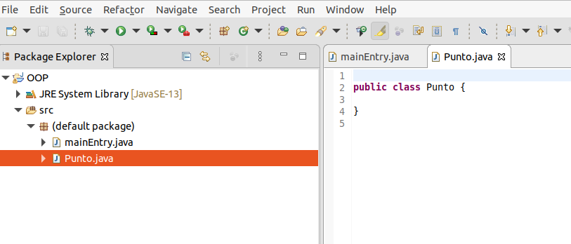
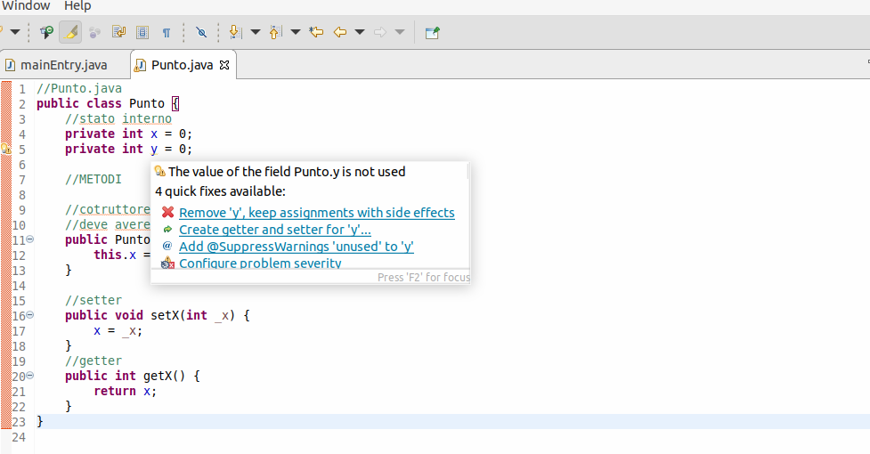
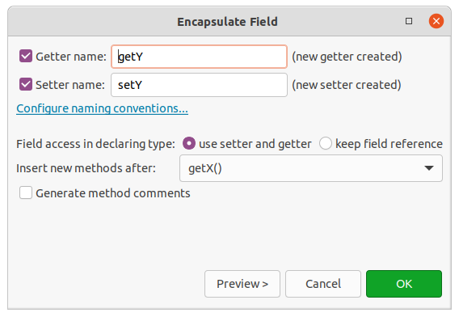
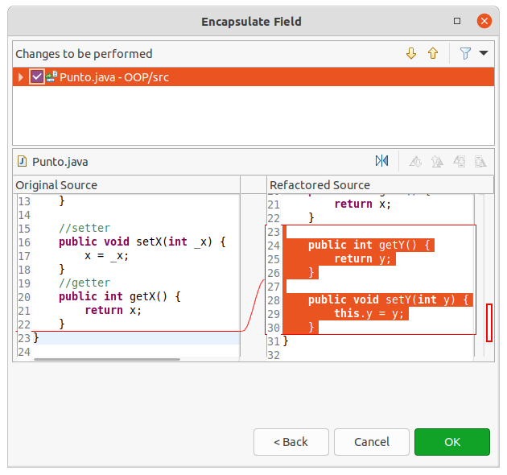

## Perchè la OOP?

Considerazioni generali del passaggio dal paradigma funzionale a quello dell OOP. Alcuni esempi sono la portabilità, l'estensione del codice o dei pezzi di codice.

I dati non devono essere separate dalle funzioni che le utilizzano

In generale invece una classe contiene:

- i dati utilizzabili solo dalla classe o dai metodi
- i metodi, cioè le funzioni che quella clase offre 

La classe incapsula quindi tutto il necessario. Non è possibile accedere a dati o metodi senza prima chimare la classe.

**Ereditarietà**

Per derivare delle classi simili riutilizzando quindi il codice è possibile utilizzare il concetto di ereditarietà. Dopodichè, se c'è la necessità di aggiungere dei metodi o dei dati o cambiare l'implementazione di qualche metodo è possibile farlo semplicemente ridefinendola all'interno.

In genere quando si scrive crea una nuova classe si fa in un file separato ma non è obbligatorio.

In eclipse puoi quindi creare un nuovo file class




**Packages Java**

Il meccanismo dei package incapsula un'insieme di classi. All'interno di ogni package posso creare strutture dati, classi che non interferiranno a livello di nomi (un po' come il concetto del namespace) all'esterno. Se all'interno di un progetto creo due package e magari questi due package hanno delle classi in comune, cioè con lo stesso nome il compilatore riesce a distinguerli grazie al meccanismo di separazione dei package. L'assemblaggio dei package poi crea l'applicazione


Di default Eclipse crea un package `default package`.

Per accedere a una classe di un modello esterno devo esplicitare il nome del package prima del nome della classe


A livello di struttura di cartelle, le classi all'interno del packege di default sono situate nella root del progetto, folder `src` mentre gli altri package sono situati in subfolder


## Creiamo una classe

All'interno del file `Punto.java` che rappresenta la classe `Punto` posso iniziare a popolarla dichiarando le variabili interne:

```java
//Punto.java


public class Punto {
	//stato interno
	int x = 0;
	int y = 0;
}
```

A questo punto (scusa il gioco di parole) posso instanziare una variabile di tipo `Punto` nel `main` o meglio instanziare un oggetto appartenente alla classe `Punto`

```java
//mainEntry.java


public class mainEntry {

	public static void main(String[] args) {
		Punto p1;
	}

}
```

**Attenzione!!** 

L'oggetto appena creato `p1`, appartenente alla classe `Punto` è solo un **riferimento** alla classe `Punto`. E' un *puntatore mascherato* ma di fatto l'oggetto `p1` non esiste ancora. Per creare un oggetto devo chiamare il **costruttore**

```java
//mainEntry.java
public class mainEntry {

	public static void main(String[] args) {
		Punto p1;
		
		//Chiamo il costruttore, creando di fatto l'oggetto
		p1 = new Punto();
		
        //A questo punto posso accedere a dati e metodi
		p1.x = 123;
		p1.y = 234;
		
		
	}

}
```

**Attenzione!!**

Non è buona pratica consentire l'utilizzo e la modifica dei dati interni di una classe. Dovremmo essere in grado di agire solo a livello di metodi e nascondere lo stato interno.

Per rendere `private` le variabile interne della classe, si usa la keyword `private`


```java
//Punto.java
public class Punto {
	//stato interno
	private int x = 0;
	private int y = 0;
}
```

a Questo punto nel main si solleva un'eccezione. Non posso accedere alle strutture interne ed è un bene, devo proteggerle!

```java 
//mainEntry.java
public class mainEntry {

	public static void main(String[] args) {
		Punto p1;
		
		//Chiamo il costruttore, creando di fatto l'oggetto
		p1 = new Punto();
		

		p1.x = 123;
		p1.y = 234;
		
	}

}
/*
Exception in thread "main" java.lang.Error: Unresolved compilation problems: 
	The field Punto.x is not visible
	The field Punto.y is not visible
*/
```

Per accedere alle strutture interne dovrò affidarmi ai metodi pubblici offerti dalla classe. In particolare adesso vedremo come creare un **Costruttore**

Un cotruttore è un metodo pubblico, quindi esportabile all'esterno che ha lo stesso nome della classe, invocato dal costrutto `new`. Vediamo un semplice esempio (in questo caso non molto utile)

```java
//Punto.java
public class Punto {
	//stato interno
	private int x = 0;
	private int y = 0;
	
	//METODI
	
	//cotruttore
    //deve avere lo stesso nome della classe
    //assegna un valore alle variabili interne x e y
	public Punto(int _x, int _y) {
		x = _x;
		y = _y;
	}
}
```

Un metodo alternativo molto utilizzato:

```java
//Punto.java
public class Punto {
	//stato interno
	private int x = 0;
	private int y = 0;
	
	//METODI
	
	//cotruttore
	//deve avere lo stesso nome della classe
	public Punto(int x, int y) {
		this.x = x;
		this.y = y;
	}
}
```

`this` serve per discriminare i parametri del costruttore (o metodo che sia) dalle variabili dello stato interno. In particolare `this.x` accede alla variabile dello stato interno `x` mentre `this.y` accede alle variabili dello stato interno `y`

dal punto di vista del main:

```java
//mainEntry.java
public class mainEntry {

	public static void main(String[] args) {
		Punto p1;
		
		//Chiamo il costruttore, creando di fatto l'oggetto
		p1 = new Punto(23, 45);	
	}
}
```

Durante la creazione passo i parametri che verranno assegnati alle variabili dello stato interno `x, y`


## Getter e setter

Un altro modo, oltre all'uso del costruttore è quello di utilizzare dei particolari metodi chiamati `getter` e `setter` utilizzati rispettivamente per la lettura e scrittura delle variabili interne ma sempre attraverso un metodo pubblico


```java
//Punto.java
public class Punto {
	//stato interno
	private int x = 0;
	private int y = 0;
	
	//METODI
	
	//cotruttore
	//deve avere lo stesso nome della classe
	public Punto(int x, int y) {
		this.x = x;
        this.y = y;
	}
	
	//setter
	public void setX(int _x) {
		x = _x;
	}
	//getter
	public int getX() {
		return x;
	}
}
```

Getter e Setter sono dei metodi quindi posso invocarli in ogni punto del programma per leggere e scrivere le variabili dello stato interno della classe.

```java
//mainEntry.java
public class mainEntry {

	public static void main(String[] args) {
		Punto p1;
		
		//Chiamo il costruttore, creando di fatto l'oggetto
		p1 = new Punto(23, 45);
		
		//Chiamo il getter (è un metodo) per la lettura della coordinata x
		int myX = p1.getX();
		System.out.println(myX); //23
		
		//Chiamo il setter (è un metodo) per la scrittura della coordinata x
		p1.setX(34);
		myX = p1.getX();
		System.out.println(myX); //34
	}
}
```

Eclipse ti aiuta a scrivere in modo automatico i getter/setter:





Dopodichè nel codice troverai:

```java
//Punto.java
public class Punto {
	//stato interno
	private int x = 0;
	private int y = 0;
	
	//METODI
	
	//cotruttore
	//deve avere lo stesso nome della classe
	public Punto(int x, int y) {
		this.x = x;
		this.y = y;
	}
	
	//setter
	public void setX(int _x) {
		x = _x;
	}
	//getter
	public int getX() {
		return x;
	}

	public int getY() {
		return y;
	}

	public void setY(int y) {
		this.y = y;
	}
}
```

E' bene abituarsi all'uso di `this`, è un metodo più sicuro

riporto il main

```java
//mainEntry.java
public class mainEntry {

	public static void main(String[] args) {
		Punto p1;
		
		//Chiamo il costruttore, creando di fatto l'oggetto
		p1 = new Punto(23, 45);
		
		//Chiamo il getter (è un metodo) per la lettura della coordinata x
		int myX = p1.getX();
		System.out.println(myX); //23
		
		//Chiamo il setter (è un metodo) per la scrittura della coordinata x
		p1.setX(34);
		myX = p1.getX();
		System.out.println(myX); //34
		
		System.out.println(p1.getY());//45
	}
}

```

### Getter e setter all'interno del costruttore

Spesso si utilizzano le chiamate a getter e setter proprio all'interno del costruttore
Durante la wizard di costruzione del getter e setter di eclipse infatti c'è l'opzione per usare i getter e setter nella definizione (quindi nel costruttore) oppure no:

Partiamo da questa situazione:

```java
//Punto.java
public class Punto {
	//stato interno
	private int x = 0;
	private int y = 0;
	
	//METODI
	
	//cotruttore
	public Punto(int x, int y) {
		this.x = x;
		this.y = y;
	}
}
```

A questo punto applicando la procedura wizard mantenendo `Field access in declaring type: use setter and getter`

alla fine avremo:

```java
//Punto.java
public class Punto {
	//stato interno
	private int x = 0;
	private int y = 0;
	
	//METODI
	
	//cotruttore
	public Punto(int x, int y) {
		this.setX(x);
		this.setY(y);
	}

	public int getX() {
		return x;
	}

	public void setX(int x) {
		this.x = x;
	}

	public int getY() {
		return y;
	}

	public void setY(int y) {
		this.y = y;
	}
}
```

## Cotruttore o costruttori?

Posso avere più di un costruttore basta che la `signature` sia diversa. Il costruttore che ho dichiarato per adesso ha due parametri, prende in ingresso due interi `x, y`. Realizzando una **signature** diversa posso realizzare più costruttori. Nell'esempio creerò un signature diversa a un solo parametro

```java
//Punto.java
public class Punto {
	//stato interno
	private int x = 0;
	private int y = 0;
	
	//METODI
	
	//cotruttore 1
	public Punto(int x, int y) {
		this.setX(x);
		this.setY(y);
	}
	//Cotruttore 2
	public Punto(int x) {
		this.setX(x);
		this.setY(0);
	}

	//getter x
	public int getX() {
		return x;
	}
	
	//setter x
	public void setX(int x) {
		this.x = x;
	}

	//getter y
	public int getY() {
		return y;
	}

	//setter y
	public void setY(int y) {
		this.y = y;
	}
}
```

Nel main:

```java
//mainEntry.java
public class mainEntry {

	public static void main(String[] args) {
		Punto p1, p2_asseX;
		
		//Chiamo il costruttore a due parametri
		p1 = new Punto(23, 45);
        //Chiama il costruttore a un parametro
		p2_asseX = new Punto(10);
	}
}
```

**Attenzione!!** la signatura comprende solo il Nome di una funzione (o del metodo) il numero dei  parametri e il tipo ma **NON IL NOME**, non potrei quindi analogamente richiamare un costruttore con un solo parametro intero per la coordinata `y`


