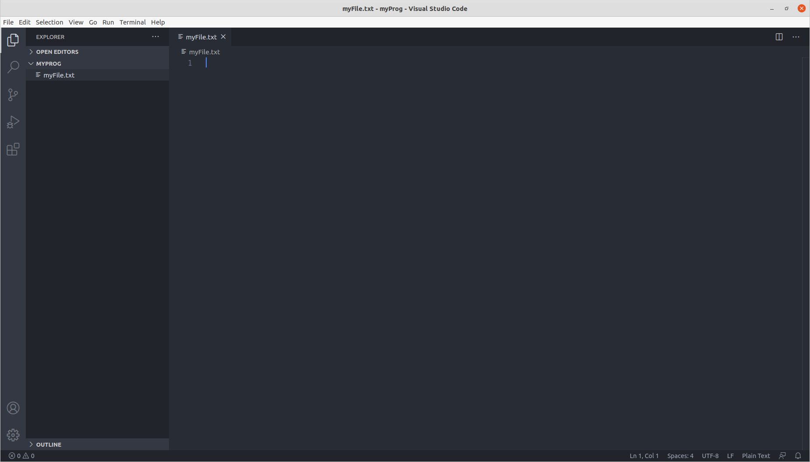
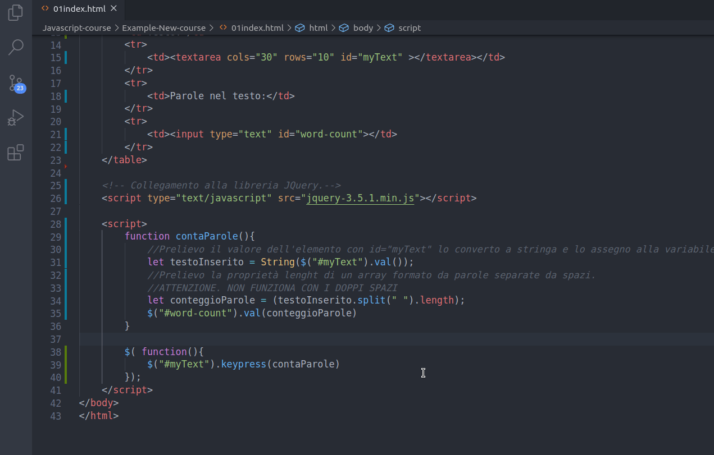
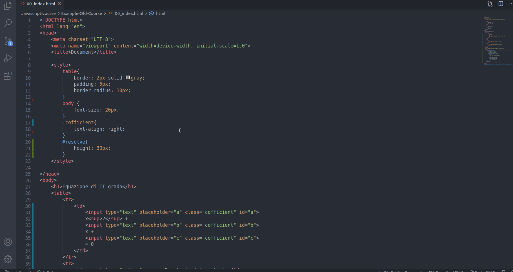

# Javascript - Modulo Base

- [Javascript - Modulo Base](#javascript---modulo-base)
- [Lezione 01](#lezione-01)
  - [Prerequisiti al corso](#prerequisiti-al-corso)
  - [Approccio al corso](#approccio-al-corso)
  - [Strumenti Necessari](#strumenti-necessari)
  - [Introduzione](#introduzione)
- [Lezione 02](#lezione-02)
  - [Cenni storici](#cenni-storici)
  - [Aspetti strutturali](#aspetti-strutturali)
  - [Versioni di Javascript](#versioni-di-javascript)
  - [Configurazione di un IDE](#configurazione-di-un-ide)
    - [Visual Studio Code - VS code](#visual-studio-code---vs-code)
- [Lezione 03](#lezione-03)
  - [Primo script](#primo-script)
- [Lezione 04](#lezione-04)
  - [Console - Browser Web](#console---browser-web)
  - [Alert & prompt](#alert--prompt)
  - [Commenti](#commenti)
- [Lezione 05](#lezione-05)
  - [Introduzione al DOM](#introduzione-al-dom)
  - [Introduzione alla libreria JQuery](#introduzione-alla-libreria-jquery)
  - [DOM ed Eventi](#dom-ed-eventi)
- [Lezione 06](#lezione-06)
  - [Variabili Javascript](#variabili-javascript)
  - [Tipi di dati in JS](#tipi-di-dati-in-js)
  - [Dati nativi](#dati-nativi)
  - [Reference type](#reference-type)
  - [Alcune regole generali per dichiarazione di variabili](#alcune-regole-generali-per-dichiarazione-di-variabili)
  - [Reference type Const](#reference-type-const)
  - [Approfondimento Null - undefined - NaN](#approfondimento-null---undefined---nan)
- [Lezione 07](#lezione-07)
  - [Stringhe](#stringhe)
  - [Opearotri, Proprietà e Metodi su stringhe](#opearotri-proprietà-e-metodi-su-stringhe)
  - [Operatori](#operatori)
  - [Approfondimento Interpolazioni di stringhe](#approfondimento-interpolazioni-di-stringhe)
  - [Le stringhe sono immutabili](#le-stringhe-sono-immutabili)
  - [Proprietà](#proprietà)
  - [Metodi](#metodi)
- [Lezione 08](#lezione-08)
  - [Conta parole](#conta-parole)
- [Lezione 09](#lezione-09)
  - [Approfondimento - Rappresentazione numerica in Javascript](#approfondimento---rappresentazione-numerica-in-javascript)
  - [Numeri in Fixed Point](#numeri-in-fixed-point)
  - [Numeri in Floating Point](#numeri-in-floating-point)
  - [Not A Number NaN](#not-a-number-nan)
- [Lezione 10](#lezione-10)
  - [Approfondimento - Codifica caratteri Javascript](#approfondimento---codifica-caratteri-javascript)
  - [ASCII](#ascii)
  - [Unicode](#unicode)
  - [Caratteri di Escape](#caratteri-di-escape)
- [Lezione 11](#lezione-11)
  - [Type conversion](#type-conversion)
  - [Conversione esplicita](#conversione-esplicita)
  - [Conversione implicita](#conversione-implicita)
- [Lezione 12](#lezione-12)
  - [Operatori matematici](#operatori-matematici)
  - [Pre e post incremento/decremento](#pre-e-post-incrementodecremento)
  - [Oggetto MATH](#oggetto-math)
- [Lezione 13](#lezione-13)
  - [Equazione di II grado](#equazione-di-ii-grado)
- [Lezione 14](#lezione-14)
  - [Operator Precedence](#operator-precedence)
  - [Associatività](#associatività)
  - [Operatori di assegnamento](#operatori-di-assegnamento)
- [Lezione 15](#lezione-15)
  - [Operatori Logici](#operatori-logici)
  - [Logica Booleana](#logica-booleana)
  - [Approfondimento - Short evalutation](#approfondimento---short-evalutation)
  - [Truthy e falsy](#truthy-e-falsy)
- [Lezione 16](#lezione-16)
  - [Control Structure if/else](#control-structure-ifelse)
  - [Ternary Operator](#ternary-operator)
  - [Switch statemeant](#switch-statemeant)
- [Lezione 17](#lezione-17)
  - [while loop](#while-loop)
  - [do-while loop](#do-while-loop)
- [Lezione 18](#lezione-18)
  - [for loop](#for-loop)
  - [break & coninue](#break--coninue)
- [Lezione 19](#lezione-19)
  - [Function](#function)
  - [Parametri di default](#parametri-di-default)
  - [Ritorno di una funzione](#ritorno-di-una-funzione)
- [Lezione 20](#lezione-20)
  - [Funzioni - Passaggio di oggetti e array](#funzioni---passaggio-di-oggetti-e-array)
  - [Funzioni - Ritorno di un oggetto o un array](#funzioni---ritorno-di-un-oggetto-o-un-array)
  - [Approfondimento funzioni - Oggetto Arguments](#approfondimento-funzioni---oggetto-arguments)
  - [Approfondimento funzioni - Parametri Rest](#approfondimento-funzioni---parametri-rest)
  - [Approfondimento Introduzione forEach / this](#approfondimento-introduzione-foreach--this)
- [Lezione 21](#lezione-21)
  - [Approfondimento Funzioni ricorsive](#approfondimento-funzioni-ricorsive)
  - [Approfondimento Function expression](#approfondimento-function-expression)
  - [Approfondimento Hoisting](#approfondimento-hoisting)
  - [Approfondimento Differenza tra undefined e not defined](#approfondimento-differenza-tra-undefined-e-not-defined)
  - [Approfondimento IIFI Immediatly invoked function expression](#approfondimento-iifi-immediatly-invoked-function-expression)
  - [Paradigma di programmazione Javascript](#paradigma-di-programmazione-javascript)
- [Lezione 22](#lezione-22)
  - [Scope](#scope)
  - [Visibilità di variabili](#visibilità-di-variabili)
  - [Visibilità Globale (global scope)](#visibilità-globale-global-scope)
  - [Scope Chaining](#scope-chaining)
  - [Visibilità a livello di blocco (block scope)](#visibilità-a-livello-di-blocco-block-scope)
  - [Approfondimento - Closure di una funzione](#approfondimento---closure-di-una-funzione)
- [Lezione 23](#lezione-23)
  - [Array](#array)
  - [Matrix](#matrix)
- [Lezione 24](#lezione-24)
  - [Array - Metodi base](#array---metodi-base)
- [Lezione 25](#lezione-25)
  - [Arrays - forEach()](#arrays---foreach)
  - [Arrays - map()](#arrays---map)
  - [Funzioni freccia (lambda)](#funzioni-freccia-lambda)
  - [Array - Metodi avanzati](#array---metodi-avanzati)
- [Lezione 26](#lezione-26)
  - [Introduzione agli Object](#introduzione-agli-object)

# Lezione 01

## Prerequisiti al corso
Prima di iniziare questo modulo, dovresti avere familiarità con i linguaggi [HTML e CSS](). 

## Approccio al corso
Questo corso è stato scritto con l'intento di imparare il linguaggio attraverso esempi pratici. Se all'inizio pensate di trovare troppo pesanti alcuni capitoli puramente "teorici" vi capisco, lo penserei anch'io quindi **evitate** con leggerezza queste sezioni.
Faccio notare anche l'approccio a "Lezioni" brevi che ho preferito rispetto all'approccio classico a "Libro/capitoli" che dal mio punto di vista allunga il tempo di apprendimento specialmente per chi non mastica già un po' il linguaggio e che comunque può essere seguito parallelamente per approfondimenti. 
Concludo nella speranza che il corso possa piacervi e risultare snello per l'apprendimento.

## Strumenti Necessari

Per questo corso sarà necessario un **web browser** e un editor di testo. Come web browser utilizzeremo [Google Chrome](https://www.google.com/chrome/) mentre come editor di testo utilizzeremo [Visual Studio Code](https://code.visualstudio.com/download). 

## Introduzione

JavaScript è un linguaggio di scripting cross-platform e object-oriented. È un linguaggio piccolo e leggero. All interno di un ambiente ospite (ad esempio un web browser), JavaScript può essere connesso agli oggetti del suo ambiente per fornire controllo programmatico su di essi.

JavaScript contiene una libreria standard di oggetti come Array, Date e Math, ed una serie di elementi base del linguaggio come operatori, strutture di controllo e dichiarazioni. La base di JavaScript può essere estesa per una varietà di scopi fornendogli oggetti aggiuntivi; ad esempio:

- *Client-side* JavaScript estende il linguaggio base fornendo oggetti per controllare il browser ed il suo Document Object Model (DOM). Per esempio, le estensioni client-side permettono ad una applicazione di inserire elementi in un form HTML e rispondere ad eventi dell'utente come il click del mouse, input nei form e navigazione delle pagine.
- *Server-side* JavaScript estende il linguaggio base fornendo oggetti rilevanti per eseguire JavaScript in un server. Per esempio le estensioni server-side consentono ad una applicazione di comunicare con un database, forniscono continuità di informazioni da una chiamata ad un altra dell'applicazione, o permettono la manipolazione di files nel server.

[MDN - Introduzione](https://developer.mozilla.org/it/docs/Web/JavaScript/Guida/Introduzione)

# Lezione 02

## Cenni storici
Originariamente sviluppato da Brendan Eich della Netscape Communications con il nome di Mochan e successivamente di LiveScript, in seguito è stato rinominato "JavaScript" ed è stato formalizzato con una sintassi più vicina a quella del linguaggio Java di Sun Microsystems (che nel 2010 è stata acquistata da Oracle). Standardizzato per la prima volta il 1997 dalla ECMA con il nome ECMAScript, l'ultimo standard, di giugno 2017, è ECMA-262 Edition 8 ed è anche uno standard ISO (ISO/IEC 16262).

[Wikipedia - JavaScript](https://it.wikipedia.org/wiki/JavaScript)

## Aspetti strutturali

Le caratteristiche principali di JavaScript sono:

- essere un linguaggio interpretato: il codice non viene compilato, ma eseguito direttamente; in JavaScript lato client, il codice viene eseguito dall'interprete contenuto nel browser dell'utente.
- la sintassi è relativamente simile a quella dei linguaggi C, C++ e Java.
- definisce le funzionalità tipiche dei linguaggi di programmazione ad alto livello (strutture di controllo, cicli, ecc.) e consente l'utilizzo del paradigma object oriented.
- è un linguaggio debolmente tipizzato.
- è un linguaggio debolmente orientato agli oggetti. Ad esempio, il meccanismo dell'ereditarietà è più simile a quello del Self e del NewtonScript che a quello del linguaggio Java, fortemente orientato agli oggetti. Gli oggetti stessi ricordano più gli array associativi del linguaggio Perl che gli oggetti di Java o C++.

Altri aspetti di interesse: in JavaScript lato client, il codice viene eseguito direttamente sul client e non sul server. Il vantaggio di questo approccio è che, anche con la presenza di script particolarmente complessi, il web server non rischia sovraccarichi dato che il lavoro viene svolto dal client. Un rovescio della medaglia è che, nel caso di script particolarmente grandi, il tempo per il trasferimento dalla rete può diventare eccessivamente lungo. Inoltre ogni informazione che presuppone un accesso a dati memorizzati in una base di dati remota deve essere rimandata a un linguaggio che effettui materialmente la transazione, per poi restituire i risultati ad una o più variabili JavaScript; operazioni del genere richiedono un nuovo caricamento della pagina stessa. Questi limiti sono però stati superati in buona parte con la nascita di AJAX.

Alcune altre caratteristiche di JavaScript degne di nota:

- Può usare caratteri Unicode
- Può valutare le espressioni regolari (introdotte nella versione 1.2; supporto da parte dei browser: a partire da Netscape Navigator 4 e Internet Explorer 4)
- Le espressioni JavaScript contenute in una stringa possono essere valutate usando la funzione eval.

[Wikipedia - JavaScript](https://it.wikipedia.org/wiki/JavaScript)

## Versioni di Javascript

Un linguaggio di programmazione per essere definito uno standard ha bisogno di essere revisionato da un organo dedicato che prende il nome di ECMA International. Da questo lavoro è nato un nuovo standard che prende il nome di ECMAScript, anche se per tutti noi il termine JavaScript è rimasto sufficiente per definirlo.

Nel corso degli anni lo standard ha definito nuove versioni e aggiornamenti del linguaggio e delle funzionalità. Nel contempo i browser si sono adattati alle modifiche introdotte per supportare il nuovo standard. Per orientarsi al supporto allo stato attuale da parte dei browser dei nuovi standard Javascript è possibile visionare la seguente tabella:

[github - es6 table](https://kangax.github.io/compat-table/es6/)


Possiamo affermare che la versione più utilizzata ad oggi è ES6, la ES5 è obsoleta ma di fatto ormai anche la ES2016+ è supportata da tutti i browser.

**Indice riassuntivo:**

- **ECMAScript** – un linguaggio standardizzato dal ECMA Internetional e supervisionato dal comitato T39;
- **JavaScript** – il nome comune utilizzato per identificare lo standard ECMAScript. Con questo termine non ci rivolgiamo a una specifica versione dello standard, ma piuttosto al suo utilizzo a livello globale o parziale.
- **ECMAScript 5 (ES5)** – questa rappresenta la quinta versione dello standard ECMAScript rilasciata nel 2009. Dato che a oggi i maggiori browser supportano questa versione è probabile che sarà la più comune da incontrare.
- **ECMAScript 6 (ES6)/ECMAScript 2015 (ES2015)** – questa rappresenta la sesta versione dello standard ECMAScript rilasciata nel 2015. Al momento non è ancora supportata completamente dai nuovi browser e dato che presenta un gran numero di moduli ti consiglio di consultare questa tabella aggiornata.
- **ECMAScript 2016** – rilasciata a inizio 2016 presenta un esiguo numero di funzionalità implementate e non dovrebbe comportare grossi problemi di compatibilità nei browser in grado di supportare la versione ES2015.

[skillsandmore - Conosci tutte le versioni di Javascript?](https://skillsandmore.org/javascript-nomi-versione/)


## Configurazione di un IDE

Un ambiente di sviluppo integrato (in lingua inglese integrated development environment ovvero IDE, anche integrated design environment o integrated debugging environment, rispettivamente ambiente integrato di progettazione e ambiente integrato di debugging), in informatica, è un ambiente di sviluppo ovvero un software che, in fase di programmazione, supporta i programmatori nello sviluppo e debugging del codice sorgente di un programma: spesso l'IDE aiuta lo sviluppatore segnalando errori di sintassi del codice direttamente in fase di scrittura, oltre a tutta una serie di strumenti e funzionalità di supporto alla fase stessa di sviluppo e debugging.

[Wikipedia - Integrated development environment](https://it.wikipedia.org/wiki/Integrated_development_environment)

### Visual Studio Code - VS code



Visual Studio Code è un editor di codice sorgente sviluppato da Microsoft per Windows, Linux e macOS. Include il supporto per debugging, un controllo per Git integrato, Syntax highlighting, IntelliSense, Snippet e refactoring del codice. Sono personalizzabili il tema dell'editor, le scorciatoie da tastiera e le preferenze. È un software libero e gratuito, anche se la versione ufficiale è sotto una licenza proprietaria.

Visual Studio Code è basato su Electron, un framework con cui è possibile sviluppare applicazioni Node.js.

[Wikipedia - Visual Studio Code](https://it.wikipedia.org/wiki/Visual_Studio_Code)

In questo corso useremo [Visual Studio Code](https://code.visualstudio.com/download) come IDE con le seguenti **Estensioni:**

- **HTML snippets**
- **javascript es6 code snippets**
- **live server**

Per installare un'estensione con VS code vi rimando alla seguente immagine animata:


# Lezione 03

## Primo script

Come integro codice javascript all'interno di una pagina html?
- Modo 1: E' possibile inserire codice Javascript direttamente all'interno della pagina html tramite il tag `<script></script>`.
- Modo 2: E' possibile creare un collegamento con un file esterno con estensione `.js` che rappresenterà il file contente codice Javascript. Per creare tale collegamento è necessario inserire prima della chiusura del `body` il seguente link-tag
```html
<script src="main.js"></script>
```

**Modo 1: Codice Javascript interno alla pagina html**<br>

`File html`
```HTML
<!DOCTYPE html>
<html lang="en">
<head>
    <meta charset="UTF-8">
    <meta name="viewport" content="width=device-width, initial-scale=1.0">
    <title>Document</title>
</head>
<body>
    <script>
        //Stampa "ciao mondo" direttamente nella pagina html
        document.write("ciao mondo");
    </script>
</body>
</html>
```

Una volta creato il file è possibile aprirlo direttamente con un web browser o tramite l'estensione di VS code *live server* che permette di lanciare l'aggiornamento della pagina in automatico quando si salva il file


**Modo 2: Collegamento al file javascript main.js** <br>

`File html`
```html
<!DOCTYPE html>
<html lang="en">
<head>
    <meta charset="UTF-8">
    <meta name="viewport" content="width=device-width, initial-scale=1.0">
    <title>Document</title>
</head>
<body>
    <script src="main.js"></script>
</body>
</html>
```

`File JS`
```js
//Stampa "ciao mondo" direttamente nella pagina html
document.write("ciao mondo");
```

Il modo migliore è sempre quello di creare file separati per dividere il contesto tra html / css / Javascript soprattutto per progetti grandi e strutturati. In questo corso per motivi di praticità invece utilizzeremo spesso codice Javascript all'interno della pagina html 

# Lezione 04

## Console - Browser Web

La console è uno strumento molto utile in fase di sviluppo software all'interno del browser web. Segnala errori e warning sintattici dell'interprete javascript ed è molto utilizzata in fase di debug. E' uno strumento interattivo, permette quindi la generazione di script Javascript in real-time e di stampare il valore di alcune variabili o strutture dati per monitorare il corretto funzionamento dello script.

Il comando `console.log()` (o per meglio dire il metodo `log()` dell'oggetto `Console`, parleremo più avanti di metodi e oggetti..) stampa un messaggio sulla web console del browser. Il messaggio può essere una semplice stringa (opzionalmente, anche con valori sostituibili), o può essere uno qualsiasi o più oggetti JavaScript.

`File html`
```html
<!DOCTYPE html>
<html lang="en">
<head>
    <meta charset="UTF-8">
    <meta name="viewport" content="width=device-width, initial-scale=1.0">
    <title>Document</title>
</head>
<body>
    <script>
        //Stampa "ciao mondo" direttamente nella pagina html
        console.log("ciao mondo");
    </script>
</body>
</html>
```


Riporto qualche comando (metodo) aggiuntivo della console:

```js
console.log('Ciao a tutti');         //stampa sulla console
console.warn('Avvertimento');        //Genera un warning
console.error('questo è un errore'); //Genera un errore
console.table({name: 'simone'});     //Stampa in formato tabella
console.clear();                     //Pulisce la console
```
E' bene comuqnue precisare che qualsiasi cosa venga stampata sulla console come log, errori o warning non saranno visibili all'utente ma solo in modalità sviluppatore.

Una lista di tutti i metodi applicabili all'oggetto si trova alla pagina [MDN - Console](https://developer.mozilla.org/it/docs/Web/API/Console)

## Alert & prompt

`alert()` mostra una finestra di avviso contenente il testo specificato mentre `prompt()` mostra una finestra di dialogo che chiede all'utente di inserire del testo.

```html
<!DOCTYPE html>
<html lang="en">
<head>
    <meta charset="UTF-8">
    <meta name="viewport" content="width=device-width, initial-scale=1.0">
    <title>Document</title>
</head>
<body>
    <script>
        //Salva l'input ricevuto in una variabile cioè un contenitore testuale 
        myName = prompt('Come ti chiami?');
        alert("Il tuo nome è ..");
        //Stampa il valore testuale contenuto nella variabile
        alert(myName);
    </script>
</body>
</html>
```


Approfondimenti sul metodo `alert()` dell'oggetto `Window` li trovate su [MDN - Window.alert()](https://developer.mozilla.org/it/docs/Web/API/Window/alert) mentre approfondimenti sul metodo `prompt()` dell'oggetto `Window` li trovate su [MDN - Window.prompt()](https://developer.mozilla.org/it/docs/Web/API/Window/prompt)

## Commenti

I commenti sono linee testuali non processate dall'interprete utili per la documentazione del codice. In javascritp ci sono due tipi di sintassi permesse per l'inserimento dei commenti.
- `// comment`: per commenti inline
- `/* comment */`: per commenti su linee multiple

```js
//inline comment

/*
multi line comment
console.log('ciao a tutti');
*/
```

# Lezione 05

**Attenzione!**<br>
Questa lezione sembrerà troppo approfondita e allo stesso tempo vaga considerato l'argomento che sto per trattare. Non preoccuparti se non capisci granchè, cerca comunque di cogliere il meccanismo di funzionamento dell'esempio che riporto in fondo alla lezione. Più avanti tratteremo questi argomenti in modo più dettagliato e diventerà tutto chiaro. Preferisco comunque affrontare questi argomenti "avanzati" fin da subito per evitare di basare l'apprendimento di Javascript sul solo comando `console.log()`. Mi sembra giusto passare all'interazione con html fin da subito per intuire con la pratica le potenzialità di questo linguaggio

## Introduzione al DOM

E' utile introdurre fin da subito il concetto di DOM per scrivere codice Javascript in grado di interagire con la pagina html altrimenti saremmo costretti ad utilizzare per tutto il corso `console.log()` e non vederne un'applicazione pratica.

In informatica il Document Object Model (spesso abbreviato come DOM), letteralmente modello a oggetti del documento, è una forma di rappresentazione dei documenti strutturati come modello orientato agli oggetti. È lo standard ufficiale del W3C per la rappresentazione di documenti strutturati in maniera da essere neutrali sia per la lingua che per la piattaforma. È inoltre la base per una vasta gamma di interfacce di programmazione delle applicazioni, alcune di esse standardizzate dal W3C.

Nativamente supportato dai browser per modificare gli elementi di un documento HTML, DOM è un modo per accedere e aggiornare dinamicamente il contenuto, la struttura e lo stile dei documenti. Per le numerose incompatibilità dovute al diverso tipo di gestione di DOM dai vari browser, il W3C ha stabilito delle specifiche standard.


[Wikipedia - Document Object Model](https://it.wikipedia.org/wiki/Document_Object_Model)

Nelle lezioni precedenti abbiamo già utilizzato il concetto di DOM. Un esempio è la stampa diretta sulla pagina html:

```js
document.write("ciao mondo");
```

Il "comando" `document.write()` è in realtà un **oggetto Javscript** `document` a cui si applica un **metodo** `write()` ovvero una funzione richiamabile solo nel contesto di un particolare oggetto (DOM = Document Object Model).
 

## Introduzione alla libreria JQuery

Vediamo anche il metodo per aggiungere librerie esterne, necessario qualora volessimo utilizzare funzioni particolari di Javascript non presenti nel linguaggio standard. Installeremo JQuery perchè è una libreria popolare molto utilizzata proprio per la manipolazione del DOM ovvero degli elementi (oggetti) html.

jQuery è una libreria JavaScript per applicazioni web, distribuita come software libero, distribuito sotto i termini della Licenza MIT. Nasce con l'obiettivo di semplificare la selezione, la manipolazione, la gestione degli eventi e l'animazione di elementi DOM in pagine HTML, nonché semplificare l'uso di funzionalità AJAX, la gestione degli eventi e la manipolazione dei CSS.

Le sue caratteristiche permettono agli sviluppatori JavaScript di astrarre le interazioni a basso livello con i contenuti delle pagine HTML. L'approccio di tipo modulare di jQuery consente la creazione semplificata di applicazioni web e contenuti dinamici versatili. Nel 2020, jQuery risulta la libreria JavaScript più utilizzata in Internet, ovvero è presente nel 74,4% dei primi 10 milioni di siti Internet più popolari secondo W3Techs.

[Wikipedia - JQuery](https://it.wikipedia.org/wiki/JQuery)

Scaricate quindi la libreria JQeury da [JQuery - download](https://jquery.com/download/)

Una volta scaricato il file è necessario copiarlo nella root del progetto e creare un collegamento al file html. 
Vediamo le funzioni base della libreria JQuery. Le approfondiremo quando necessario più avanti nel corso

- `$()`: Selettore di elementi html. E' possibile selezionare un elemento tramite il suo `id`, la sua `classe`, un `attributo`..

Alcuni metodi:

- `val()`: legge/scrive l'attributo `value` dell'elemento selezionato
- `click(functionName)`: aggiunge l'evento click all'elemento selezionato e chiama la funzione `functionName`

Vediamo un esempio:

```html
<!DOCTYPE html>
<html lang="en">
<head>
    <meta charset="UTF-8">
    <meta name="viewport" content="width=device-width, initial-scale=1.0">
    <title>Document</title>
    <style>
        table{border: 1px dashed black}
    </style>
</head>
<body>
    <table>
        <tr>
            <td>Nome</td>
            <td> <input type="text" id="myName"> </td>
        </tr>
        <tr>
            <td>Nuovo Nome</td>
            <td> <input type="text" id="new-name"> </td>
        </tr>
    </table>
    <input type="button" value="OK" id="btn-ok">

    <!-- Collegamento alla libreria JQuery.--> 
    <script type="text/javascript" src="jquery-3.5.1.min.js"></script>

    <script>        
        function cambiaNome(){
            //Seleziono l'elemento con id "new-name" e ne prelevo il valore con il metodo "val()"
            //Memorizzo il risultato in una variabile di nome "nuovoNome"
            nuovoNome = $("#new-name").val(); 
            //Assegno all'elemento con id "myName" il valore associato alla variabile "nuovoNome"
            $("#myName").val(nuovoNome); 
            //Pulisco il contenuto del valore dell'elemento con id "new-name"
            $("#new-name").val(""); 
        }
        
       //Associo all'elemento con id "btn-ok" un evento.
       //Al click sull'elemento con id "btn-ok" scatta la funzione "cambiaNome"
        $("#btn-ok").click(cambiaNome)
        
    </script>
</body>
</html>
```


**ATTENZIONE:** Il simbolo `$` è un alias che sta per `jQuery`.E' importante saperlo perchè ci sono altre librerie che utilizzano il simbolo `$` e potrebbero quindi generare un conflitto. Per ovviare a ciò è possibile utilizzare il nome originale `jQuery` al posto del suo alias `$`.

Con il comando `$.noConflict()` è possibile eliminare la definizione dell' alias `$` evitando quindi conflitti di ogni genere. A quel punto dovremmo però utilizzare necessariamente `jQuery` al posto di `$`

## DOM ed Eventi
Appena la pagina va in esecuzione il browser deve costruire il DOM ma nel contempo potrebbe già partire il codice Javascript e l'esecuzione potrebbe portare a qualche errore in certi casi a causa di asincronismo. L'esempio di sopra potrebbe essere uno di questi. Per ovviare a ciò è necessario racchiudere l'evento all'interno di una funzione anonima:

```js
$( function(){
    //evento
});
```

Vediamolo applicato all'esempio di prima:

```html
<!DOCTYPE html>
<html lang="en">
<head>
    <meta charset="UTF-8">
    <meta name="viewport" content="width=device-width, initial-scale=1.0">
    <title>Document</title>
    <style>
        table{border: 1px dashed black}
    </style>
</head>
<body>
    <table>
        <tr>
            <td>Nome</td>
            <td> <input type="text" id="myName"> </td>
        </tr>
        <tr>
            <td>Nuovo Nome</td>
            <td> <input type="text" id="new-name"> </td>
        </tr>
    </table>
    <input type="button" value="OK" id="btn-ok">

    <!-- Collegamento alla libreria JQuery.--> 
    <script type="text/javascript" src="jquery-3.5.1.min.js"></script>

    <script>        
        function cambiaNome(){

            nuovoNome = $("#new-name").val(); 
            //Assegno all'elemento con id "myName" il valore associato alla variabile "nuovoNome"
            $("#myName").val(nuovoNome); 
            //Pulisco il contenuto del valore dell'elemento con id "new-name"
            $("#new-name").val(""); 
        }
        
        //L'evento sarà pronto a scattare soltanto quando la struttura del DOM sarà preparata
        $( function(){ 
            $("#btn-ok").click(cambiaNome)
        });
    </script>
</body>
</html>
```
In questo modo si ha la sicurezza che il codice javascript e quindi l'evento possa scattare solo dopo la creazione del DOM. Il che non significa che comprende il caricamento di tutti gli oggetti come immagini, video o alcune formattazioni testuali ma solo la struttura html come oggetto Javascript che è tuttavia sufficiente al corretto funzionamento del codice Javascript. <br>
Altri metodi equivalenti:

```js
$().ready(function (){
    //event
})
$(document).ready (function () {
    //event
})
$(window).ready(function () {
    //event
})
```

# Lezione 06

## Variabili Javascript

Le variabili sono utilizzate per rappresentano dei valori attraverso un nome simbolico chiamato **identificatore**.

```js
var cognome = 'Rossi';
let nome = 'Mario';
const eta = 25;

pi = 3.14;
```

Esistono tre tipi di `keyword` per la dichiarazione di variabili/costanti in JS.

- `var`: Questa sintassi può essere usata per dichiarare sia variabili locali che globali
- `let`: Introdotta nelle nuove versioni di JS può essere usata per dichiarare una variabile locale visibile in un blocco.
- `const`: Introdotta nelle nuove versioni di JS è utilizzata per creare una costante in sola lettura.
- Possono inoltre dichiarare una variabile senza nessuna `keyword` (come fatto negli esempi precedenti) ma è da evitare perchè sarà l'interprete ad assegnare a tale variabile delle proprietà

Per le variabili dichiarate con `let/var` valgono le seguenti regole:

- Posso dichiarare una variabile e non inizializzarla. Se non inizializzata verrà attribuita ad essa il valore `undefined`
- Posso assegnare il valore di una variabile successivamente nel programma e modificarne il contenuto a piacimento (Variable mutation)

Per le variabili dichiarate con `const` valgono le seguenti regole:

- Una costante non può cambiare il suo valore attraverso ulteriori assegnazioni o essere ridichiarata mentre lo script è in esecuzione. 
- Deve essere sempre inizializzata ad un valore.

```js
let myVar = 4;   //OK, inizializzazione (dichiarazzione + assegnamento)
myVar = 23;      //OK, assegnamento

let myVar2;      //OK, solo dichiarazione
myVar2 = 29;     //OK, assegnamento successivo alla dichiarazione

const myVar = 4; //OK, inizializzazione (dichiarazione + assegnazione)
myVar = 23;      //EEROR!! - assegnazione successiva all'inizializzazione

const myVar2;    //EEROR!! - solo dichiarazione
```

**Quando usare const, let o var**

E' sempre meglio usare `const` per tutte le strutture dati che non cambiano nel tempo, è più sicuro. E' necessario usare `let` o `var` solo per le variabili o strutture dati che cambiano valore nel tempo. Tra `let` e `var` è preferibile usare `let` per mantenere la regola della visibilità all'interno di un blocco (l'argomento visibilità delle variabili verrà trattato più avanti).

## Tipi di dati in JS

L'ultimo standard ECMAScript definisce sette tipi di dati:

- Sei tipi di dato che sono *primitives*:
  - `Boolean`. true e false.
  - `null`. Una parola chiave che denota un valore nullo.
  - `undefined`. Una proprietà il cui valore non è stato definito.
  - `Number`. 42 oppure 3.14159.
  - `String`. "Salve"
  - `Symbol` (nuovo in ECMAScript 2015). Un tipo di dato la cui istanza è unica e immutabile.
  
- Due *Reference Type*
  - `Object`
  - `Array`

**NOTA:** `typeof` è una proprietà di Javascript che stampa (ritorna) il tipo di un oggetto o una variabile.

## Dati nativi

```js
//String
//Le stringhe si indicano attraverso i singoli apici 'mystring'
//attraverso i doppi apici "myString" o l'accento grave `myString`
const nome = 'simone'; 

//Number
const temp = -1.5;

//Boolean
const isMaggiorenne = true;

//Null
const value = null;
//Interessante da vedere
console.log (typeof value);

//Undefined
const cognome = undefined;

//Symbol
const mySymbol = Symbol();
```

## Reference type 

Gli array sono tipi di dato *Reference Type* utilizzati per raggruppare diversi dati appartenenti alla stessa categoria, ovvero un insieme di dati omogenei.
Gli object anch'essi *Reference Type* sono utilizzati per raggruppare qualità / caratteristiche di una struttura dati più complessa, in genere eterogenea.

```js
//Arrays
const nomi = ['simone', 'matteo', 'giovanni'];

//Accedo ai campi di un array con l'operatore di indicizzazione []
//               0         1         2
//const nomi = ['simone', 'matteo', 'giovanni'];
console.log(nomi[1]); //matteo

//Objects
const persona = {
    nome: 'simone',
    eta: 25,
    isMarry: true
}

//Accedo ai campi di un Object spcificando il nome della proprietà dell'oggetto
console.log(persona.nome); //simone
```

Formalizzeremo più avanti sia la struttura dei dati primitivi sia la struttura dei reference type.  

## Alcune regole generali per dichiarazione di variabili

- Usare sempre dei nomi significativi e esplicativi per le variabili
- Usare sempre il camelCase quando la variabile è composta da due o più parole
- Non si può usare un numero, un `#`, una `@`come inizio del nome di una variabile. E' accettanto invece il simbolo`$
- Non si possono utilizzare, come identificatore, le keyword native di JS come: `function`, `if`, `delete` ..
- E' possibile dichiarare più variabili/costanti nello stesso statement, separando le dichiarazioni con una virgola.

Vediamo qualche esempio qua sotto:

```js
//Sintassi alternativa per dichiarare più costanti
const na = 3,
      pigreco = 3.14;
      _iou = 0;
      $yui = 78;
      u-1 = 45; //ERROR!!
      1T = 1;   //ERROR!!
```

## Reference type Const

**ATTENZIONE:** Se un oggetto/array è dichiarato `const` non significa che non è possibile modificare i campi all'interno ma solo che non posso cambiare la natura dell'oggetto/array. QUesto proprio perchè gli oggetti/arrays sono, a differenza dei dati primitivi, dei reference type. Il loro nome rappresenta solo l'indirizzo per accedere al dato in memoria e non il dato in memoria. Questo concetto per adesso può sembrare poco chiaro ma i reference type verranno trattati ampiamente nelle sezioni più avanti.

```js
const myObj {
    nome: 'simone',
    cognome: 'di ricco',
    eta: 34
}

myObj.nome = 'luca'; //OK
myOby = 5;           //ERROR perchè in questo caso cambierei la natura dell'oggetto. Da oggetto diventerebbe un <number>

let myObj2 {
    ram: 4,
    rom: 5,
    anno: 2010
}

myObj2.ram = 6;   //OK
myObj2 = 18;      //OK è permesso in JS. Ecco perchè si dovrebbe usare <const> invece di <let> quando è possibile
```

## Approfondimento Null - undefined - NaN

Questa parte per adesso potrebbe essere troppo "approfondita", è possibile saltarla senza pregiudicare il corso

- `undefined`: Si verifica quando un oggetto o una variabile non assume nessun valore
- `null`: E' un valore attributo in fase di programmazione per identificare che un dato oggetto o variabile non assume nessun valore. Differisce da `undefined` poichè `null` è previsto deliberatamente in fase di programmazione
- `NaN`: Viene restituito quando **l'espressione numerica** valutata non restituisce un `Number`

Esempio 1:
```js
console.log(null === undefined); //false
```

**NOta:** Per controllare gli stati di *null* e *undefined* è possibile utilizzare direttamente le keyword `null` e `undefined` come nell'esempio sopra illustrato. La stessa cosa non vale per *NaN*. In questo caso conviene utilizzare `IsNaN()`.


```js
//Attenzione
console.log(NaN != NaN); //true !!!!
```
 
# Lezione 07

## Stringhe

Una stringa è un tipo di dato formato da zero o più caratteri racchiusi tra virgolette doppie `" "`, singole `' '` o tramite accento grave. È possibile chiamare qualsiasi metodo dell'oggetto `String` su una stringa. 

```js
const saluto = 'Ciao a tutti'; 

//Stringa multi-line. Attenzione all'apice -accento grave-
var fraseFilosofica = `Il mattino ha l'oro in bocca.
                       La sera no`;
```

## Opearotri, Proprietà e Metodi su stringhe

## Operatori

- `+`: Uninione/concatenazione di stringhe.
- `[ index ]`: Indicizzazione di una stringa come array di caratteri, in sola lettura
- `<, >`: operatori di confronto tra stringhe. Ritornano un `boolean`, *true/false*
- `{}`: Interpolazione di stringhe

```js
const nome = "marco";
const cognome = "rossi";

console.log(nome + " " + cognome); //marco rossi
//                 0,1,2,3,4 
//const cognome = "r o s s i";
console.log(cognome[1]);     //"o"
console.log(nome > cognome); //true
```

## Approfondimento Interpolazioni di stringhe

Questa parte per adesso potrebbe essere troppo "approfondita", è possibile saltarla senza pregiudicare il corso.

E' possibile utilizzare espressioni all'interno di un unica stringa. Per far cio' si ricorre all'interpolazione di stringhe molto comune anche in altri linguaggi di programmazione.

**La sintassi prevede di usare SOLO l'accento grave** e per le espressioni da valutare, l'operatore `$` seguito dall'espressione racchiusa tra le parentesi graffe `{ }`

```js
let index = 0;
//La variabile "index" viene valuta
console.log(`${index} ciao`); //0

index = index + 1;
console.log(`${index} ciao`); //1
```

## Le stringhe sono immutabili

**!! LE STRINGHE SONO IMMUTABILI IN JAVASCRIPT !!**<br>
Questo significa che dal punto di vista semantico le stringhe non possono essere trattate come array di caratteri e di fatto non è possibile applicare alle stringhe i metodi applicabili agli array.

```js
var saluto = "ciao"
saluto[2] = 'Z';

//Attenzione! LE STRINGHE SONO IMMUTABILI
console.log(saluto); //ciao
```

L'unico modo per cambiare un carattere all'interno di una stringa è distruggere l'intera stringa e ricostruirne un'altra con il carattere modificato tramite assegnamento. Non è possibile tuttavia modificre direttamente il singolo carattere di una stringa.

```js
var saluto = "ciao"
saluto[2] = '2';
console.log(saluto); //ciao

saluto = "super ciao"
console.log(saluto); //super ciao
```

## Proprietà
La propietà `.lenght` restituisce il numero di caratteri presenti nella stringa.

```js
const nome = "marco";
console.log(nome.lenght);   //5
console.log("ciao".lenght); //4
```

## Metodi
Vediamo adesso diversi metodi applicabili alle stringhe. Più avanti, quando tratteremo gli oggetti capiremo meglio la terminologia metodo/proprietà/operatore. Per adesso è importante capirne gli esempi applicativi e imparare ad usare le stringhe per intuirne le potenzialità.

`toUpperCase()`:
- **Parametri** : 
- **Tipo di Ritorno** : `String`
- **Descrizione** : Ritorna la stringa in caratteri maiuscoli
```js
console.log("simOne di rIcco".toUpperCase()); //SIMONE DI RICCO
```

`toLowerCase()`:
- **Parametri** : 
- **Tipo di Ritorno** : `String`
- **Descrizione** :Ritorna la stringa in caratteri minuscoli
```js
console.log("SimOne di rICco".toLowerCase()); //simone di ricco
```

`charAt(index)`:
- **Parametri** : `index` (`Number`)
- **Tipo di Ritorno** : `String`
- **Descrizione** :  Restituisce il carattere all'interno della stringa corrispondente all'indice *index* (Ottenibile anche tramite l'indicizzazione [ ])
```js
console.log("JaVascript".charAt(3)); //a
```


`substring(indexStart, indexEnd)`: 
- **Parametri** : `indexStart` (`Number`), indexEnd (`Number`) 
- **Tipo di Ritorno** : `String`
- **Descrizione** : Ritorna la porzione di stringa compresa tra *indexStart* incluso e *indexEnd* escluso.
```js
console.log("JaVascript language".substring(0, 10)); //JaVascript
```


`endsWith(param)`
- **Parametri** : `param` (`String`)
- **Tipo di Ritorno** : `boolean`
- **Descrizione** :ritorna un boolean se la stringa termina o meno con la stringa *param*
```js
console.log("myPdfFile.pdf".endsWith("pdf")); //true
console.log("01110000011".endsWith("10")); //false
```

`startsWith(string)`: 
- **Parametri** : `param` (`String`)
- **Tipo di Ritorno** : `boolean`
- **Descrizione** :ritorna un boolean (true/false) se la stringa inizia o meno con la stringa *param*
```js
console.log("01110000011".startsWith("0111")); //true
```

`.includes(param1, ?param2)`:
- **Parametri** : `param1` (`String`), `param2` (`Number`), 
- **Tipo di Ritorno** : `boolean`
- **Descrizione** : cerca la stringa *param1* a partire dall'indice opzionale *param2*, ritorna true o false. Se *param2* è omesso cerca *param1* in tutta la stringa
```js
console.log("JaVascript is programming language".includes("is")); //true
console.log("JaVascript is programming language".includes("is", 16)); //false
```

`indexOf(param1, ?param2)` :
- **Parametri** : `param1` (`String`), `param2` (`Number`), 
- **Tipo di Ritorno** : `Number`
- **Descrizione** : Cerca la prima occorrenza della stringa *param1* a partire dall'indice opzionale *param2*. Restituisce l'indice della posizione di *param1*. Se non trova *param1* nella stringa restituisce -1. Se *param2* è omesso cerca *param1* in tutta la stringa a partire dall'inizio della stringa.
```js
console.log("0011010111000110".indexOf("111")); //7
console.log("0011010111000110".indexOf("111", 10)); //-1
```

`lastIndexOf(param1, param2)` :
- **Parametri** : `param1` (`String`), `param2` (`Number`), 
- **Tipo di Ritorno** : `Number`
- **Descrizione** :  Cerca l'ultima occorrenza della stringa *param1* vincolato dall'indice limite *param2*.  Restituisce l'indice della posizione di *param1*. Se *param2* è omesso cerca *param1* in tutta la stringa a partire dalla fine della stringa.


`padEnd(param1, param2)`: 
- **Parametri** : `param1` (`Number`), `param2` (`String`), 
- **Tipo di Ritorno** : `String`
- **Descrizione** : Riempie la stringa fino a una lunghezza massima di *param1*, aggiungendo come riempitivo in coda la stringa *param2*

```js
console.log("100".padEnd(5, "-"));    //100--
console.log("100000".padEnd(5, "-")); //100000
console.log("".padEnd(5, "-"));       //-----
```

`padStart(param1, param2)`:
- **Parametri** : `param1` (`Number`), `param2` (`String`)
- **Tipo di Ritorno** : `String`
- **Descrizione** : Riempie la stringa fino a una lunghezza massima di *param1*, aggiungendo come riempitivo in testa la stringa *param2*

```js
console.log("120".padStart(5, "0"));  //00120
console.log("9040".padStart(5, "0")); //09040
console.log("2".padStart(5, "0"));    //00002
```

`repeat(param)`:
- **Parametri** : `param` (`Number`) 
- **Tipo di Ritorno** : `String`
- **Descrizione** :  Replica la stringa un numero di volte specificato da *param*

```js
console.log("0".repeat(32)); //00000000000000000000000000000000
console.log("*-".repeat(8)); //*-*-*-*-*-*-*-*-
```

`replace(param1, param2)`:
- **Parametri** : `param1` (`String`), `param2` (`String`)
- **Tipo di Ritorno** : `String`
- **Descrizione** :  Sostituisce la prima occorennza della stringa *param1* con la stringa *param2*. Funziona anche se *param1* è un'espressione regolare.

```js
console.log("Ciao a tutto il mondo".replace("o", "0")); //Cia0 a tutto il mondo
//Uso interessante del metodo replace() con un'espressione regolare. /o/g >>> cerca tutte le occorrenze
//di "o". Nota che "g" sta per "global" cioè tutte
console.log("Ciao a tutto il mondo".replace(/o/g, "0")); //Cia0 a tutt0 il m0nd0
```

`search(param)`:
- **Parametri** : `param` (`String`)
- **Tipo di Ritorno** : `Number`
- **Descrizione** : cerca la prima occorenza di *param* e restituisce l'indece della posizione. Funziona anche se *param* è un'espressione regolare. 
```js
console.log("Ciao a tutto il mondo".search("mondo"));  //16
console.log("Ciao a tutto il mondo".search("ill"));  //-1
```

`slice(indexStart, indexEnd)`:
- **Parametri** : `indexStart` (`Number`), `indexEnd` (`Number`)
- **Tipo di Ritorno** : `String`
- **Descrizione** :  Restituisce una sottostringa tra *indexStart* e *indexEnd*

```js
console.log("DRCSMN91L22E715Q".slice(6, 8)); //91
```

`split(separatore, ?max)`:
- **Parametri** : `separatore` (`String`), `max` (`Number`)
- **Tipo di Ritorno** : Array of `String`
- **Descrizione** : Può essere utilizzato per raggruppare delle stringhe sottoforma di array contenute in un unica grande stringa e separate tramite un separatore. Crea quindi un array di stringhe contenente porzioni di stringa derivate dalla stringa a cui è applicato il metodo separate dal carattere (o i caratteri) come indicato nel parametro *separatore*. Il secondo parametro, opzionale, indica il numero massimo di elementi dell'array.

```js
const myArray = "Ciao a tutto il mondo".split(" ");
console.log(myArray);    //(5) ["Ciao", "a", "tutto", "il", "mondo"]
console.log(myArray[3]); //il

const myArray2 = "Ciao a tutto il mondo".split(" ", 3);
console.log(myArray2);   //(3) ["Ciao", "a", "tutto"]
```

`trim()`:
- **Parametri** :
- **Tipo di Ritorno** : `String`
- **Descrizione** : rimuove gli spazi all'inizio e alla fine di una stringa
```js
console.log("#" + "         Ciao a tutto il mondo    ".trim() + "#"); //#Ciao a tutto il mondo#
```

`trimLeft()`:
- **Parametri** :
- **Tipo di Ritorno** : `String`
- **Descrizione** : rimuove gli spazi in testa a una stringa.
```js
console.log("#" + "         Ciao a tutto il mondo    ".trimLeft() + "#"); //#Ciao a tutto il mondo    #
```

`trimRight()`:
- **Parametri** :
- **Tipo di Ritorno** : `String`
- **Descrizione** : rimuove gli spazi in coda a una stringa
```js
console.log("#" + "         Ciao a tutto il mondo    ".trimRight() + "#"); //#         Ciao a tutto il mondo#
```

# Lezione 08

## Conta parole

Il seguente esempio conta le parole inserite in un certo input testuale.
Faremo uso dell'evento `keypress` che scatta ad ogni tasto premuto e del metodo su stringa `split()`

```html
<!DOCTYPE html>
<html lang="en">
<head>
    <meta charset="UTF-8">
    <meta name="viewport" content="width=device-width, initial-scale=1.0">
    <title>Document</title>
</head>
<body>

    <h1>Conta parole</h1>

    <table>
        <td>Testo:</td>
        <tr>
            <td><textarea cols="30" rows="10" id="myText" ></textarea></td>
        </tr>
        <tr>
            <td>Parole nel testo:</td>
        </tr>
        <tr>
            <td><input type="text" id="word-count"></td>
        </tr>    
    </table>

    <!-- Collegamento alla libreria JQuery.--> 
    <script type="text/javascript" src="jquery-3.5.1.min.js"></script>

    <script>        
        function contaParole(){
            //Prelievo il valore dell'elemento con id="myText" lo converto a stringa e lo assegno alla variabile testoInserito
            let testoInserito = String($("#myText").val()); 
            //Prelievo la proprietà lenght di un array formato da parole separate da spazi.
            //ATTENZIONE. NON FUNZIONA CON I DOPPI SPAZI
            let conteggioParole = (testoInserito.split(" ").length);
            $("#word-count").val(conteggioParole)
        }

        $( function(){ 
            $("#myText").keypress(contaParole)
        });
    </script>
</body>
</html>
```



# Lezione 09

## Approfondimento - Rappresentazione numerica in Javascript

Questa parte per adesso potrebbe essere troppo "approfondita", è possibile saltarla senza pregiudicare il corso

## Numeri in Fixed Point
Per il tipo nativo `Number` Javascript utilizza 64 bit per la memorizzazione in ram sia per i numeri interi sia per i numeri decimali a "virgola fissa" (fixed point). Vengono utilizzati 53 bit per la parte intera e i restanti 9 per la parte decimale anche se un numero è intero. Il numero intero (safe) più grande rappresentabile in JS è `MAX_SAFE_INTEGER`.

- `MAX_SAFE_INTEGER`: E' il numero intero più grande a cui posso applicare un incremento in modo affidabile.

Il metodo `isSafeInteger()` applicato all'oggetto `Number` ritorna un `boolean` che indica se il numero è safe oppure no


```js
console.log(Number.MAX_SAFE_INTEGER); //9007199254740991
/*
(property) NumberConstructor.MAX_SAFE_INTEGER: number

The value of the largest integer n such that n and n + 1 are both exactly representable as a Number value. The value of Number.MAX_SAFE_INTEGER is 9007199254740991 2^53 − 1.
*/

let n1 = Number.MAX_SAFE_INTEGER;      //OK, safe
console.log(Number.isSafeInteger(n1)); //true
let n2 = Number.MAX_SAFE_INTEGER + 1;  //OK, safe
console.log(Number.isSafeInteger(n2)); //true
let n3 = Number.MAX_SAFE_INTEGER + 1   //NO, non safe, il risultato non è affidabile
console.log(Number.isSafeInteger(n3)); //false

```

## Numeri in Floating Point
La rappresentazione dei numeri in "virgola mobile" (floating point) Javascript utilizza lo standard IEEE 754 

```js
//MAX_VALUE rappresenta il più grande numero rappresentabile in virogla mobile
console.log(Number.MAX_VALUE); //1.7976931348623157e+308

//Attenzione!!
console.log(0.1 + 0.2 == 0.3); //false
console.log(0.1 + 0.2); //0.30000000000000004
```
Lo standard IEE754 rappresenta i numeri reali e come tale è necessario conoscere ed evitare alcune pratiche di cattivo utilizzo dei numeri reali. In generale con i numeri reali è da evitare l'utilizzo di espressioni di uguglianza. E' possibile tuttavia trasformare un'espressione di uguaglianza esatta con un'espressione di "vicinanza" definendo un'accuratezza in questo modo:

```js
const accuracy = 0.0000001;
console.log( (0.1 + 0.2) - 0.3  < accuracy); //true
```

Il più piccolo valore rappresentabile (vicino allo zero) in floating point è:

```js
console.log(Number.MIN_VALUE); //5e-324
```

E' bene ricordare che la rappresentazione dei numeri con lo standard IEEE 754 è su scala logaritimica quindi non lineare. Questo significa che posso rappresentare numeri estremamente grandi e numeri estremamente piccoli ma la distanza tra due numeri diventa sempre più grande (e quindi meno accurata) mano a mano che i numeri diventano grandi e diventa più piccola (quindi più accurata) mano a mano che i numeri diventano piccoli

## Not A Number NaN

Javascript restituisce `NaN` quando valuta che un'espressione non può essere svolta e darebbe errore.

```js
console.log( 10/"ciao" ); //NaN
console.log( 0/0 ); //NaN
```

E' buona norma evitare NaN in special modo per quelle espressioni numeriche non prevedibili o che ricevono valori dall'esterno. La funzione `isNaN()` restituisce un boolean se un dato valore risulta o meno un NaN.

```js
let myVar = 12 / 0.9;
if ( !isNaN(myVar) ) {
    console.log(myVar);
}
```

# Lezione 10

## Approfondimento - Codifica caratteri Javascript

Questa parte per adesso potrebbe essere troppo approfondita, è possibile saltarla senza pregiudicare il corso

## ASCII

ASCII (acronimo di American Standard Code for Information Interchange, Codice Standard Americano per lo Scambio di Informazioni) è un codice per la codifica di caratteri. Lo standard ASCII è stato pubblicato dall'American National Standards Institute (ANSI) nel 1968

Con US-ASCII si intende un sistema di codifica dei caratteri a 7 bit, comunemente utilizzato nei calcolatori, proposto dall'ingegnere dell'IBM Bob Bemer nel 1961, e successivamente accettato come standard dall'ISO, con il nome di ISO/IEC 646.

Alla specifica iniziale basata su codici di 7 bit fecero seguito negli anni molte proposte di estensione ad 8 bit e quindi 256 caratteri, con lo scopo di raddoppiare il numero di caratteri rappresentabili. Nei PC IBM si fa per l'appunto uso di una di queste estensioni, ormai standard de facto, chiamata extended ASCII o high ASCII. In questo ASCII esteso, i caratteri aggiunti sono vocali accentate, simboli semigrafici e altri simboli di uso meno comune. I caratteri di ASCII esteso sono codificati nei cosiddetti codepage. Ogni paese presentò la sua proposta di ASCII esteso per rappresentare e codificare tutti i caratteri aggiuntivi relativi alla lingua creando non pochi problemi di comunicazione tra continenti. C'era quindi bisogno di uno standard nuovo e unico per tutto il mondo. Nasce quindi l'UNICODE.

[Wikipedia - ASCII](https://it.wikipedia.org/wiki/ASCII)

## Unicode

Unicode è stato creato per risolvere i limiti dei tradizionali schemi di codifica dei caratteri Ad esempio , sebbene i caratteri definiti nella ISO 8859-1 siano ampiamente utilizzati in paesi diversi, spesso si verifica incompatibilità tra paesi diversi. Molti metodi di codifica tradizionali hanno un problema comune, ovvero consentono ai computer di gestire un ambiente bilingue (di solito utilizzando lettere latine e le loro lingue native), ma non possono supportare un ambiente multilingue allo stesso tempo (riferendosi a una situazione in cui più lingue possono essere mescolate contemporaneamente).

Unicode era stato originariamente pensato come una codifica a 16 bit (quattro cifre esadecimali) che dava la possibilità di codificare 65.535 (2^16 -1) caratteri. Tanto si riteneva essere sufficiente per rappresentare i caratteri impiegati in tutte le lingue scritte del mondo. Ora invece lo standard Unicode, che tendenzialmente è perfettamente allineato con la norma ISO/IEC 10646, prevede una codifica fino a 21 bit e supporta un repertorio di codici numerici che possono rappresentare circa un milione di caratteri. Ciò appare sufficiente a coprire anche i fabbisogni di codifica di scritti del patrimonio storico dell'umanità, nelle diverse lingue e negli svariati sistemi di segni utilizzati.

Al 2009, solo una piccolissima parte di questa disponibilità di codici è assegnata. Per lo sviluppo dei codici sono infatti previsti 17 "piani" ("planes", in inglese), da 00 a 10hex, ciascuno con 65.536 posizioni (quattro cifre esadecimali), ma solo i primi tre e gli ultimi tre piani sono ad oggi assegnati[2], e di questi il primo, detto anche BMP, è praticamente sufficiente a coprire tutte le lingue più usate.


Concretamente, questo repertorio di codici numerici è serializzato mediante diversi schemi di ricodifica, che consentono l'uso di codici più compatti per i caratteri usati più di frequente. È previsto l'uso di codifiche con unità da 8 bit (byte), 16 bit (word) e 32 bit (double word), descritte rispettivamente come UTF-8, UTF-16 e UTF-32. UTF-8 è di fatto lo standard successore di ASCII, perfettamente compatibile mentre javascript utilizza l'UTF-16 consentendo di rappresentare un numero elevato di caratteri, 655536. Ciò non significa che per le codifiche UTF-8 e UTF-16 non sia possibile rappresentare tutti i caratteri unicode ma a causa della codifica potrebbe non essere conveniente in certe situazioni utilizzare UTF-8 anzichè UTF-16. In certe situazioni infatti UTF-8 potrebbe aver bisogno di 3 byte per rappresentare un certo carattere mentre UTF-16 soltanto 2. Dipende dalla frequenza e natura dei caratteri. 

Si rirprenda il template html:
```html
<!DOCTYPE html>
<html lang="en">
<head>
    <meta charset="UTF-8">
    <meta name="viewport" content="width=device-width, initial-scale=1.0">
    <title>Document</title>
</head>
<body>
    
</body>
</html>
```

Alla riga

```html
<meta charset="UTF-8">
```
E' indicata la codifica necessaria per la trasmissione e visualizzazione corretta dei caratteri.


[Wikipedia - Unicode](https://en.wikipedia.org/wiki/Plane_(Unicode)) <br>
[Wikibooks - Unicode/Character reference/0000-0FFF](https://en.wikibooks.org/wiki/Unicode/Character_reference/0000-0FFF)<br>


## Caratteri di Escape

Il backslash `\` indica la presenza di un carattere escape che non sarebbe possibile inserire direttamente con un editor di testo poichè verrebbe interpretato come un comando.

Vediamo qualche carattere di escape:

- `\n`: a capo
- `\t`: tab
- `\b`: Backspace
- `\r`: Carriage return
- `\\`: Backslash
- `\'`: Single quote
- `\"`: Double quote


Introdotti gli escape è possibile vedere come inserire un carattere UNICODE tramite il suo codice identificatico: `\u{codice_unicode}`

```js 
let str = "\u{1234}"; // ሴ === 1234 codice unicode, 1 carattere
console.log (str);
console.log (str, str.lenght); //ሴ, 1

//Attenzione!! la codifica UTF-16 non raggiunge direttamnte il carattere stampato qui di seguito
//Utilizza quindi 2 caratteri Javascript
let str = "\u{1F600}"; // 😀 === 1F600 codice unicode, 2 caratteri
console.log (str, str.lenght); //😀, 2
```

Posso risalire al codice unicode tramite il metodo `charCodeAt(index)` che restituisce il codice unicode del carattere specificato da `index`. 

```js

let str = "\u{1F600}"; // 😀 === 1F600 codice unicode 2 caratteri
console.log (str); //😀
console.log(str.charCodeAt(0), strCharCodeAt(1)); //55357 56832
```

C'è anche il metodo che più completo `charCodePointAt(index)` che restituisce il codice unicode che *inizia* da `index`. Questo è necessario per quei caratteri che non possono essere rappresentati da UTF-16 e che quindi sono necessari "due caratteri" Javascript 

```js
let str = "\u{1F600}"; // 😀 === 1F600 codice unicode 2 caratteri
console.log (str); //😀
console.log(str.codePointAt(0)); // 128512 === 1F600 
```

Posso usare l'unicode anche per il nome di variabili! Da evitare.

```js
var \u{1f68} = 2017; // Ὠ
```

# Lezione 11

## Type conversion

JavaScript è un linguaggio con tipi assegnati dinamicamente. Questo significa che non si va a specificare il tipo di dato che una variabile conterrà quando viene dichiarata e anche che il tipo di un dato viene convertito automaticamente a seconda delle necessità durante l'esecuzione dello script. Nelle espressioni che coinvolgono valori numerici e stringhe con l'operatore + JavaScript converte i valori numerici in stringhe (conversione implicita). 
Vediamo come formalizzare questi concetti e distinguere tra conversioni esplicite e implicite.

## Conversione esplicita

E' una pratica di buona programmazione far riferimento a conversioni esplicite come trattamento di errori o ricezione dati dall'esterno anche quando "sembra" che non sia necessario. La conversione esplicita forza un tipo e previene in molti casi errori di mal interpretazione dei dati.
Vediamo alcune soluzioni disponibili per la conversione esplicita tra tipi in Javascript. 

- `String(value)`: converte `value` (qualsiasi tipo) in un tipo `String`
- `value.toString()`: metodo che converte `value` in una stringa (equivalente a `String(value)`)
- `Number(value)`: converte `value` in un tipo `Number`
- `parseInt(value)` - converte `value` in un tipo `Number` e ritorna la parte intera
- `parseInt(value)` - converte `value` in un tipo `Number` e ritorna la parte frazionaria

```js
//Number to string - String(value)
let value = 45;
String(value); //ritorna la stringa '45'

//Boolean to string - String(value)
let value2 = false;
String(value2); //ritorna la stringa 'false'

//Metodo alternativo - toString();
let value3 = false;
(value3).toString(); //ritorna la stringa 'false'

//String to number - Number(string)
let string = '45';
Number(string); //ritorna il numero 45

//Boolean to number - Number(string)
let myBool = true;
Number(myBool); //1ritorna il numero 1

parseInt('100.31'); //100
parseFloat('100.31'); //31
```

## Conversione implicita

Anche se è sconsigliato affidarsi alle conversioni implicite, cioè quelle che Javascript effettua implicitamente incontrando in una espressione due o più valori appartenenti a tipi diversi, è bene conoscerle per difendersi e saperle trattare. In alcuni semplici casi non è comunque sbagliato utilizzarle.

Riporto un esempio qui sotto:

```js
// Type coercion

const nome = 'marco';
const cognome = 'rossi';
const eta = 20;
const sposato = false;

console.log(nome + ' ' + cognome + ' ha ' +  eta + ' anni. ' + 'é sposato? ' + sposato);

/*
Console:
---------------
marco rossi ha 20 anni. E' sposato? false
*/
```

Notiamo che la variabile `eta` è stata convertita da tipo `numero` a tipo `stringa` e la variabile `sposato` è stata convertita da `boolean` a `stringa` in modo implicito da javascript. Queste sono conversioni effettuate in modo automatico da javascript poichè nella stessa espressione si trovano tipi diversi.

# Lezione 12

## Operatori matematici

Vediamo alcuni operatori matematici direttamente con un esempio:

```js
/* operatori matematici */

const questAnno = 2020;

const etaMarco = 25;
const etaStefano = 22;

const nascitaMarco = questAnno - etaMarco;  
const nascitaStefano = questAnno - etaStefano; 

console.log(nascitaMarco);   //1995
console.log(nascitaStefano); //1998

console.log(5 * 2); //10
console.log(5 / 2); //2.5

// Modulo: resto della divisione intera
console.log(7 % 4); //3
```

## Pre e post incremento/decremento

L'operatore di incremento incrementa (aggiunge uno a) il suo operando e restituisce un valore.

- `++x` / `--x`: **pre incremento/decremento** restituisce il valore dopo l'incremento
- `x++` / `x--`: **post incremento/decremento** restituisce il valore prima di incrementare

Pre e post incremento/decremento rilevano una differenza solo in caso di valutazione di un'espressione.
Se troviamo Pre e post incremento/decremento isolati in un singolo statement (come spesso accade) risultano equivalenti.

```js
//Pre incremento
x = 0;
y = ++x; //y=1, x=1

//Post incremento
x = 0;
y = x++; //y=0, x=1

x = 0;
x++; //x=1 // in questo caso è equivalente a ++x

x = 0;
++x; //x=1 // in questo caso è equivalente a x++
```

La lista di tutti gli operatori aritmetici la troviamo alla pagina: [MDN - Operatori Aritmetici](https://developer.mozilla.org/it/docs/Web/JavaScript/Reference/Operators/Operatori_Aritmetici)

## Oggetto MATH

In JS è possibile utilizzare funzioni matematiche avanzate tramite l'oggetto `Math`. Vediamo alcune tra le più comuni:

- `Math.round(value)`: Ritorna l'arrotondamento di *value* al numero più vicino
- `Math.ceil(value)`: Ritorna l' arrotondamento di *value* per eccesso
- `Math.floor(value)`: Ritorna l' arrotondamento di *value* per difetto
- `Math.trunc(value)`: Ritorna il troncamento di *value*
- `Math.sqrt(value)`: Ritorna la radice quadrata di *value*
- `Math.abs(value)`: Ritorna il valore assoluto di *value*
- `Math.pow(base, exp)`: Ritorna l'esponenziale: *base^exp*
- `Math.min(value1, value2, value3, ..)`: Ritorna il minimo valore tra i parametri indicati tra gli argomenti
- `Math.max(value1, value2, value3, ..)`: Ritorna il massimo valore tra i parametri indicati tra gli argomenti
- `Math.random()`: Ritorna un numero random decimale nel range *0 - 1*

Esempio:
```js
//Math.PI
console.log(Math.PI); //stampa del numero pi greco: 3,14..

Math.round(42.1); //42
Math.round(42.5); //43
Math.round(42.7); //43

Math.ceil(42.1); //43
Math.ceil(42.5); //43
Math.ceil(42.7); //43

Math.floor(42.1); //42
Math.floor(42.5); //42
Math.floor(42.7); //42

Math.sqrt(25); //5
Math.sqrt(42.5); //6.

Math.abs(-25); //25
Math.abs(42.5); //42.5

Math.pow(2, 5); //32
(2**5); //32 === 2^5 >> equivalente a Math.pow(2, 5); 
Math.pow(5, 3); //125

Math.min(2, 5, -2, 6); //-2
Math.max(2, 5, -2, 6); //6

Math.random(); //0.234514378429

Math.trunc(12.78899); //12
```

La seguente riga di codice genera un numero casuale da 0 a 100.

```js
console.log(Math.round((Math.reandom()*100))); //45
```

# Lezione 13

## Equazione di II grado

Il seguente script calcola le soluzioni reali di un'equazione di secondo grado. Stampa "Soluzioni immaginarie" se le soluzioni non sono reali 

```html
<!DOCTYPE html>
<html lang="en">
<head>
    <meta charset="UTF-8">
    <meta name="viewport" content="width=device-width, initial-scale=1.0">
    <title>Document</title>

    <style>
        table{
            border: 2px solid gray;
            padding: 5px;
            border-radius: 10px;
        }
        body {
            font-size: 20px;
        }
        .cofficient{ 
            text-align: right;
        }
        #resolve{
            height: 30px;
        }
    </style>

</head>
<body>
    <h1>Equazione di II grado</h1>
    <table>
        <tr>
            <td>
                <input type="text" placeholder="a" class="cofficient" id="a">
                x<sup>2</sup> + 
                <input type="text" placeholder="b" class="cofficient" id="b">
                x + 
                <input type="text" placeholder="c" class="cofficient" id="c">
                = 0
            </td>
        </tr>
        <tr>
            <td><input type="button" value="Risolvi" id="resolve"></td>
        </tr>
        <tr>
            <td>
                <input type="text" placeholder="---" id="ris-1">
                x<sub>1</sub> 
            </td>
        </tr>
        <tr>
            <td>
                <input type="text" placeholder="---" id="ris-2">
                x<sub>2</sub> 
            </td>
        </tr>

    </table>

    <script type="text/javascript" src="jquery-3.5.1.min.js"></script>

    <script>
        function ResolveEqIIgrado(){
            //Prelievo il valore dell'elemento con id="myText" lo converto a stringa e lo assegno alla variabile testoInserito
            let a = Number($("#a").val()); 
            let b = Number($("#b").val());
            let c = Number($("#c").val());

            let delta = Math.sqrt(b**2 - 4*a*c);

            if (isNaN(delta)) {
                $("#ris-1").val("Soluzioni immaginarie");
                $("#ris-2").val("Soluzioni immaginarie");
            } 
            else{
                let ris1 = (-b - delta)/(2*a);
                let ris2 = (-b + delta)/(2*a);
                $("#ris-1").val(String(ris1));
                $("#ris-2").val(String(ris2));
            }
        }

        $( function(){ 
            $("#resolve").click(ResolveEqIIgrado)
        });
    </script>
</body>
</html>
```



# Lezione 14

## Operator Precedence

La precedenza degli operatori determina la priorità in cui gli operatori vengono valutati. Gli operatori con precedenza più alta sono valutati prima degli operatori con precedenza più bassa.

La lista completa di tutti gli operatori con le rispettive precedenze la troviamo qua: 
[MDN - Operator Precedence](https://developer.mozilla.org/en-US/docs/Web/JavaScript/Reference/Operators/Operator_Precedence)

Da notare che l'operatore `( )` ha la priorità più alta e quindi la precedenza su tutti gli operatori. Questo significa che per forzare la precedenza, esattamente come per la matematica è possibile sfruttare le parentesi `( )`.

**Regola di buona programmazione:** Non è mai una buona pratica di programmazione lasciare espressioni troppo complesse prive di parentesi anche se sono rispettate dal punto di vista semantico tutte le precedenze previste. Le parentesi, oltre a forzare la precedenza, offrono visivamente una chiarezza maggiore, evitando di commettere errori banali di svista.

```js
/* Operatore precedence */
/* Calcolo eta' media */

const questAnno = 2020;
const maggiorenne = 18;

const nascitaMarco = 1996;
const nascitaLuca = 2006;


/* l'operatore "-" ha precedenza sull'operatore ">" quindi l'espressione è svolta correttamente da sinistra verso destra
La sottrazione verrà quindi svolta prima dell'operatore ">" */
let isMaggiorenne = questAnno - nascitaMarco > maggiorenne
console.log(isMaggiorenne); //true
let isMaggiorenne = questAnno - nascitaMarco > maggiorenne
console.log(isMaggiorenne); //false

//Grouping
const etaMarco = questAnno - nascitaMarco; //24
const etaLuca = questAnno - nascitaLuca;   //14

// In questo caso poichè la divisione ha precedenza sulla somma è necessario forzare la priorità inserendo le parentesi
// Calcolo età media
console.log ( (etaMarco + nascitaLuca)/2 ); //19
```

## Associatività

L'associatività specifica in che modo vengono eseguite le elaborazioni a parità di operatore.
Mentre la precedenza valuta la priorità, l'associatività valuta la modalità di esecuzione. Quasi tutti gli operatori hanno un'associatività *left-to-right* ovvero, l'elaborazione è da sinistra verso destra esattamente come per la matematica. 

Alla pagina [MDN - Operator Precedence](https://developer.mozilla.org/en-US/docs/Web/JavaScript/Reference/Operators/Operator_Precedence) si trova una tabella riassuntiva che mostra priorità/associatività per ogni operatore.


```js
//Associatività del'operatore +. L'operatore + vale sia da somma che da concatenazione stringa
for(let i=0, j=5; i<=j; i++,j--){
    document.writeln(i + j + " "); //5//5//5
}
for(let i=0, j=5; i<=j; i++,j--){
    document.writeln(i + (j + " ") ); //05//14//23
}
```

## Operatori di assegnamento

L'operatore di assegnazione semplice `=` viene utilizzato per assegnare un valore a una variabile. L'operazione di assegnazione restituisce il valore assegnato. È possibile concatenare l'operatore di assegnazione per assegnare un singolo valore a più variabili (multiple assignment).

```js
//Multiple assignement
// E' possibile dichiarare due variabili contemporaneamente
let x, y;

/*Molto importante! L'operatore "= è un operatore da destra a sinistra  */
x = y = (2 * 7) * 3 - 5; // 9 * 3 - 5 // 27 - 5 // 22

console.log(x); //22
console.log(y); //22
```

Molto utilizzati sono anche gli operatori di assegnamento composto come: `+=, -=, *=, /= ..` <br>

Hanno una sintassi molto chiara e compatta. Vengono utilizzati nei casi in cui è necessario elaborare anche il valore della variabile a sinistra contrariamente all'operatore di assegnamento semplice `=` che ignora e distrugge il valore contenuto a sinistra.

```js
let x = 10;

x *= 2; // x = x * 2
console.log(x); //20

x /= 2; // x = x / 2
console.log(x); //10
```

# Lezione 15

## Operatori Logici

Gli operatori logici `<`, `<=`, `==`, `>`, `>=`, `!=` ..  trattano l'espressione come un espressione logica e ritornano un valore booleano. Sono spesso utilizzati nel controllo di condizioni in costruttti `if` o cicli `while`, `for` e tutti i costrutti condizionali e iterativi inerenti.  

```js
console.log(1 >= 5);           //false
//Per le stringhe si segue un ordine lessicografico
console.log("ciao" < "pasta"); //true
console.log(12 != 5); /        //true
```

**Nota - Operatore di uguaglianza:** == Vs ===

Entrambi sono operatori logici di uguaglianza.

- `===`: **Uguaglianza forte**, valuta l'uguaglianza dell'espressione valutanto il tipo e il contenuto.
- `==`: **Uguaglianza debole**, valuta l'uguaglianza dell'espressione valutanto il contenuto effettuando prima una conversione di tipo.


```js
/* === */
console.log(5 === 5);            //true
console.log(15 === "15");        //false -> sono tipi di dati diversi, il primo è un numero, il secondo è una stringa
console.log(null === undefined); //false -> sono tipi di dati diversi.

/* == */
console.log(5 == 5);             //true
console.log(15 == "15");         //true!! -> sono tipi di dati diversi, il primo è un numero, il secondo è una stringa ma il contenuto è lo stesso

console.log(false == 0);         //true!! -> entrambi hanno un valore falsy anche se il tipo è diverso
console.log(null == undefined);  //true!! -> entrambi hanno un valore falsy anche se il tipo è diverso
```

In generale l'uguaglianza forte è da preferire per essere sicuri di effettuare quindi anche un controllo sul tipo e rendere più semplice l'individuazione di errori run-time spesso causati da conversioni implicite di Javascript.

## Logica Booleana

Trattano l'espressione come un'espressione logica e permettono la concatenazione di espressioni con più operatori logici. Ritornano un valore booleano: `TRUE`, `FALSE`.
Vediamo i principali:

**AND** : `condition1 && condition2`: Ritorna *true* se entrambe `condition1` e `condition2` risultano *true*. <br>
**OR**  : `condition1 || condition2`: Ritorna *true* se almeno una tra `condition1` e `condition2` risulta *true*. <br>
**NOT** : `!condition1`: Inverte il risultato logico di `condition1`. <br>


```js
console.log( (1 >= 5) || ("ciao" < "pasta") );  //true
console.log( ("ciao" < "pasta") && (12 == 5) ); //false
```

## Approfondimento - Short evalutation

Se un' espressione logica risulta necessariamente *true* o *false* le elaborazioni concatenate non vengono elaborate.

- `true || expr`: `expr` non viene valutata
- `false && expr`: `expr` non viene valutata

Esempio:
```js
console.log( (1 < 2) || ("ciao" < "pasta") ); //true,  ("ciao" < "pasta") non viene valutata
console.log( (12 == 5) && ("c" < "p") ); //false, ("c" < "p") non viene valutata
```

## Truthy e falsy

I valori `truthy` e `falsy` sono quei valori considerati rispettivamente sempre veri o falsi o per meglio dire che ritornano sempre un boolean: *true/false*.

- Valori truthy: `1`, `"content"` ..
- Valori falsy: `undefined`, `null`, `0`, `""`, `NaN`

Vedremo adesso come mettere in pratica questi concetti attraverso l'uso di costrutti condizionali e iterativi.

# Lezione 16

## Control Structure if/else

La struttura di controllo `if/else` esegue un'istruzione o un blocco di istruzioni se una condizione specificata come argomento di `if` risulta *true*. Se la condizione risulta *false* si eseguono le istruzioni del ramo `else`

[MDN - if...else](https://developer.mozilla.org/en-US/docs/Web/JavaScript/Reference/Statements/if...else)

```js
if (condition1) {
    //code
} else if (condition2) {
    //code
}
else {
    //code
}
```

La condizione espressa come argomento di `if` è trattata come un'espressione logica e quindi ritorna un boolean: *true/false*.

```js
/*Utilizzo di operatori logici combinati al costrutto if/else*/

const maggioreEta = 18;
const etaLuca = 10;

if (etaLuca > maggioreEta) {
    console.log("Luca è maggiorenne");
} else {
    console.log("Luca non è maggiorenne");
}
/*
Luca non è maggiorenne
*/


/* Boolean logic, trattano l'espressione come logica
AND     -> && : ritorna TRUE se tutte le condizioni sono VERE
OR      -> || : ritorna TRUE se una condizione è VERE
NOT     -> !  : inverte il risultato dell'espressione logica
*/

const nome = "Luca";
const eta = 15;

if (eta <= 13) {
    console.log(nome + " è un bambino");
} else if ( eta > 13 && eta <= 20) {
    console.log(nome + " è un ragazzo");
}
 else  {
    console.log(nome + " è un adulto");
}
/*
Luca è un ragazzo
*/
```

## Ternary Operator

Il Ternary Operator è un costrutto condizionale inline.

L'operatore condizionale (ternary) è  l'unico operatore JavaScript che necessità di tre operandi. Questo operatore è frequentemente usato al posto del comando `if` per la sua sintassi concisa e perché fornisce direttamente un espressione valutabile.

[MDN - Operatore condizionale (ternary)](https://developer.mozilla.org/it/docs/Web/JavaScript/Reference/Operators/Operator_Condizionale)

`(condition) ? (steatement1) : (steatement2);` : Se `condition` risulta *true* verrà eseguito `steatement1` altrimenti `steatement2`.<br>

```js
/* Ternary Operator */
var nome = "Marco";
var eta = "17";

eta >= 18 ? console.log(nome + " può guidare") : console.log(nome + " non può guidare");

/*
Marco non può guidare
*/
```

E' da preferire il `ternary operator` nei casi in cui si hanno due semplici statemeant da eseguire condizionati da un'espressione altrettanto semplice. In questo caso risulta chiaro ed elegante. 


## Switch statemeant

L'ultimo costrutto condizionale è `switch`.
Il comando `switch` valuta un espressione, confronta il valore dell'espressione con ciascuna delle clausole `case` ed esegue i comandi (statements) associati alla clausola (case) che verifica il confronto.

[MDN - switch](https://developer.mozilla.org/it/docs/Web/JavaScript/Reference/Statements/switch)

```js
switch (key) {
    case value1:
        //code
        break;
    case value2:
        //code
        break;      
    default:
        //code
        break;
}
```

Esempio:

```js
/* switch statemeant*/
const sport = "calcio";

switch (sport) {
    case "calcio":
        console.log("Amo giocare a calcio");
        break;
    case "tennis":
        console.log("Amo giocare a tennis");
        break;
    default:
        console.log("non amo nessuno sportf");
        break;
}
/*
Console:
---------------
Amo giocare a calcio
*/
```

In che occasioni si usa è preferibile utilizzare il costrutto `switch`?<br>
E' da preferire quando si hanno opzioni multiple di una un unico `key` (un tipo di dato qualsiasi) da valutare e tutte le opzioni sono omogenee. In questo caso risulta chiaro e leggibile.

Nel prossimo esempio lo `switch/case` è *trasformato* in un `if/else`.

```js
/* switch statemeant*/

const nome = "Matteo";
const eta = 15;

switch (true) {
    case (eta <= 13):
        console.log(nome + " è un bambino");
        break;
    case ( eta > 13 && eta <= 20):
        console.log(nome + " è un ragazzo");
        break;
    default:
        console.log(nome + " è un adulto");
        break;
}
/*
Matteo è un ragazzo
*/
```

In questo caso lo `switch/case` risulta meno chiaro di un `if/else`. <br>
E' importante fin da subito saper utilizzare i costrutti giusti per la situazione giusta.

# Lezione 17

## while loop
L'istruzione `while` crea un ciclo che esegue un'istruzione specificata fintanto che la condizione di test restituisce *true*. La condizione viene valutata prima di eseguire l'istruzione.

[MDN - while](https://developer.mozilla.org/en-US/docs/Web/JavaScript/Reference/Statements/while)

```js
while (condition) {
    //code
}
```

Esempio:

```js
let contatore = 1;

while (contatore < 5) {
    console.log(contatore);
    contatore++;
}
/*
1
2
3
4
*/
```

In un qualsiasi costrutto iterativo è sempre bene tenere in considerazione:
- La condizione da verificare
- l'evento che altera, ad ogni ciclo, la condizione da verificare.

Il programmatore si deve assicurare che *prima o poi* la condizione diventi falsa altrimenti rischia di creare un loop infinito causando un crash del browser.


```html
<!DOCTYPE html>
<html lang="en">
<head>
    <meta charset="UTF-8">
    <meta name="viewport" content="width=device-width, initial-scale=1.0">
    <title>Document</title>
</head>
<body>
    <h1>LOOP INFINITO</h1>
    <script>
        /*Loop Infinito - DA EVITARE! */
        var infinito = 0;

        while (infinito < 10) {
            console.log(infinito);
        }
    </script>
</body>
</html>
```


Altro esempio di un ciclo iterativo applicato a una stringa con *while*:

```js
var parola = "ciao";

var contatore = 0;

while (contatore < parola.length) { // 0 < 4 // 1 < 4 // 2 < 4 // 3 < 4
    console.log(parola[contatore]); // c     // i     // a     // o
    contatore++;                    // 1     // 2     // 3     // 4
}

/*
parola.lenght ->  restituisce il numero delle lettere che compongono la stringa parola
parola[contatore] -> restituisce il contenuto relativo all'indice "contaotore"

Output:
c
i
a
o
*/
```

## do-while loop

L'istruzione do ... while crea un ciclo che esegue un'istruzione specificata finché la condizione di test non restituisce false. La condizione viene valutata dopo l'esecuzione dell'istruzione, determinando l'esecuzione dell'istruzione specificata almeno una volta.

[MDN - do...while](https://developer.mozilla.org/en-US/docs/Web/JavaScript/Reference/Statements/do...while)

```js
do {
    //code
} while (condition);
```

```js
let j = 0;
do {
    j++;
    console.log(j);
} while (j < 5);
console.log(j);

/*
Console:
---------------
0
1
2
3
4
*/
```

Il do-while loop è molto simile al while loop ma differisce nel punto in cui valuta la condizione sotto test. Qui sotto riporto un esempio dello stesso loop realizzato prima con while e poi con do-while.

```js
//while
let i = 5;

//la condizione è falsa, non eseguo il corpo del loop
while (i < 5){
    i++;
    console.log(i);
}
console.log(i);

/*
5
*/

//do-while
let j = 5;
do {
    j++;
    console.log(j);
} while (j < 5); //la condizione è falsa ma ho eseguito una volta il corpo del loop
console.log(j);

/*
Console:
---------------
6
6
*/
```

*do...while* esegue il ciclo almeno una volta mentre *while* può anche non eseguire mai il corpo. *do...while* è meno utilizzato rispetto *while* ma può comunque essere utilizzato in strutture iterative sempre in esecuzione come quella di selezione di un menù grafico a opzioni multiple.

# Lezione 18

## for loop

L'istruzione `for` crea un ciclo che consiste di tre espressioni opzionali, racchiuse tra parentesi tonde `( )` e separate da punto e virgola, seguite da un'istruzione (di solito un'istruzione di blocco) da eseguire nel ciclo.

[MDN - for](https://developer.mozilla.org/en-US/docs/Web/JavaScript/Reference/Statements/for)

```js
for (inizializzazione; condizione; incremento/decremento){
    //code
}
```

Esempio:

```js
for (let contatore = 1; contatore < 5; contatore++){
    console.log(contatore);
}

/*
1
2
3
4
*/
```

**Nota**: la variabile "contatore", poichè è creata all'interno del ciclo for *vive* all'interno del ciclo. Al di fuori del ciclo non è conosciuta.


Vediamo anche un altro esempio precedentemente svolto con *while*:

```js
/* For Loop */

const nome = "Marco";

for (let i = 0; i < nome.length; i++){ // 0 < 4 // 1 < 4 // 2 < 4 // 3 < 4 // 4 < 5 // 
    console.log(nome[i]);              // M     // a     // r     // c    // o
}

/*
M
a
r
c
o
*/
```

**Approfondimento:** I cicli in cui sono note a priori il numero di iterazioni sono sono detti "enumerativi". Per questi cicli la struttura più adatta è certamente il `for`. I cicli si dicono invece "indefiniti" quando a priori non è noto il numero esatto di iterazioni. Per questi cicli la struttura più adatta è il `while` o il `do-while`.

Gli esempi riportati fino ad ora sono tutti cicli enumerativi. Notiamo infatti che la struttura `for` risulta più chiara e compatta ed è quindi da preferire.

## break & coninue

All'interno del corpo di loop statemeant  `for / while / do... while` è possible invocare i comandi: `continue`, `break`.
- `continue`: Salta all'iterazione successiva ignorando le istruzioni successive
- `break`: Esce dal loop.

Vediamo l'uso attraverso un esempio

```js
//NO continue NO break
for (let i = 0; i < 5; i++){
    if (i === 2){
        console.log('QUESTO È 2');
    }
    console.log(i);
}

/*
Console:
---------------
0
1
QUESTO È 2
2
3
4
*/

//<conitnue> salta all'iterazione successiva
for (let i = 0; i < 5; i++){
    if (i === 2){
        console.log('QUESTO È 2');
        continue
    }
    console.log(i);
}

/*
0
1
QUESTO È 2
3
4
*/

//<break> esce dal ciclo
for (let i = 0; i < 5; i++){
    if (i === 2){
        console.log('QUESTO È 2');
        break;
    }
    console.log(i);
}

/*
0
1
QUESTO È 2
*/
```

**Approfondimento break:** E' possibile uscire da loop innestati facendo uso di un'etichetta.

```html
<!DOCTYPE html>
<html lang="en">
<head>
    <meta charset="UTF-8">
    <meta name="viewport" content="width=device-width, initial-scale=1.0">
    <title>Document</title>
    <style>
        table td{
            text-align: center;
            border: 1px dashed black;
            padding: 10px;
            margin-bottom: 10px;
        }
    </style>
</head>
<body>

    <script type="text/javascript" src="jquery-3.5.1.min.js"></script>

    <script>
        document.write("<table>");
        myLoop:
        for (let i=1; i <= 10; i++) {
            document.write("<tr>");
            for (let j=1; j <= 10; j++) {
                document.write("<td>" + "A" + "</td>");
                if ( j*i == 20 ) break myLoop;
            }
            document.write("</tr>");
        }
        document.write("</table>");
    </script>
</body>
</html>
```


# Lezione 19

## Function

Le funzioni sono tra i blocchi di programmazione fondamentali in JavaScript. Una funzione è una procedura JavaScript — un gruppo di istruzioni ( statement ) che esegue un compito o calcola un valore.

La definizione di funzione ( o dichiarazione di funzione, o istruzione di funzione ) consiste della parola chiave `function`, seguita da:

- il nome della funzione.
- una lista di argomenti per la funzione, chiusi tra due parentesi e separati da una virgola.
- le istruzioni JavaScript che definiscono la funzione, chiuse tra due parentesi graffe, { }.

[MDN - Funzioni](https://developer.mozilla.org/it/docs/Web/JavaScript/Guida/Functions)

```js
//Dichiarazione o definizione di una funzione
function name(param1, param2, ?param3) {
    //code
}

//Chiamata
name(param1, param2);
```

Esempio:

```js
/* Function with arguments */
function salutoCompleanno(nome, anni){
    console.log("ciao " + nome + ", auguri per i tuoi " + anni + " anni!");
}

salutoCompleanno("Francesco", 22); //ciao Francesco, auguri per i tuoi 22 anni!
```

**Nota:** L'ordine dei parametri è importante!
**Nota2:** Il passaggio dei parametri è sempre per *valore* intendendo che al momento della chiamata della funzione, si esegue una copia dei parametri. Non vengono quindi elaborati direttamente i valori passati a una funzione


## Parametri di default

Alcuni parametri possono essere opzionali. In fase di chiamata possono quindi essere passati dei valori a tali parametri opppure no. In caso non venga passato un valore a tali parametri assumeranno all'interno della funzione un cosìdetto valore di `default`. Per inserire un valore di default e quindi rendere il parametro opzionale basta assegnare ad esso un valore in fase di dichiarazione della funzione.

Vediamo un esempio:

```js
function salutoCompleanno(nome, anni=0){
    if (anni === 0){
        console.log("ciao " + nome + ", auguri per il tuo compleanno!");
    }
    else{
        console.log("ciao " + nome + ", auguri per i tuoi " + anni + " anni!");
    } 
}

salutoCompleanno("Francesco", 22); //ciao Francesco, auguri per i tuoi 22 anni!
salutoCompleanno("Mario");         //ciao Mario, auguri per il tuo compleanno!
```


**NOTA:** E' buona norma passare parametri in modo che i primi siano obbligatori e gli altri opzionali anche se tutto è consentito ma di fatto in fase di chiamata della funzione i parametri passati sono interpretati a partire dal primo. Ricorda che conta solo l'ordine dei parametri e non l'identificativo utilizzato

## Ritorno di una funzione

Una funzione può restituire un valore con il comando `return`

```js
/* Return Keword */
function quadrato(numero){
    return (numero*numero);
}

console.log( quadrato(5) ); //25
```

E' preferibile che una funzione esegua un'elaborazione interna e che ritorni un valore invece di salvare il risultato all'interno di variabili esterne globali. In questo modo è possibile riutilizzare la funzione ovunque e non renderla dipendente dal codice. E' quindi indispensabile l'utilizzo del `return`

**Note**

- Una funzione ammette **un** solo `return` che termina l'esecuzione della funzione.
- Eventuali linee di codice dopo il `return` verranno ignorate.

# Lezione 20

## Funzioni - Passaggio di oggetti e array

Il passaggio di oggetti e array come parametri ad una funzione avviene per *riferimento*.
Dal momento che viene passato il nome dell'oggetto e dell'array che corrisponde all'indirizzo puntatore dei dati contenuti, viene effettuata la copia dell'indirizzo e non dell'intero oggetto/array contenente i dati interni.
**In sostanza è possibile accedere e modificare i dati dell'array o oggetto passato!!**

```js
//Metodo Object - Gli oggetti sono passati per riferimento
const annoAttuale = 2020;

const objPersona = { 
    nome: "simone",
    eta: 24,
    titolo: "laurea",
    annoNascita: 1994
}
aggiornaEta(objPersona, annoAttuale);
console.log(objPersona.eta); //26

function aggiornaEta(obj, anno){
    obj.eta = anno - obj.annoNascita;
    console.log()
}

//Metodo Array - Gli array sono passati per riferimento
const arrayPersona = [
    "simone", //0
    24,       //1
    "laurea", //2
    1994      //3
];
aggiornaEta2(arrayPersona, annoAttuale);
console.log(arrayPersona[1]); //26

function aggiornaEta2(array, anno){
    array[1] = anno - array[3];
    console.log(array);
}
```

## Funzioni - Ritorno di un oggetto o un array

Una funzione in Javascript può avere come tipo di ritorno anche un oggetto o un array

```js      
//Metodo Oggetto
let objRisultatoEqIIgrado = objCalcolaRisultatoEqIIgrado(1, 5, -1);
console.log("Risultato 1: " + objRisultatoEqIIgrado.x1); 
console.log("Risultato 2: " + objRisultatoEqIIgrado.x2); 

function objCalcolaRisultatoEqIIgrado(a, b, c){
    let delta = Math.sqrt(b*b - 4*a*c);
    let ris1 = (-b + delta)/2;
    let ris2 = (-b - delta)/2;
    //Ritorno un oggetto
    return { 
        x1: ris1,
        x2: ris2 
    };
}

//Metodo Array
let arrayRisultatoEqIIgrado = arrayCalcolaRisultatoEqIIgrado(1, 6, -1);
console.log("Risultato 1: " + arrayRisultatoEqIIgrado[0]); 
console.log("Risultato 2: " + arrayRisultatoEqIIgrado[1]); 

function arrayCalcolaRisultatoEqIIgrado(a, b, c){
    let delta = Math.sqrt(b*b - 4*a*c);
    let ris1 = (-b + delta)/2;
    let ris2 = (-b - delta)/2;
    //Ritorno un oggetto
    return [ris1, ris2];
}
```

## Approfondimento funzioni - Oggetto Arguments

Facendo uso di `arguments` è possibile passare un numero *indefinito* di parametri. `arguments` raggruppa gli argomenti in un oggetto collezione di elementi. L'oggetto `arguments` permette di utilizzare la proprietà `lenght`, l'indicizzazione `[ ]` ma **non è un array** e quindi non si possono applicare i metodi applicabili agli array.
`arguments` non si specifica nella definizione di una funzione tra i parametri poichè è un oggetto riconosciuto nel contesto stesso della funzione

```js
//arguments è un oggetto riconosciuto all'interno della definizione della funzione
function somma(){
    let ris = 0;
    for (let index = 0; index < arguments.length; index++) {
        ris += arguments[index];           
    }
    console.log(arguments);
    return ris;
}

console.log(somma(1,4));           //5
console.log(somma(1,4,6,0,3,1,2)); //17
console.log(somma());              //0
```


## Approfondimento funzioni - Parametri Rest

La sintassi dei *rest parameter* permette di rappresentare un indefinito numero di argomenti come un array. A differenza dell'oggetto `arguments` in questo caso gli argomenti "restanti" sono rappresentati e raggruppati in un array ed è possibile quindi utilizzare ogni metodo applicabile agli arrays.
Si specificano i *rest parameter* all'interno della definizione di una funzione come ultimo parametro attraverso l'operatore rest `...`

- `...`: Operatore **rest**

[MDN - Rest parameters](https://developer.mozilla.org/en-US/docs/Web/JavaScript/Reference/Functions/rest_parameters)

```js
function calcola(a,b, ...altriParam ){
    ris = a + b;
    //Il forEach(param1, param2) ha due parametri. Il primo è una funzione che a sua volta accetta i parametri 
    //opzionali (valore, indice, array) in questo caso dell'array altriParam passato come argomento a calcola.
    //this in questo caso rappresenta il fatto che voglio ritornare il valore all'interno del contesto di ris
    altriParam.forEach(controllaEsomma, this);
    return ris;
}

function controllaEsomma (valore, indice, array){
    if(valore < 100)
    {
        //this riesce a raggiungere il contesto di "ris" della funzione calcola
        this.ris += valore;
    }
}

console.log(calcola(1,4));             //5
console.log(calcola(1,4,6,100,3,1,2)); //17
console.log(calcola(1,2));             //0
```

## Approfondimento Introduzione forEach / this

**forEach()** è un metodo applicabile agli array.

E' una struttura iterativa cheesegue una funzione fornita una volta per ogni elemento dell'array a cui si applica il metodo. La funzione riceve dall'array tre parametri opzionali in ordine: `value, index, array` ovvero il valore dell'elemento dell'array a cui si applica il metodo, l'indice dell'elemento e l'array stesso.

```js
myArray.forEach(myFunc);

function myFunc (value, index, array){
    //code;
}
```
Nell'esempio di sopra:

```js
altriParam.forEach(controllaEsomma, this);
```

Esegue la funzione `controllaEsomma` per ogni elemento dell'array.

```js
function controllaEsomma (valore, indice, array){
    if(valore < 100)
    {
        //this riesce a raggiungere il contesto di "ris" della funzione calcola
        this.ris += valore;
    }
}
```

L'identificatore `this`, come il `forEach` stesso verranno approfonditi più avanti. Per adesso ci basta sapere che `this` consente di raggiungere un oggetto utilizzato come callback (valore di ritorno). 

**Osservazione:**
Se dichiariamo la variabile "ris" con `let` o `var` ritorna `NaN`.

**Approfondimento:** <br>
[MDN - var](https://developer.mozilla.org/it/docs/Web/JavaScript/Reference/Statements/var)

# Lezione 21

## Approfondimento Funzioni ricorsive

> Questa parte per adesso potrebbe essere troppo "approfondita", è possibile saltarla senza pregiudicare il corso.

La funzioni ricorsive sono funzioni che richiamano se stesse all'interno del corpo. Questa tecnica fornisce un modo per scomporre problemi complicati in problemi semplici che sono più facili da risolvere.


Con le funzioni ricorsive si costruiscono algoritmi potenti.

```js
function x(contatore){
    if (contatore > 5){
        return; //Terminatore, 
    }
    else{
        x(++contatore); //passo ricorsivo
        console.log(contatore);
    }
}
x(0);

/*
6
5
4
3
2
1
*/
```

Nell'esempio di sopra al primo passo  ricorsivo `x(++contatore)` non eseguo `console.log(contatore);` che rimane pending nello stack. Così anche per gli altri passi successivi finchè la condizione dell' `if` diventa *true* e l'ultima funzione ritorna. A questo punto lo statemeant `console.log(contatore);` rimasto pending viene eseguito e così via i precedenti. fino al ritorno dell'intera funzione

**Osservazioni:**
- Se nulla limita il meccanismo di chiamate a funzione con una serie di ritorni a cascata, lo stack si riempie e il browser va in crash con l'errore `Maximum call stack size exceeded`.
- E' un meccanismo che rallenta parecchio l'applicazione quando il passo ricorsivo diverge.


## Approfondimento Function expression

> Questa parte per adesso potrebbe essere troppo "approfondita", è possibile saltarla senza pregiudicare il corso.

La parola chiave `function` può essere utilizzata per definire una funzione all'interno di un'espressione.

```js
var media = function(a,b){ //funzione anonima
    return (a+b)/2;
};

console.log(media(4,9));

var fattoriale = function fatt (n){
    if (n === 0){
        return 1;
    }
    else{
        return n * (fatt(n-1));
    }
}

console.log (fattoriale(4)); //24
```

## Approfondimento Hoisting

> Questa parte per adesso potrebbe essere troppo "approfondita", è possibile saltarla senza pregiudicare il corso.

Per comprendere l'hoisting è necessario introdurre il meccanismo di parsing dell'interprete javascript.
Prima di eseguire lo script, il parser dell'interprete Javascript scansiona tutto il codice per risolvere i valori da assegnare agli identificatori ed esegue molte altre operazioni

```js
function esterna() {
    function interna(){
        return "interna1";
    }

    return interna();

    function interna(){
        return "interna2";
    }
}
console.log( esterna() );//interna2
```

Nell'esempio di sopra, poichè la funzione `interna()` è stata definita due volte, il parser sovraiscrive la prima definizione con la seconda!

Tutto cambia se utilizzo le `function expression`

```js
function esterna() {
    var interna =  function(){
        return "interna1";
    }

    return interna();

    var interna = function{
        return "interna2";
    }
}
console.log( esterna() );//interna1
```
In questo caso poichè non sono definizioni di funzione ma variabili la seconda variabile non viene valutata poichè è codice irraggiungibile. In questo caso si segue un andamento lineare del codice anche detto paradigma imperativo. Nel caso invece di chiamate a funzione il paradigma si dice funzionale.

Altro controesempio:
```js
function esterna() {
    return interna();

    var interna =  function(){
        return "interna1";
    }

    var interna = function{
        return "interna2";
    }
}
console.log( esterna() );//ERROR. interna() non è riconosciuto perchè non è stato dichiarato l'identificaore
```

Con il paradigma funzionale invece non ci sono problemi:
```js
function esterna() {
    return interna();

    function interna(){
        return "interna1";
    }
    
    function interna(){
        return "interna2";
    }
}
console.log( esterna() );//interna2
```

## Approfondimento Differenza tra undefined e not defined

> Questa parte per adesso potrebbe essere troppo "approfondita", è possibile saltarla senza pregiudicare il corso.

Anche se sembra un uso improprio del vocabolario, c'è una differenza tra una variabile `undefined` e un **errore dell'interprete** dovuto a una variabile `not defined`.

- `undefined`: L'interprete trova la definizione della variabile ma non trova nessun valore associato a tale variabile. Non genera un errore
- `not defined`: l'interprete non trova da nessuna parte nel codice l'identificatore. Genera un errore

```js
function esterna() {
    return interna;
    var interna =  function(){
        return "interna1";
    }

    var interna = function{
        return "interna2";
    }
}
console.log( esterna() );//undefined, l'interprete sa cos'è ma non è stata definita a quel punto del codice
```

```js
function esterna() {
    return y;
    var interna =  function(){
        return "interna1";
    }

    var interna = function{
        return "interna2";
    }
}
console.log( esterna() );//ERROR. y is not defined. L'interprete non sa cosa sia y, ben diverso
```

## Approfondimento IIFI Immediatly invoked function expression

> Questa parte per adesso potrebbe essere troppo "approfondita", è possibile saltarla senza pregiudicare il corso.

Sebbene introdurre funzioni aiuti a scrivere moduli indipendenti si rischia di inondare il contesto globale di nomi di funzioni.
Il pattern IIFE (Immediately Invoked Function Expression) aiuta in tal senso.
Le IIFI functions sono funzioni che vengono eseguite al momento della definizione. Non necessitano quindi della chiamata.

```js
(function name(){
    //code
})();
```

Esempio:

```js
//Questa è una funzione standard, NON IIFI. Viene eseguita solo alla chiamata
function stampaLogo(){
    console.log('myLogo');
}

stampaLogo(); //in questa linea eseguo la funzione
/*
*/

//Questa è una funzione IIFI. Viene eseguita al momento.
//(function name(){})();
(function stampaLogo(){
    console.log('myLogo');
})();   //eseguo qui la funzione IIFI
```

Esempio 2:

```js
( //operatore di raggruppamento: cio' che e' all'interno e' una espressione
  function iife() 
  { 
    var a=222;
    console.log("parto da sola!! " + a);
  }
) //fine espressione
(); //operatore di chiamata di funzione

//forma alternativa
( function iife() 
  { 
    var a=444;
    console.log("parto da sola!! " + a);
  } 
  ()
);

iife(); //errore! iife come identificatore non esiste nel contesto globale
```


## Paradigma di programmazione Javascript
Javascript è un linguaggio multiparadigma, consente quindi il paradigma imperativo, quello funzionale e il paradigma object oriented in un unico linguaggio. Non esiste il miglior paradigma in assoluto ma esista il paradigma migliore per la situazione migliore.

# Lezione 22

## Scope

Lo *scope* è l'attuale contesto di esecuzione. Il contesto in cui i valori e le espressioni sono "visibili" o possono essere referenziati. Se una variabile o un'altra espressione non è "nell'ambito corrente", non è disponibile per l'uso. Gli ambiti possono anche essere stratificati in una gerarchia, in modo che gli ambiti figlio abbiano accesso agli ambiti padre, ma non viceversa.

Una funzione funge da chiusura, *closure* in JavaScript e quindi crea uno scope, in modo che (ad esempio) non sia possibile accedere a una variabile definita esclusivamente all'interno della funzione dall'esterno della funzione o da altre funzioni. 

[MDN - Scope](https://developer.mozilla.org/en-US/docs/Glossary/Scope)

Esempio:

```js
/* Scope */

/* Gloabl variable -> Riconosciuta da tutto il programma */
let var1 = 1;

function function1(){
    /* Local variable -> ricnosciuta solo nel blocco di codice tra le parentesi {}  in cui è stata dichiarata*/
    let var2 = 10;         //qui nasce var2
    console.log(var2);     
}                          //qui muore var2

function1();
console.log(var1); //var1 is defined, var1 is global
console.log(var2); //var2 is not defined

/*
Console:
---------------
10
1
Uncaught ReferenceError: var2 is not defined
*/
```

Vediamo un esempio molto più complesso:

```js
/* Scope */

/* Gloabl variable -> Riconosciuta da tutto il programma */
let var1 = 1;

function function1(){
    /* Local variable -> ricnosciuta solo nel blocco di codice tra le parentesi {}  in cui è stata dichiarata*/
    let var2 = 10;         //qui nasce var2
    console.log("var2 function1 : " + var2);   
}                          //qui muore var2

function function2(){
    /* Local variable ->   ricnosciuta solo nel blocco di codice tra le parentesi {}  in cui è stata dichiarata*/
    let var2 = 20;         //qui nasce var2 ma è diversa rispetto a quella di prima, è una nuova var2
    console.log("var2 function2 : " + var2);
    console.log("var1: " + var1);     //è riconosciuta anche var1 perchè è stata dichiarata in un blocco più esterno
    for (let var3 = 0; var3 < 1; var3++) {
        console.log("var3: " + var3);
        console.log("var2 function2: " + var2);   //è riconosciuta anche var2 perchè è stata dichiarata in un blocco più esterno
        console.log("var1: " + var1);             //è riconosciuta anche var1 perchè è stata dichiarata in un blocco più esterno
    }                                             //qui muore var3
}                                                 //qui muore var2

function1();
function2();

console.log("var1: " + var1);     //OK
console.log("var3: " + var3);     //non riconosciuta
console.log("var2: " + var2);     //non riconosciuta

/*
Console:
---------------
var2 function1 : 10
var2 function2 : 20
var1: 1
var3: 0
var2 function2: 20
var1: 1
var1: 1
Uncaught ReferenceError: var3 is not defined
*/
```


## Visibilità di variabili


Lo 'scope' di una variabile (visibilita' di una variabile) e' la sezione di codice 
in cui essa e' visibile ed in Javascript e' regolato con l'uso
delle funzioni.

NB: non confondere lo scope con il context (contesto) che indica invece l'oggetto
per il quale una funzione viene eseguita (`this`).
Per una funzione visibile a livello globale cioe' non contenuta in alcun oggetto 
questo in realta' esiste e coincide con 'window'.

La distinzione e' tra visibilita' globale, locale e di blocco.


## Visibilità Globale (global scope)

E' quella che ha come riferimento l'intero codice. Sono le variabili/oggetti dichiarate all'esterno di qualunque funzione usate in una funzione senza `var/let`. In generale **la visibilita' globale e' da evitare**

Esempio:

```js
var x = 100;

function f_bad() {
  //modifica la variabile esterna potenzialmente all'insaputa di chi la chiama
  x = 2; 
}

console.log("Prima di invocare f_bad() " + x); //x = 100
f_bad();    //modifica x, da evitare
console.log("Dopo f_bad() " + x); //x = 2
```

L'obiettivo delle funzioni è proprio racchiudere il codice in blocchi riutilizzabili. Se modificano/dipendono da variabili esterne/globali questo concetto viene a meno.

Per risolvere questa cosa:

```js
x = 100;
//versione corretta di f
function f_good() {
  //dichiarazione di una variabile LOCALE (x) distinta da quella globale
  var x = 2; 
  var y=200;
}

console.log("Prima di invocare f_good() " + x); // x = 100
f_good(); 
console.log("Dopo f_good() " + x); // x = 100, Ok
console.log(y); //errore: y not defined; visibile solo a f_good in esecuzione
```

## Scope Chaining
Una varibaile è visibile ai blocchi interni (figli) ma non ai contenitori (padre). I blocchi interni (figli) ereditano tutto dai loro contenitori (padri) ma *i padri non conoscono i segreti dei figli* ovvero non possono conoscere le variabili/oggetti dichiarati dei figli.


```js

var x = 2;
//FUNZIONI ANNIDATE (nested)
function esterna()
{
  var x = 999;// dichiaro una nuova "x" diversa da quella globale
  interna();

  //Accedo alla "x" esterna tramite il contest. <window> è il contesto esterno, è il contenitore di tutto
  window.x = 18; 
  //interna accede anche allo scope di esterna ma non il viceversa
  function interna()
  {
    //code
  }
}
```

## Visibilità a livello di blocco (block scope)

La visibilità è racchiusa da i delimitatori `{ }`

Per mantenere la visibilità a livello di blocco è necesario usare `let`, `var` mantiene soltanto lo scope locale a livello di funzione ma non di blocco `{ }`

- `let`: Mantiene lo scope delle variabili sia a livello locale (all'interno di una funzione) sia livello di blocco ovvero tra i delimitatori `{ }`
- `var`: Mantiene lo scope delle variabili solo a livello locale (all'interno di una funzione) ma non a livello di blocco ovvero tra i delimitatori `{ }`

```js
//"var" non mantiene la visibilità di blocco
var x=5;
if ( Math.random() > 0.5 )
{
    var x = 100;
}
else
{
    var x = 200
}
console.log("La x ora vale: " + x); //100 o 200!! ATTENZIONE, 

//"let" mantiene la visibilità di blocco
x=5;
if ( Math.random() > 0.5 )
{
    let x = 100;
}
else
{
    let x = 200
}
console.log("La x globale vale ancora: " + x);  //5, ok 
```

## Approfondimento - Closure di una funzione


Si ricordi:

*Una funzione funge da chiusura, closure in JavaScript e quindi crea uno scope, in modo che (ad esempio) non sia possibile accedere a una variabile definita esclusivamente all'interno della funzione dall'esterno della funzione o da altre funzioni* 

Applichiamo questo concetto ad un esempio pratico. <br>
La funzione:
`setInterval( param1, param2 )`: *param1* è una funzione, *param2* rappresenta un intervallo di tempo espresso in `ms`.
La funzione `setInterval()` chiama la funzione *param1* ogni *param2* `ms`.

```js
function chiamaMessaggio(messaggio){
    setInterval( function(){writeln(messaggio);}, 1000); //uso una funzione anonima
}

chiamaMessaggio("il sistema è in fase di spegnimento..");
```

Ho utilizzato il concetto di *closure* (e quindi dell'ereditarietà delle variabili/oggetti padre->figlio) di una funzione per passare un parametro alla funzione (parametro) di `setInterval()` 

Esempio 2:
```js
function chiamaMessaggio2(ilMessaggio, volte)
{

    let timer = setInterval( 
    function ()
    {
        writeln(ilMessaggio + " " + volte + " secondi..."); 
        --volte;
        if (volte<1) { clearInterval(timer); writeln("Boom!");}
    }
    , 1000)
}

chiamaMessaggio2("Sistem Shutdown in ", 5);
```

**Approfondimento:** Le funzioni che ricevono come parametri altre funzioni o ritornano altre funzioni prendono il nome di *High orderd function*

# Lezione 23

## Array

Gli array sono aggragatori di dati utilizzati per raggruppare elementi appartenenti alla stessa *famiglia* ed accedere ad uno di essi in lettura o scrittura in modo semplice. 

- Ogni elemento dell'array è raggiungibile tramite un numero detto **indice**. L'indice indica la posizione dell'elemento nell'array.
- La proprietà `lenght` restituisce il numero degli elementi in un array

```js
// Dichiarazione e inizializzazione
//                 0            1            2
const elementi = ["elemento1", "elemento2", "element03"];
console.log(elementi);        //(3) ["elemento1", "elemento2", "element03"]
console.log(elementi[1]);     //elemento2
console.log(elementi.lenght); //3

elementi[2] = "Silicio";
console.log(elementi);        //(3) ["elemento1", "elemento2", "Silicio"]

// Solo dichiarazione
const mammiferi = [];
```

Altre sintassi (meno utilizzate ma valide):

```js
//Array vuoto
let vuoto1 = new Array();
let vuoto2 = Array();
let vuoto3 = []; //da preferire

let v1 = Array(100);    //100 elementi pre allocati 
let v2 = Array('100');  //1 elemento stringa, crea confusione

let v3 = new Array(31,8,2017); //meno consigliata
let arr3 = [31, 8, 2017];      //sintassa più chiara
```

Alcuni esempi:

```js
const mammiferi = ["tigre", "scoiattolo", "orso"];
mammiferi[mammiferi.length] = "volpe"; // === mammiferi[3] = "volpe", aggiunge in coda un elemento
console.log(mammiferi); //(4) ["tigre", "scoiattolo", "orso", "volpe"]

mammiferi[10] = "cinghiale"; //aggiunge "cinghiale" al decimo elemento e riempie con elementi vuoti i restanti
console.log(mammiferi, mammiferi.lenght); //(11) ["tigre", "scoiattolo", "orso", "volpe", empty × 6, "cinghiale"] 11

mammiferi.lenght = 20;
console.log(mammiferi, mammiferi.lenght); //(11) ["tigre", "scoiattolo", "orso", "volpe", empty × 6, "cinghiale", lenght: 20] 20

//Iterazione sugli elementi dell'array
for (let i=0; i<mammiferi.length; i++){
    if (mammiferi[i] != undefined){
        console.log(i + ": " + mammiferi[i]);
    }
    else{
        console.log(i + ": " + "non è un mammifero");
    }
}

/*
0: tigre
1: scoiattolo
2: orso
3: volpe
4: non è un mammifero
5: non è un mammifero
6: non è un mammifero
7: non è un mammifero
8: non è un mammifero
9: non è un mammifero
10: cinghiale
*/
```

## Matrix

Della famiglia degli array ci sono anche le matrici che non sono altro che array di array.

```js
const social = [
    ["facebook", "instagram"],
    ["whatsapp", "telegram"],
    ["tiktok", "snapchat"],
];
console.log(social);
console.log(social[1][1]);
console.log(social[2][0]);

/*
Console:
---------------
Esercizio 2

(3) [Array(2), Array(2), Array(2)]
0: (2) ["facebook", "instagram"]
1: (2) ["whatsapp", "telegram"]
2: (2) ["tiktok", "snapchat"]

telegram
tiktok
*/
```

# Lezione 24

## Array - Metodi base

Qualche metodo base applicabile agli array in javascript:

- `push(elem)` : aggiunge l'elemento *elem* in coda all'array. Restituisce il numero di elementi dell'array.
- `pop()` : rimuove l'ultimo elemento dall'array. Restituisce l'elemento che ha tolto.
- `array.unshift(elem)` : aggiunge l'elemento *elem* in testa all'array. Restituisce il numero di elementi dell'array
- `array.shift()` : rimuove il primo elemento dall'array. Restituisce l'elemento che ha tolto
- `indexOf(elem)` : Restituisce l'indice dell' elemento *elem* nell'array. Se non lo trova restituisce `-1`
- `slice(startIndex, endIndex);` : Restituisce un array derivato dall'array a cui si applica il metodo filtrando gli elementi nel range (*startIndex* incluso,*endIndex* escluso).
- `.concat(array2);` : Restituisce un array che è la concatenazione dell'array a cui si applica il metodo e *array2*
-  `splice(startIndex, nToDelete, elem1, elem2, ...);` : Restituisce un array derivato dall'array a cui si applica il metodo aggiungendo *elem1*, *elem2*, .. a partire da *startIndex* ed eliminando i primi *nToDelete* elementi a partire da *startIndex*. Se non specifico i parametri *elem1*, *elem2*, .. semplicemente elimina gli elementi *nToDelete*  a partire da *startIndex*.
- `fill(value, indexStart, indexEnd)`: Inserisce *value* all'interno dell'array tra i parametri opzionali *indexStart* e *indexEnd*. Omettendo *indexStart* e *indexEnd* riempie tuttto l'array con *value*
- `join()` : Trasforma un array in stringa
- `reverse()` : Inverte l'ordine degli elementi
- `sort()` : Ordinamento lessicografico degli elementi. Ogni elemento viene quindi trattato come una stringa e poi ordinato secondo la precedenza definita dalla rappresentazione in UTF-8 (ASCII)


```js
//push
const colori = ["rosso", "verde", "giallo"];
console.log(colori); //(3) ["rosso", "verde", "giallo"]

let newArrayLenght = colori.push("blu"); //push ritorna il numero degli elementi dell'array
console.log(colori, newArrayLenght);     //(4) ["rosso", "verde", "giallo", "blu"] 4

//pop
console.log(colori); //(4) ["rosso", "verde", "giallo", "blu"]

let lastElement = colori.pop(); //pop ritorna l'elemento che ha tolto
console.log(colori, lastElement); //(3) ["rosso", "verde", "giallo"] "blu"

//unshift
console.log(colori); //["rosso", "verde", "giallo"]

newArrayLenght = colori.unshift("gialletto"); //unshift ritorna il numero degli elementi dell'array
console.log(colori, newArrayLenght); //(4) ["gialletto", "rosso", "verde", "giallo"] 4

//shift
console.log(colori); //(4) ["gialletto", "rosso", "verde", "giallo"]

let firstElement = colori.shift(); //shift ritorna l'elemento che ha tolto
console.log(colori, firstElement); //(3) ["rosso", "verde", "giallo"] "gialletto"

//indexOf
console.log(colori); //(3) ["rosso", "verde", "giallo"] 

let indexElem = colori.indexOf("verde");
console.log(indexElem); //1

//slice
//                0            1           2           3           4
const social = ["facebook", "instagram", "whatsapp", "telegram", "snapchat"];
const messaggi = social.slice(2, 4);
console.log(messaggi); //(2) ["whatsapp", "telegram"]

//concat
const numeriBassi = [1,2,3];
const numeriAlti = [100,200,300];

const tuttiNumeri = numeriBassi.concat(numeriAlti); 
console.log(tuttiNumeri); //(6) [1, 2, 3, 100, 200, 300]

//splice
//poichè il secondo parametro è 0, aggiungerà a partire dall'indice 3 i parametri 50, 60, 70
tuttiNumeri.splice(3, 0, 50, 60, 70); //poichè il secondo parametro è 0
console.log(tuttiNumeri); //(9) [1, 2, 3, 50, 60, 70, 100, 200, 300]

//poichè il secondo parametro è 3, sostituirà 50, 60, 70 con -50, -60, -70
tuttiNumeri.splice(3, 3, -50, -60, -70);
console.log(tuttiNumeri); //(9) [1, 2, 3, -50, -60, -70, 100, 200, 300]

//fill()
const myArr = [1, 2, 4, 1, 5, 5, 7];
myArr.fill(0, 1, 3); 
console.log(myArr); //(7) [1, 0, 0, 1, 5, 5, 7]

//join()
const paroleTesto = ["ciao", " ", "a", " ", "tutti"]; 
console.log(paroleTesto); //(5) ["ciao", " ", "a", " ", "tutti"]

conole.log(parole.Testo.join()); // ciao, ,a, ,tutti

//reverse()
const numeriDispari = [1, 3, 5, 7, 9, 11, 13, 15, 17, 19];
console.log (numeriDispari); //(10 [1, 3, 5, 7, 9, 11, 13, 15, 17, 19]

console.log(numeriDispari.reverse()); //(10) [19, 17, 15, 13, 11, 9, 7, 5, 3, 1]

//sort() - ATTENZIONE
console.log(numeriDispari.sort()); //(10) [1, 11, 13, 15, 17, 19, 3, 5, 7, 9]
```

# Lezione 25

## Arrays - forEach()
`forEach()` è un metodo applicabile agli array utilizzato per l'iterazione.

```js
forEach(function(value, index, array){/*code*/});
```
Riceve come parametro una funzione detta *anonima* poichè non ha un nome. La funzione riceve tre parametri opzionali, in ordine *value*, *index*, *array* che, dell'array a cui è applicato il metodo, rappresentano rispettivamente l'elemento, l'indice e l'array stesso. Viene invocata la funzione anonima per ogni elemento (forEach) presente nell'array. 


```js
const frutta = ["mela", "pera", "banana"];       

stampaArray(frutta);

function stampaArray(arr)
{
    //i parametri della funzione anonima del forEach sono opzionali e, essendo parametri posso
    //dare un nome simbolico qualsiasi
    arr.forEach( function(elemento, indice, a)  { console.log( indice + ": " + a[indice] ); } );
}

/*
0: mela
1: pera
2: banana
*/
```

## Arrays - map()
`map()` è un metodo applicabile agli array utilizzato per l'iterazione.

```js
map(function(value, index, array){/*code*/});
```

Itera ogni elemento dell'array e ritorna un array. E' utile quindi all'elaborazione e costruzione di un nuovo array a partire da quello a cui si applica il metodo.

Riceve come parametro una funzione detta *anonima* poichè non ha un nome. La funzione riceve tre parametri opzionali, in ordine *value*, *index*, *array* che, dell'array a cui è applicato il metodo, rappresentano rispettivamente l'elemento, l'indice e l'array stesso. Viene invocata la funzione anonima per ogni elemento (forEach) presente nell'array. 

```js
const fruits = ['mela', 'pera', 'banana'];
//In questo caso newFruits sarà identico a fruits. Ho effettuato una copia
const newFruits = fruits.map(function(value, index){
    return value;
})
console.log(newFruits); //(3) ["mela", "pera", "banana"]


//In questo caso newFruits2 sarà un array contenente 0, 1, 2 poichè ritorna l'indice
const newFruits2 = fruits.map(function(value, index){
    return index;
})

console.log(newFruits2); //3) [0, 1, 2]
```

## Funzioni freccia (lambda)

Oltre alla sintassi espressa tramite *funzione anonima* esiste anche una sintassi diversa espressa tramite l'operatore *freccia* `=>`. Ogni funzione anonima può essere espressa tramite l'operatore freccia, questo tipo di funzione prende il nome di funzione *lambda*.

```js
(param1, param2, ..) => {/*code*/}; //function(param1, param2, ..{/*code*/}

//Esempi con forEach() e map()
map( (value, index, array) => {/*code*/} );
forEach( (value, index, array) => {/*code*/});
```
**Nota:**
- I parametri vanno sempre espressi tra parentesi. Se si ha necessità solo del primo parametro le parentesi possono essere omesse.
- In generale il corpo della funzione lambda va tra le parentesi graffe `{ }`. Se il corpo ha un'istruzione inline, le parentesi graffe possono essere omesse.

Esempio interessante:

```js
//casuali è un array di 30 numeri inter casuali
const numeriCasuali = [];

for(let i=0; i<10; i++)
{ numeriCasuali.push( Math.floor( Math.random()*100) ) ;}
console.log(numeriCasuali); //32, 54, 33, 91, 4, 25, 46, 37, 73, 2]

//calcola il resto della divisione per 7 dei numeri casuali
//e crea con questi un nuovo array
const isPari = numeriCasuali.map( (elemento,indice, a) => Boolean(!(elemento%2)) );
console.log(isPari); //[true, true, false, false, true, false, true, false, false, true]
```

## Array - Metodi avanzati

- `filter( (value,index,array) => {/*CONDITION*/} );` : Ritorna un array risultato del filtraggio gli elementi dell'array a cui si applica il metodo che restituiscono **true** nella *CONDITION*
- `some ( (value,index,array) => {/*CONDITION*/} );`: Ritorna un booleano se c'è almeno un elemento nell'array che restituisce **true** alla *CONDITION*
- `every ( (value,index,array) => {/*CONDITION*/} );` Ritorna *true* (ritorna n boolean) se c'è almeno un elemento nell'array che restituisce **true** alla *CONDITION*
- `reduce ((accumulatore, value,index,array) => {/*CONDITION*/}, startValueAccumulatore);` : Ritorna il numero di elementi che soddisfano la *CONDITION*. Ha due parametri: il primo è una funzione freccia che riceve a sua volta 4 parametri in ordine: *accumulatore*, *value*, *index*, *array* , il secondo, *startValueAccumulatore* è il valore di partenza dell'accumulatore, opzionale. Se non si specifica il valore di partenza dell'accumulatore *startValueAccumulatore* viene assegnato come valore il primo elemento.


```js
let casuali = [];
for(let i=0; i<20; i++)
{ casuali.push( Math.floor( Math.random()*100) ) ;}

let diversiDaZero = casuali.filter( elemento => elemento!==0 );
console.log(diversiDaZero);

if ( diversiDaZero.some( elemento => elemento>4 ) )
{console.log("Trovato almento un resto maggiore di zero");}

let quanti = diversiDaZero.reduce( (conta, elemento) => elemento>4 ? conta + 1 : conta, 0);
console.log(quanti); //19

let totale = diversiDaZero.reduce( (somma, elemento) => somma+elemento);
console.log(totale); //1057

/*
[37, 67, 31, 88, 55, 45, 26, 21, 32, 2, 20, 62, 79, 48, 85, 53, 33, 97, 92, 84]
Trovato almento un resto maggiore di zero
19
1057

*/
```

# Lezione 26

## Introduzione agli Object

JavaScript è progettato su un semplice paradigma basato su oggetti. Un oggetto è una raccolta di proprietà e una proprietà è un'associazione tra un nome (o chiave) e un valore. Il valore di una proprietà può essere una funzione, nel qual caso la proprietà è nota come metodo. Oltre agli oggetti predefiniti nel browser, è possibile definire i propri oggetti. Questo capitolo descrive come utilizzare oggetti, proprietà, funzioni e metodi e come creare i propri oggetti.

Gli oggetti in JavaScript, proprio come in molti altri linguaggi di programmazione, possono essere paragonati agli oggetti nella vita reale. Il concetto di oggetti in JavaScript può essere compreso con oggetti tangibili della vita reale.

In JavaScript, un oggetto è un'entità autonoma, con proprietà e tipo. Confrontalo con una tazza, per esempio. Una tazza è un oggetto, con proprietà. Una tazza ha un colore, un disegno, un peso, un materiale di cui è composta, ecc. Allo stesso modo, gli oggetti JavaScript possono avere proprietà che definiscono le loro caratteristiche.

Fonte: *https://developer.mozilla.org/en-US/docs/Web/JavaScript/Guide/Working_with_Objects#:~:text=JavaScript%20is%20designed%20on%20a,is%20known%20as%20a%20method.*

Sono un tipo di data-structure che rappresenta elementi tramite una coppia *chiave/valore*. Si accede al valore tramite il nome dell'oggetto e la sua *property* cioè l'identificativo della chiave.

```js
const object = {
    key1: value1,
    key2: value2,
    key3: value3
}
```

SI chiama modello per prototipazione. Cioè un modello creato che andremo ad arricchire e modificare nel corso del codice dinamicamente.

Un oggetto in js è una collezione di coppe *identificatore: valore*


Esempio

```js
// Dichiarazione di un oggetto, prototipo
const persona = {
    nome: "Simone",
    eta: 23,
    citta: "Lucca"
}

//accesso ai dati
//Modo 1
persona.nome; //Simone, (=== persona["nome"])
//Modo2
persona["citta"]; //Lucca, (=== persona.citta)

//modifica di un valore dell'oggetto
persona.nome = "Luigi";

//Eliminazione della property <citta> dall'oggetto
delete persona.citta; 

console.log(persona);

/*
persona = {
    nome: "Luigi",
    eta: 23
}
*/
```

La creazione/dichiarazione di un oggetto con proprietà e metodi (vedremo più avanti) viene anche detto prototipo. Il prototipo è un modello base dell'oggetto che può essere arricchito o modificato nel corso del programma dinamicamente

Posso creare un oggetto inizialmente vuoto e aggiungere gli elementi successivamente

```js
//Dichiaro un oggetto vuoto, modo 1 - preferibile
var persona = {};

//Dichiaro un oggetto vuoto, modo 2
var computer = new Object;

//Inserisco elementi in un oggetto inizialmente vuoto
persona.nome = "billy";
persona.hobby = "scacchi";

computer.ram = "4Gb";
computer.rom = "1Tb";
```

Di seguito mostro un esempio di un oggetto più complicato. In realtà è un array di oggetti


```js
var post = [
    // index: 0
    {
        username: "Billy",
        like: 4,
        commenti: ["figo!", "ottimo", "bleah"]
    },
    // index: 1
    {
        username: "thebest95",
        like: 0,
        commenti: ["fighissimo", "buono", "buonissimo"]
    }
]

console.log(post);

/*
Console:
---------------
(2) [{…}, {…}]
    0:
        commenti: (3) ["figo!", "ottimo", "bleah"]
        like: 4
        username: "Billy"
        __proto__: Object
    1:
        commenti: (3) ["fighissimo", "buono", "buonissimo"]
        like: 0
        username: "thebest95"
        __proto__: Object
    length: 2
    __proto__: Array(0)
*/

//Aggiungo un commento al primo elemento, cioè all'oggetto cui corrisponde username "Billy"
post[0].commenti.push("Fantastico!");
console.log(post);

/*
Console:
---------------
(2) [{…}, {…}]
    0:
        commenti: (3) ["figo!", "ottimo", "bleah","Fantastico!"]
        like: 4
        username: "Billy"
        __proto__: Object
    1:
        commenti: (3) ["fighissimo", "buono", "buonissimo"]
        like: 0
        username: "thebest95"
        __proto__: Object
    length: 2
    __proto__: Array(0)
*/
```


