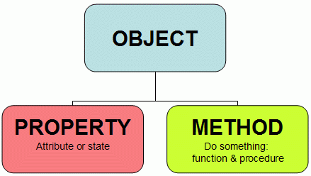
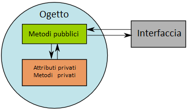
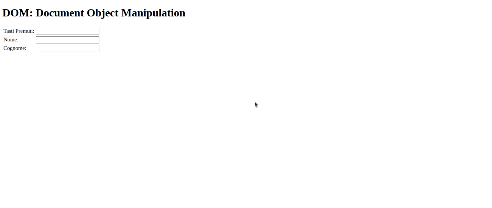

# Javascript OOP

- [Javascript OOP](#javascript-oop)
- [Lezione 01](#lezione-01)
  - [OOP Object Oriented Programming](#oop-object-oriented-programming)
- [Lezione 02](#lezione-02)
  - [Introduzione ai Metodi](#introduzione-ai-metodi)
- [Lezione 03](#lezione-03)
  - [Costruttore](#costruttore)
- [Lezione 04](#lezione-04)
  - [Ereditarietà](#ereditarietà)
- [Lezione 05](#lezione-05)
  - [Ereditarietà - Shadowing](#ereditarietà---shadowing)
  - [Ereditarietà classica](#ereditarietà-classica)
- [Lezione 06](#lezione-06)
  - [THIS](#this)
  - [Object - Variabili Statiche (condivise)](#object---variabili-statiche-condivise)
- [Lezione 07](#lezione-07)
  - [Introduzione For In](#introduzione-for-in)
  - [Oggetto Date()](#oggetto-date)
- [Lezione 08](#lezione-08)
  - [Classi](#classi)
- [Lezione 09](#lezione-09)
  - [Classi assegnanili a variabili](#classi-assegnanili-a-variabili)
  - [Get / Set](#get--set)
      - [try-catch](#try-catch)
- [Lezione 10](#lezione-10)
  - [Derivazione di classi , ereditarietà](#derivazione-di-classi--ereditarietà)
- [Lezione 11](#lezione-11)
  - [Ereditarietà classi Pt 2](#ereditarietà-classi-pt-2)
- [Lezione 12](#lezione-12)
  - [Approfondimento - Symbols](#approfondimento---symbols)
- [Lezione 13](#lezione-13)
  - [Approfondimento - Iterables/Iterator](#approfondimento---iterablesiterator)
  - [Costrutto for - of](#costrutto-for---of)
- [Lezione 14](#lezione-14)
  - [Approfondimento - Funzioni Generatrici](#approfondimento---funzioni-generatrici)
- [Lezione 15](#lezione-15)
  - [Approfondimento - Esempio (For .. of) custom](#approfondimento---esempio-for--of-custom)
- [Lezione 16](#lezione-16)
  - [Destructuring](#destructuring)
- [Lezione 17](#lezione-17)
  - [Map Object](#map-object)
  - [Iterazione Map Object](#iterazione-map-object)
- [Lezione 18](#lezione-18)
  - [Set](#set)
  - [Conversione di un Oggetto Map / Set in un Array](#conversione-di-un-oggetto-map--set-in-un-array)
- [Lezione 19](#lezione-19)
  - [Dom Manipulation](#dom-manipulation)
- [Lezione 20](#lezione-20)
  - [DOM - Selettori](#dom---selettori)
  - [Metodi di selezione di elementi html](#metodi-di-selezione-di-elementi-html)
- [Lezione 21](#lezione-21)
  - [Dom - Child e Parent](#dom---child-e-parent)
  - [DOM - Manipolazione dello stile degli elementi html](#dom---manipolazione-dello-stile-degli-elementi-html)
- [Lezione 22](#lezione-22)
  - [DOM - Manipolazione del testo degli elementi html](#dom---manipolazione-del-testo-degli-elementi-html)
  - [DOM - Manipolazione degli attributi html](#dom---manipolazione-degli-attributi-html)
- [Lezione 23](#lezione-23)
  - [DOM - Creazione di Un elemento](#dom---creazione-di-un-elemento)
  - [DOM - Rimpiazzo di un elemento](#dom---rimpiazzo-di-un-elemento)
  - [DOM - ELiminazione di un elemento](#dom---eliminazione-di-un-elemento)
- [Lezione 24](#lezione-24)
  - [DOM Events](#dom-events)
  - [Metodo addEventListener](#metodo-addeventlistener)
- [Lezione 25](#lezione-25)
  - [Prevent Default](#prevent-default)
    - [Che cos'è esattamente l'oggetto ricevuto come unico parametro "e"?](#che-cosè-esattamente-loggetto-ricevuto-come-unico-parametro-e)
- [Lezione 26](#lezione-26)
  - [Approfondimento type event](#approfondimento-type-event)
  - [Aprrofondimento eventi tastiera e input](#aprrofondimento-eventi-tastiera-e-input)
- [Lezione 27](#lezione-27)
  - [Argomeni non trattati / da approfondire](#argomeni-non-trattati--da-approfondire)
  - [Fonti](#fonti)

# Lezione 01

## OOP Object Oriented Programming

Si ricordi la frase di apertura di questo corso: <br>
*In informatica JavaScript è un linguaggio di programmazione orientato agli oggetti e agli eventi...* <br>

Ma che cos'è un linguaggio di programmazione orientato agli oggetti?

In informatica, la programmazione orientata agli oggetti (in inglese object-oriented programming, in acronimo OOP) è un paradigma di programmazione che permette di definire oggetti software in grado di interagire gli uni con gli altri attraverso lo scambio di messaggi. Particolarmente adatta nei contesti in cui si possono definire delle relazioni di interdipendenza tra i concetti da modellare (contenimento, uso, specializzazione), un ambito che più di altri riesce a sfruttare i vantaggi della programmazione ad oggetti è quello delle interfacce grafiche.

Tra gli altri vantaggi della programmazione orientata agli oggetti:

- essa fornisce un supporto naturale alla modellazione software degli oggetti del mondo reale o del modello astratto da riprodurre;
- permette una più facile gestione e manutenzione di progetti di grandi dimensioni;
l'organizzazione del codice sotto forma di classi favorisce la modularità e il riuso di codice.

*Fonte: https://it.wikipedia.org/wiki/Programmazione_orientata_agli_oggetti*





Ma non esiste solo il paradigma di programmazione orientato agli oggetti. Altri due paradigmi di programmazione sono il paradigma di *programmazione procedurale* e il paradigma di *programmazione imperativa*

**Programmazione Procedurale**

In informatica la programmazione procedurale è un paradigma di programmazione che consiste nel creare dei blocchi di codice sorgente, identificati da un nome e racchiusi da dei delimitatori, che variano a seconda del linguaggio di programmazione; questi sono detti anche sottoprogrammi (in inglese subroutine), procedure o funzioni, a seconda del linguaggio e dei loro ruoli all'interno del linguaggio stesso. Il nome deriva dal linguaggio COBOL, che è stato il primo ad utilizzare questo concetto.

Questi blocchi possono essere dotati di parametri, cioè variabili locali i cui valori vengono forniti o passati dall'esterno del blocco di codice ed eventualmente esportati; esistono due tipi di parametri: quelli di tipo valore e quelli di tipo variabile; nei primi viene passato un valore che, se modificato, non viene comunque salvato al termine del sottoprogramma; nel tipo variabile invece, viene comunicato l'indirizzo della cella di memoria (ad es.tramite un puntatore) al quale troviamo l'informazione, che può quindi essere modificata effettivamente e permanentemente. All'interno di un sottoprogramma possono essere generalmente definite o dichiarate delle variabili locali, che vengono deallocate al termine del sottoprogramma stesso; il loro contenuto viene quindi perso se non salvato o trasmesso altrimenti.

In Linguaggio C esiste solo la function, che può o meno restituire valori; lo stesso dicasi per il Java ed il PHP; i blocchi sono racchiusi tra parentesi graffe.

Questo tipo di paradigma è tipico per la programmazione di sistemi embedded.

*Fonte: https://it.wikipedia.org/wiki/Programmazione_procedurale*


**Programmazione imperativa**

In informatica, la programmazione imperativa è un paradigma di programmazione secondo cui un programma viene inteso come un insieme di istruzioni (dette anche direttive o comandi), ciascuna delle quali può essere pensata come un "ordine" che viene impartito alla macchina virtuale del linguaggio di programmazione utilizzato. Da un punto di vista sintattico, i costrutti di un linguaggio imperativo sono spesso identificati da verbi all'imperativo.

L'approccio imperativo è l'approccio dominante in programmazione. Nello studio dei linguaggi di programmazione, si definisce il concetto di paradigma di programmazione, ovvero un insieme di regole e strutture che definiscono un tipo di linguaggio basandosi esclusivamente sulle sue strutture, e quindi non sulle sue caratteristiche peculiari legate all'implementazione dello stesso (es. le parole chiave). Sono di tipo imperativo la grande maggioranza dei (sotto-)paradigmi di programmazione (per esempio la programmazione procedurale, la programmazione strutturata, la programmazione orientata agli oggetti e così via) e la grande maggioranza dei linguaggi (per esempio ALGOL, Ada, BASIC, Fortran, Pascal, PHP eccetera).

*Fonte: https://it.wikipedia.org/wiki/Programmazione_imperativa*

Javascript è un linguaggio di programmazione che si presta molto bene a tutti e tre i paradigmi. Adesso approfondiremo il paradigma di programmazione orientato agli oggetti concludendo con la definizione di *classe*

# Lezione 02

## Introduzione ai Metodi

Si ricordi che con Javascript è possibile definire delle funzioni assegnabili a variabili, è quindi possibile definire delle funzioni assegnabili a una property. In questo caso si parla di metodi

**Metodo:** Funzione applicabile a un oggetto. Non ha senso al di fuori del contesto dell'oggetto in cui è stata definita

```js

var persona = {
    nome: "Simone",
    dataDiNascita: 1995,
    sesso: "maschio",
    isMarried: false,
    famiglia: ["Anotinio", "Giovanni", "Alice"],
    calcolaEta: function(){
        return 2020 - this.dataDiNascita; 
    }
}

console.log(persona.calcolaEta()); //25
```

Nella definizione di un metodo (una funzione all'interno di un oggetto), *this* rappresenta l'oggetto stesso. E' quindi necessario per poter prelevare ed elaborare le property interne dell'oggetto che ricordiamo sono accessibili solo attraverso il nome dell'oggetto. Nella definizione di un metodo non posso accedere direttamente alle property senza invocare *this* l'interprete solleverebbere un'eccezione poichè non riconoscerebbe l'identificatore invocato.

```js
var persona = {
    nome: "Simone",
    dataDiNascita: 1995,
    sesso: "maschio",
    isMarried: false,
    famiglia: ["Anotinio", "Giovanni", "Alice"],
    calcolaEta: function(){
        return 2020 - dataDiNascita;
    }
}

console.log(persona.calcolaEta()); //dataDiNascita is not defined
```

**Nota:** la keyword `this` ha anche altri significati che dipendono dal contesto in cui è chiamato.

Posso invocare un metodo anche per definire una nuova proprietà dell'oggetto:

```js

const persona = {
    nome: "Simone",
    dataDiNascita: 1995,
    sesso: "maschio",
    isMarried: false,
    famiglia: ["Anotinio", "Giovanni", "Alice"],
    calcolaEta: function(){
        return 2020 - this.dataDiNascita;
    }
}

//Verrà aggiunta la property "eta" all'oggetto
persona.eta = persona.calcolaEta();

console.log(persona);
/*
Console:
---------------
{nome: "Simone", dataDiNascita: 1995, sesso: "maschio", isMarried: false, famiglia: Array(3), …}
calcolaEta: ƒ ()
dataDiNascita: 1995
eta: 25
famiglia: (3) ["Anotinio", "Giovanni", "Alice"]
isMarried: false
nome: "Simone"
sesso: "maschio"
__proto__: Object
*/
```

Vediamo un altro esempio:

```js
let libro = 
{
    titolo: "Fondazione",
    pagine: 571
}

let autorePreferito = 
{
    cognome: "Asimov",
    nome: "Isaac",
    
    // E' possibile definire una property tra gli apici doppi "nameProperty" 
    //in modo da forzare a valutarla come identificatore.
    //Infatti in questo caso il nome libro-preferito non sarebbe accettata come sintassi a causa del "-"
    //E' comunque da EVITARE
    "libro-preferito": 
    {
        titolo: "L`uomo del bicentenario",
        pagine: 288
    },
    
    //Riferimento all'oggetto "libro" esterno. Attenzione!
    //E' un riferimento non è una copia. Se modifico questa property di questo oggetto (autorePreferito)
    //modifico anche l'oggetto libro e viceversa.
    bestSeller: libro,

}

//Per accedere alla proprietà "libro-preferito" devo per necessariamente utilizzare la notazione con le []. La notazione ///con "." non può andare bene.
//Ecco perchè è necessario evitare questi nomi con caratteri non validi
cosnole.log(autorePreferito["libro-preferito"].pagine);
console.log(autorePreferito.bestSeller.titolo);

autorePreferito.bestSeller.pagine=1000;
console.log(libro.pagine); //1000, ATTENZIONE
```

Come abbiamo visto in questo esempio, specificando come property un altro oggetto, questo viene passato per riferimento e non viene fatta una copia. La libreria JQuery può aiutarci in questo.


```js
let libro = 
{
    titolo: "Fondazione",
    pagine: 571
}

let autorePreferito = 
{
    cognome: "Asimov",
    nome: "Isaac",
    
    //in questo caso sono necessari i doppi apici (o singoli) perchè scrivendo libro-preferito lo tratterebbe com espressione. E' comunque da EVITARE
    "libro-preferito": 
    {
        titolo: "L`uomo del bicentenario",
        pagine: 288
    },
    
    //in questo caso è JQuery che si occupa di restituire una copia dell'oggetto
    bestSeller: jQuery.extend(true, {}, libro)
}

console.log(autorePreferito["libro-preferito"].pagine); //288
console.log(autorePreferito.bestSeller.titolo); //Fondazione

autorePreferito.bestSeller.pagine=1000;
console.log(libro.pagine); //571
```

La funzione `jQuery.extend(true, {}, object)` effettua la copia ricorsiva di tutti elementi dell'oggetto specificato come terzo parametro. 

# Lezione 03

## Costruttore

Partendo dall'esempio della lezione precedente, riporto un esempio completo di come creare un nuovo oggetto partendo dal prototipo.

```html
<!DOCTYPE html>
<html lang="en">

<head>
    <meta charset="UTF-8">
    <meta name="viewport" content="width=device-width, initial-scale=1.0">
    <title>Document</title>
</head>

<body>

    <script type="text/javascript" src="jquery-3.5.1.min.js"></script>

    <script>
        let libro = 
        {
            titolo: "",
            pagine: 0
        }

        let autorePreferito = 
        {
            cognome: "",
            nome: "",
            
            libroPreferito: 
            {
                titolo: "",
                pagine: 0
            },
            
            //JQuery.extend() restituisce una copia dell'oggetto
            bestSeller: jQuery.extend(true, {}, libro)
        }

        console.log(autorePreferito.cognome);
        console.log(autorePreferito.nome);
        console.log(autorePreferito.libroPreferito.titolo);
        console.log(autorePreferito.libroPreferito.pagine);
        console.log(autorePreferito.bestSeller.titolo);
        console.log(autorePreferito.bestSeller.pagine);

        //Chiamata al costruttore
        libro = new LibroConstructor ("Il ritorno all'isola", 301);
        //Chiamata al costruttore
        autorePreferito = new Autore(
            "Isaac",
            "Asimov",
            "L`uomo del bicentenario",
            288,
            libro
        );

        //Modo alternativo
        /*
        autorePreferito = new Autore(
            "Isaac",
            "Asimov",
            "L`uomo del bicentenario",
            288,
            new LibroConstructor (
                "Il ritorno all'isola",
                301
            )
        );
        */

        //Funzione costruttore
        function Autore(cognome, nome, titolo, pagine, bestSeller)
        {
            //stato interno
            this.cognome = cognome;
            this.nome = nome;

            this.libroPreferito = {titolo,pagine}; //this.libroPreferito = {titolo: titolo,pagine: pagine};
            this.bestSeller = jQuery.extend(true, {}, bestSeller);

        }

        function LibroConstructor (titolo, pagine){
            this.titolo = titolo;
            this.pagine = pagine;
        }

        console.log(autorePreferito.cognome);
        console.log(autorePreferito.nome);
        console.log(autorePreferito.libroPreferito.titolo);
        console.log(autorePreferito.libroPreferito.pagine);
        console.log(autorePreferito.bestSeller.titolo);
        console.log(autorePreferito.bestSeller.pagine);
      
/*
""
""
""
0
""
0
Isaac
Asimov
L`uomo del bicentenario
288
Il ritorno all'isola
301
*/
    </script>
</body>
</html>
```

Il costruttore è una funzione che riceve come parametri i valori delle property e *costruisce* (ritorna) un oggetto. Notare l'uso del `new` necessario per l'invocazione del costruttore e del `this` ripetuto per ogni property necessario per stabilire il contesto dell'oggetto che viene creato dal costruttore.

Vediamo adesso l'aggiunta di metodi all'esempio di sopra:

```html
<!DOCTYPE html>
<html lang="en">

<head>
    <meta charset="UTF-8">
    <meta name="viewport" content="width=device-width, initial-scale=1.0">
    <title>Document</title>
</head>

<body>

    <script type="text/javascript" src="jquery-3.5.1.min.js"></script>

    <script>

        let libro = 
        {
            titolo: "",
            pagine: 0
        }

        function LibroConstructor (titolo, pagine){
            this.titolo = titolo;
            this.pagine = pagine;
        }

        let autorePreferito = 
        {
            cognome: "",
            nome: "",
            
            libroPreferito: 
            {
                titolo: "",
                pagine: 0
            },
            
            bestSeller: jQuery.extend(true, {}, libro)
        }


        function Autore(cognome, nome, titolo, pagine, bestSeller)
        {
            //stato interno
            this.cognome = cognome;
            this.nome = nome;

            this.libroPreferito = {titolo,pagine}; //this.libroPreferito = {titolo: titolo,pagine: pagine};
            this.bestSeller = jQuery.extend(true, {}, bestSeller);

            //metodi
            this.getSchedaBestSeller = function() { 
                let stringa = this.bestSeller.titolo + "\n" +
                              this.bestSeller.pagine;
                
                let stringaConCornicetta = 
               
                "*".repeat(10) + "\n" +
                "BestSeller" + "\n" +
                "-".repeat(10) + "\n" +
                stringa + "\n" +       
                "*".repeat(10);   
                
                return stringaConCornicetta; 
            }

            this.getSchedaAutore = function() { 
                let stringa = this.cognome + "\n" +
                              this.nome  + "\n" +
                              this.libroPreferito.titolo + "\n" +
                              this.libroPreferito.pagine;
                
                let stringaConCornicetta = 
                "*".repeat(10) + "\n" +
                "Scheda" + "\n" +
                "-".repeat(10) + "\n" +
                stringa + "\n" +       
                "*".repeat(10);   
                
                return stringaConCornicetta;
                    
            }

        }

        //Creo una collezione di oggetti, cioè un array di oggetti
        let schedario = [
            new Autore(
                "Runny",
                "Ted",
                "Lo sguardo del principe",
                212,
                new LibroConstructor(
                    "Il mio viaggio", 272)
                ),
                new Autore(
                "Buld",
                "Frank",
                "I segreti di tutti",
                302,
                new LibroConstructor(
                    "Il mio segreto", 180)
                )
        ];

        //Aggiungo in coda un nuovo oggetto
        schedario.push( 
            new Autore(
                "Tuy",
                "malek",
                "La voglia di te",
                167,
                new LibroConstructor(
                    "la voglia di niente", 134
                )
            )
        );

        //itero ogni elemento dell'array e chiamo i metodi
        for (let autore of schedario)
        {
            console.log( autore.getSchedaAutore() );
            console.log( autore.getSchedaBestSeller() );
        }

      
/*
**********
Scheda
----------
Runny
Ted
Lo sguardo del principe
212
**********
**********
BestSeller
----------
Il mio viaggio
272
**********
**********
Scheda
----------
Buld
Frank
I segreti di tutti
302
**********
**********
BestSeller
----------
Il mio segreto
180
**********
**********
Scheda
----------
Tuy
malek
La voglia di te
167
**********
**********
BestSeller
----------
la voglia di niente
134
**********
*/
    </script>
</body>
</html>
```

# Lezione 04

## Ereditarietà

JavaScript confonde un po' gli sviluppatori che hanno esperienza di linguaggi basati sulle classi (come Java o C++), poichè è un linguaggio dinamico e non fornisce un'implementazione di class (la keyword class è introdotto in ES2015, ma è zucchero sintattico, Javascript rimarrà basato sui prototipi).

In termini di ereditarietà, Javascript ha solo un costrutto: gli oggetti. Ogni oggetto ha un link interno ad un altro oggetto chiamato prototype. Questo oggetto prototype ha a sua volta un suo prototype, e così via finché si raggiunge un oggetto con property null. null, per definizione, non ha un prototype, ed agisce come link finale nella catena di prototipi.

Quasi tutti gli oggetti in Javascript sono istanze di Object, che risiede in cima alla catena dei prototipi.

Nonostante questo sia considerato spesso come una debolezza di Javascript, il modello di ereditarietà prototipale è invece più potente del modello classico. Per esempio, è banale costruire un classico modello sul modello prototipale, mentre il contrario è molto più difficile.


*Fonte: https://developer.mozilla.org/it/docs/Web/JavaScript/Inheritance_and_the_prototype_chain*


Supponiamo di aver creato un oggetto con certe proprietà e metodi e di voler creare un altro oggetto con le stesse propietà e gli stessi metodi ed altre proprietà/metodi speifiche.
Una soluzione, per quello che conosciamo adesso, si ha banalmente con un copia e incolla dell'oggetto modello (prototipo) aggiungendo poi le caratteristiche aggiuntive. Il concetto dell'ereditarietà evita questa procedura di copia incolla non solo perchè sarebbe una ripetizione ma anche, soprattutto, perchè gli errori con i copia e incolla diventano intracciabili. Se è stato individuato un errore nell'oggetto A, è necessario riportare tutte le modifiche anche negli altri oggetti di cui si è effettuata la copia manuale .. non è il massimo.
Per parlare di ereditarietà dobbiamo parlare di gerarchia padre/figlio. Un figlio è un oggetto che contiene tutte le caratteristiche del padre ovvero ne eredita le proprietà. Si parla anche di modello *is-a*

Immaginiamo di avere questo modello piramidale:

- Animali
  - Mammiferi
    - Cane
    - Gatto
    - Volpe

L'oggetto *Volpe* è un (is-a) *Mammifero*, un *Mammifero* è un (is-a) *Animale*.

Secondo questo modello è possibile costruire degli oggetti molto dettagliati semplicemente sfruttando le proprietà ereditate

Vediamo come si costruisce un oggetto con proprietà ereditate

```js
//persona è l'oggetto <padre>
let persona = { nome: ""};

//Creo l'oggetto fantozzi.
//fantozzi è un oggetto che ha come prototipo l'oggetto persona.
//fantozzi is-a persona
let fantozzi = Object.create( persona );

//persona e il prototipo di fantozzi sono la stesso oggetto
console.log(persona===Object.getPrototypeOf(fantozzi));  => true

//Per accedere in scrittura alle proprietà ereditate si utilizza il metodo getPrototypeOf()
//applicabile agli oggetti
Object.getPrototypeOf(fantozzi).nome = "Fantozzi";
//non avrei potuto scrivere direttamente "fantozzi.nome" perchè avrebbe creato una proprietà locale
//poichè <nome> non è una proprietà dell'oggetto "fantozzi" ma dell'oggetto "persona"
//e quindi una proprietà ereditata è necessario il metodo getPrototypeOf() per distinguere in scrittura
//le proprietà locali da quelle ereditate.

//In lettura, se non ci sono conflitti (vedremo più avanti), 
//non importa specificare getPrototypeOf() perchè il costrutto cerca prima tra le proprietà locali
//la proprietà <nome>, se non è presente la si cerca tra gli oggetti padre e quindi tra le property ereditate
//In questo caso non la troverà tra le proprietà locali ma tra quelle ereditate

console.log(fantozzi.nome); //Fantozzi

//In questo caso aggiungo una proprietà locale
fantozzi.nome = "il super sfigato";
//La proprità locale ha la precedenza. La proprietà locale maschera quella ereditata
//Shadowing
console.log(fantozzi.nome); //il super sfigato
//Per accedere in lettura alla proprietà <nome> ereditata devo necessariamente utilizzare il
//getPrototypeOf()
console.log(Object.getPrototypeOf(fantozzi).nome);
```

**ATTENZIONE!!**

Il metodo *create* non crea una copia.

```js
let fantozzi = Object.create( persona );
```

l'oggetto *fantozzi* non è una copia dell'oggetto *persona*. Il figlio (fantozzi) **condivide** le stesse property del padre(persona). Se modifico le property del figlio (fantozzi) le trovo modificate anche nell'oggetto padre (persona) proprio perchè condividono le stesse variabili, lo stesso spazio in memoria. Questo è da tenere in considerazione!

# Lezione 05

## Ereditarietà - Shadowing

Lo *shadowing* è un meccanismo di mascheramento/oscuramento di property ereditate con la definizione di property locali

Esempio

```js
    let persona = 
    { nome: "", 
      cognome:"", 
      
      Etichetta: 
         function() 
           //Stringhe template. Iniziano con $. Prima vengono valutate poi il valore viene sostituito e notare gli acccenti gravi
           { return `Egr. Sig. Lup. Mann. ${this.nome} ${this.cognome}`} 
    };

    //L'oggetto persona diventa il prototipo dell'oggetto fantozzi
    let fantozzi = Object.create( persona );

    //Metodo hasOwnProperty("property"): ritorna <true> se l'oggetto a cui si applica il metodo
    //ha come proprietà diretta (non ereditata) "property", quella indicata come parametro.
    console.log(fantozzi.hasOwnProperty("nome")); //false

    //In questo caso constrollo se "nome" appartiene al padre
    console.log(Object.getPrototypeOf(fantozzi).hasOwnProperty("nome")); //true

    cosnole.log(fantozzi.nome); //non ancora inizializzata ma la variabile viene trovata come proprietà ereditata

    //Accedo in scrittura alle proprietà ereditate
    Object.getPrototypeOf(fantozzi).nome = "Ugo";
    Object.getPrototypeOf(fantozzi).cognome = "Fantozzi";
    
    //Creo una proprietà locale
    fantozzi.nome = "e io chi sono??";

    //Accedo in lettura alla proprietà locale
    console.log(fantozzi.nome); //e io chi sono??
    //Accedo in lettura alla proprietà ereditata
    console.log(Object.getPrototypeOf(fantozzi).nome); //Ugo

    //Posso eliminare una property tramite il comando <delete> ma solo tra quelle locali
    delete fantozzi.nome;
    //A questo punto rimane solo la property <name> ereditata
    console.log(fantozzi.nome); //Ugo 

    //Shadowing: Meccanismo di mascheramento/oscuramento di property ereditate con la definizione di 
    //prperty locali

    //Chiamo il metodo Etichetta dell'oggetto fantozzi eredietato dall'oggetto persona
    console.log( "1: " + fantozzi.Etichetta() );

    //Oscuro il metodo <Etichetta> ereditato dal metodo <Etichetta> definito localmente -> shadowing
    fantozzi.Etichetta =
        function() {return "il sottoposto per eccellenza";}

    console.log("2: " + fantozzi.Etichetta());


    //Variante ...
    //Un po' complessa.
    //Definisco un metodo locale che utilizza il metodo ereditato.
    //il this fa riferimento all'oggetto in cui si definisce il metodo quindi "fantozzi"
    fantozzi.Etichetta =
    function() {return Object.getPrototypeOf(this).Etichetta() + 
    " detto il sottoposto";}

    console.log("3: " + fantozzi.Etichetta());

    //le proprietà del prototipo sono CONDIVISE. 
    //Se modifico una propietà in un figlio ereditata da una proprietà del padre,
    //la ritrovo modificata anche nel padre e negli altri figli del padre, cioè nei "fratelli"
    //Questo non è lo stesso meccanismo del C/C#/Java
    let filini = Object.create( persona );
    Object.getPrototypeOf(filini).cognome = "Filini";

    console.log(( "4: " + fantozzi.cognome );//Filini, ATTTT!!
```

Metodo `hasOwnProperty()`: ritorna <true> se l'oggetto a cui si applica il metodo ha come proprietà diretta (non ereditata) "property", quella indicata come parametro.

**Cosniderazione:** Il padre di tutti gli oggetti è proprio "Object"

**Ricorda:** Con il metodo `create()` non creo una copia dell'oggetto, cioè un'istanza del prototipo, ma instauro solo un rapporto di condivisione

## Ereditarietà classica

Per *ereditarietà classica* si intende il meccanismo con il quale Javascript permette la crazione di istanze di oggetti a partire da un prototipo. Nell'esempio vedremo come realizzare una copia dato un prototipo

Vediamo finalmente il metodo per creare una fottuta copia

```js
//Prototipo
function Persona(nome, cognome)
{    
  //stato interno
  //Ogni istanza avrà la sua copia di cognome e nome
  this.cognome = cognome; 
  this.nome = nome;    
 
  //ogni istanza avrà la sua copia di etichetta
  this.etichetta = function() 
    { return `Egr. Sig. Lup. Mann. ${this.nome} ${this.cognome}`} 
}

//chiamata al costruttore
let fantozzi = new Persona("Ugo", "Fantozzi");
let filini = new Persona("Renzo Silvio", "Filini")

//gli oggetti fantozzi e filini hanno le loro copie distinte
//delle variabili dello stato interno
console.log("1: " + fantozzi.etichetta());
cosnole.log("2: " + filini.etichetta());

cosnole.log`3: ${fantozzi.etichetta===filini.etichetta}`); //false
```

# Lezione 06

## THIS

In questi esempi cercheremo di capire la funzione di `this` in Javascript a seconda dei contesti.

```js
function Persona(nome, cognome)
{    
  //stato interno
  this.cognome = cognome; 
  this.nome = nome;    


console.log(this===window); //true

  this.etichetta = function() 
    { return `Egr. Sig. Lup. Mann. ${this.nome} ${this.cognome}`} 
}
//Attenzione, qua non utilizzo il costruttore.
//this punta all'oggetto <window> (cioè il padre del DOM).
//Il risultato è che le property <nome>, <cognme> diventano a tutti gli effetti variabili globali
//poichè <window> è un oggetto implicito
Persona("","zzzzzz"); 

//cognome è una variabile globale, window.cognome === cognome
console.log(cognome); //zzzzzz
```

Se invece utilizzo il costruttore dell'oggetto..

```js
function Persona(nome, cognome)
{     
  this.cognome = cognome; 
  this.nome = nome;    


console.log(this===window); //false

  this.etichetta = function() 
    { return `Egr. Sig. Lup. Mann. ${this.nome} ${this.cognome}`} 
}

//Utilizzo il costruttore per creare due istanze dell'oggetto "Persona", "fantozzi", "filini"
let fantozzi = new Persona("Ugo", "Fantozzi"); 
let filini = new Persona("Renzo Silvio", "Filini");

//Adesso le variabili (property) <nome>, <cognome> sono visibili solo nel contesto degli oggetti "fantozzi" e "filini"
//e accessibili solo tramite l'opertore "."
console.log(cognome); //cognome is not defined. 
console.log(fantozzi.cognome); //Fantozzi. 
console.log(filini.cognome); //Filini. 
```

Quando `this` è all'interno della definizione di un metodo, fa riferimento all'oggetto per cui si definisce il metodo.

**Nota:** Non posso definire una variabile locale "local_var" senza far uso di `this`. Non sarà disponibile nelle istanze degli oggetti ma solo nel constesto della chiamata funzione <Persona> e quindi non nel contesto della chiamata a costruttore. Vediamo un esempio

```js
function Persona(nome, cognome)
{    
 
  this.cognome = cognome; 
  this.nome = nome;    

  let local_var=999; //ATTENZIONE!! Non ha senso nel contesto di chiamata a costruttore

  //ogni istanza avrà la sua copia di etichetta
  this.etichetta = function() 
    { return `Egr. Sig. Lup. Mann. ${this.nome} ${this.cognome}`} 
}

let fantozzi = new Persona("Ugo", "Fantozzi"); 
let filini = new Persona("Renzo Silvio", "Filini");

console.log(fantozzi.local_var); //undefined
console.log(fantozzi.cognome); //Fantozzi. 
console.log(filini.cognome); //Filini. 
```

## Object - Variabili Statiche (condivise)

In generale, le variabili statiche sono variabili condivise. Nel contesto di un oggetto, per creare delle variabili statiche cioè condivise tra tutte le istanze si ottiene attraverso il metodo `prototype`


```js
function Persona(nome, cognome)
{    

  this.cognome = cognome;
  this.nome = nome;    

  this.etichetta = function() 
    { return `Egr. Sig. Lup. Mann. ${this.nome} ${this.cognome}`} 
}

let fantozzi = new Persona("Ugo", "Fantozzi"); 
let filini = new Persona("Renzo Silvio", "Filini");

//dichairo una variabile (property) "s", "ETA_MIN" statica cioè condivisa tra tutte le istanze create attravero il modello
//dell'oggetto "Persona"
Persona.prototype.s = "ciao";
Persona.prototype.ETA_MIN={value: 18} ;

console.log(fantozzi.s); //ciao
console.log(filini.s); //ciao
console.log(fantozzi.ETA_MIN); //{value: 18}
console.log(filini.ETA_MIN); //{value: 18}

//Posso dichiarare anche un metodo condiviso
Persona.prototype.etichettaCondivisa = function() 
    { return `Egr. Sig. Lup. Mann. ${this.nome} ${this.cognome}`} 

console.log(`3: ${fantozzi.etichetta===filini.etichetta}`); //false

console.log(`4: ${fantozzi.etichettaCondivisa===filini.etichettaCondivisa}`); //true
```

Vediamo un ultimo esempio:

```js
function Persona(nome, cognome)
{    
  this.cognome = cognome; 
  this.nome = nome;    

  this.etichetta = function() 
    { return `Egr. Sig. Lup. Mann. ${this.nome} ${this.cognome}`} 
}

let fantozzi = new Persona("Ugo", "Fantozzi"); 
let filini = new Persona("Renzo Silvio", "Filini");

Persona.prototype.s = "ciao";
console.log(fantozzi.s); //ciao
console.log(filini.s); //ciao

//Se voglio accedere in scrittura ad una property condivisa tramite un figlio, dobbiamo al solito modo
//utilizzare getPrototypeOf()
Object.getPrototypeOf(fantozzi).s = "amor";

console.log(fantozzi.s); //amor
console.log(filini.s); //amor

//Definisco una property locale a fantozzi
fantozzi.s = "mare";

console.log(fantozzi.s); //mare
console.log(filini.s); //amor
```

# Lezione 07

## Introduzione For In

*for-in* è un metodo utilizzato per iterare sulle property degli oggetti tramite l'identificativo delle chiavi.
Vedremo più avanti cosa sta dietro a un costrutto così semplice e potente

```js
for(const x in object){
    //code
}
```

```js
const Persona = {
    name: 'Simone',
    eta: 23,
    hobby: 'Tennis'
}

for (const x in Persona) {
    console.log('+++++++++++++++');
    console.log(x);          //Itero sulle chiavi
    console.log(typeof x);   //x è una stringa
    //non posso utilizzare Persona.x poichè x è una stringa.
    //Posso comunque utilizzare la notazione Persona[x] che in questo i torna comodo
    console.log(Persona[x]); //Itero sui valori
    console.log(Persona.x); //Itero sui valori
    console.log('+++++++++++++++');
}
/*
+++++++++++++++
name
string
Simone
+++++++++++++++
+++++++++++++++
eta
string
23
+++++++++++++++
+++++++++++++++
hobby
string
Tennis
+++++++++++++++
*/
```

## Oggetto Date()

Un oggetto interessante è l'oggetto `Date()`. Javascript permette di gestire in modo semplice il tempo, la data, l'ora acquisendo dati dalla rete.

```js
//Chiamata al costruttore Date() con parametri di default
let oggi = new Date();
console.log(oggi);
/*
Console:
---------------
Wed Nov 11 2020 17:13:04 GMT+0100 (Ora standard dell’Europa centrale)
*/

//Passaggio di parametri al costruttore Date()
let compleannoMio = new Date('07-22-1991-09:30:12'); 
//Modi alternativi
let compleannoMario = new Date('07/22/1991');
let compleannoGiovanni = new Date('July 22 1991');

console.log('compleannoMio: ' + compleannoMio);
console.log('compleannoMario: ' + compleannoMario);
console.log('compleannoGiovanni: ' + compleannoGiovanni);

/*
Console:
---------------
compleannoMio: Mon Jul 22 1991 09:30:12 GMT+0200 (Ora legale dell’Europa centrale)
compleannoMario: Mon Jul 22 1991 00:00:00 GMT+0200 (Ora legale dell’Europa centrale)
compleannoGiovanni: Mon Jul 22 1991 00:00:00 GMT+0200 (Ora legale dell’Europa centrale)
*/
```

Essendo `Date()` un oggetto ci sono diversi metodi `get` associati a questo oggetto come:

- `getFullYear()` : Ritorna l'anno
- `getMonth()` : Ritorna il mese a partire da 0, 0 = GEN, 1 = FEB
- `getDate()` : Ritorna il giorno del mese corrente, range [1 - 31]
- `getDay()` : Ritorna il giorno della settimana a partire da 0, 0 = DOM, 1 = LUN
- `getHours()` : Ritornano le ore
- `getMinutes()` : Ritornano i minuti
- `getSeconds()` : Ritornano i secondi
- `getMilliseconds()` : Ritornano i millisecondi
- `getTime()` : he getTime() method returns the number of milliseconds between midnight of January 1, 1970 and the specified date
- ...

Ma anche metodi analoghi di `set` come:
- `setFullYear(year)`
- `setMonth(month)`
- `setHours(h, m, s)`
- ..

```js
//Metodi get
let myData = new Date();

console.log('getFullYear: ' + myData.getFullYear());
console.log('getMonth: ' + myData.getMonth());
console.log('getDate: ' + myData.getDate());
console.log('getDay: ' + myData.getDay());
console.log('getHours: ' + myData.getHours());
console.log('getMinutes: ' + myData.getMinutes());
console.log('getSeconds: ' + myData.getSeconds());
console.log('getMilliseconds: ' + myData.getMilliseconds());
console.log('getTime: ' + myData.getTime());

/*
Console:
---------------
getFullYear: 2020
getMonth: 10
getDate: 12
getDay: 4
getHours: 10
getMinutes: 27
getSeconds: 50
getMilliseconds: 336
getTime: 1605173270336
*/

//Metodi set
let compleannoMario = new Date('April 02 2002');
console.log('compleannoMario: ' + compleannoMario);
/*
Console:
---------------
compleannoMario: Tue Apr 02 2002 00:00:00 GMT+0200 (Ora legale dell’Europa centrale)
*/

compleannoMario.setFullYear('1991');
compleannoMario.setMonth(9);
compleannoMario.setHours(12, 45, 09);

console.log('compleannoMario: ' + compleannoMario);

/*
Console:
---------------
compleannoMario: Wed Oct 02 1991 12:45:09 GMT+0100 (Ora standard dell’Europa centrale)
*/
```

**Nota:** Se creto un'istanza dell'oggetto `Date()` senza parametri, verrà invocato il costruttore con parametri di default. Di default `Date()` restituisce l'ora e la data locale fornita dalla rete. Quindi l'oggetto appena creato farà riferimento all'ora corrente, un dato dinamico.

# Lezione 08

## Classi

Le classi JavaScript, introdotte in ECMAScript 2015, sono principalmente zucchero sintattico sull'esistente ereditarietà prototipale di JavaScript. La sintassi non introduce un nuovo modello di eredità orientata agli oggetti in JavaScript.

Le classi sono di fatto delle "funzioni speciali", e così come puoi definire function expressions e function declarations, la sintassi per la classe ha due componenti: class expressions e class declarations.

Non è lo stesso concetto di classe definita come ad esempio per il linguaggio C++. 

```js
class Persona 
{

}

let Fantozzi = new Persona();
cosnole.log(typeof(Fantozzi)); //Object
//Dietro il meccanismo di classe c'è di fatto il concetto di prototipo/funzione 
cosnole.log(typeof(Persona));  //function
```

Vediamo un esempio più completo

```js
class Persona 
{
   //utilizzo parametri di default
   constructor(cognome="sconosciuto", nome="sconosciuto")
   {
      this.cognome = cognome;
      this.nome = nome; 
   }
}

//non passo nessun parametro quindi utilizzerà i valori di default
let Fantozzi = new Persona();
cosnole.log(Fantozzi.nome); //sconosciuto
```

**Note:**
- Con questa definizione di classe non esiste tuttavia un meccanismo che possa rendere *privati* i dati come nel concetto di classe che si avrebbe nel c++.
- Non è possibile un meccanismo di *overload dei costruttori*, non possono quindi coesistere più costruttori. E' ammesso  un solo costruttore per classe.

Tuttavia ogni istanza creata avrà i dati separati


```js
class Persona 
{
   //utilizzo parametri di default
   constructor(cognome="sconosciuto", nome="sconosciuto")
   {
      this.cognome = cognome;
      this.nome = nome; 
   }
}

//non passo nessun parametro quindi utilizzerà i valori di default
let Fantozzi = new Persona();
console.log(Fantozzi.nome); //sconosciuto

let Fantozzi = new Persona("Fantozzi", "Ugo");
console.log(Fantozzi.nome); //Ugo

let Filini = new Persona("Filini", "Silvio");
console.log(Filini.nome);   //Silvio
console.log(Fantozzi.nome); //Ugo
```

Ampliamo la classe con l'aggiunta di metodi:

```js
class Persona 
{
   //utilizzo parametri di default
   constructor(cognome="sconosciuto", nome="sconosciuto")
   {
      this.cognome = cognome;
      this.nome = nome; 
   }
   etichetta()
   {
     return `Egr. Sig. ${this.nome} ${this.cognome}`;
   }
}

let Fantozzi = new Persona("Fantozzi", "Ugo");
let Filini = new Persona("Filini", "Silvio");

cosnole.log(Fantozzi.etichetta );
cosnole.log(Filini.Etichetta );
cosnole.log(Fantozzi.etichetta===Filini.Etichetta); //false
```

Aggiunta di metodi condivisi

```js
class Persona 
{
   //utilizzo parametri di default
   constructor(cognome="sconosciuto", nome="sconosciuto")
   {
      this.cognome = cognome;
      this.nome = nome; 
   }
   //metodo condiviso tra tutte le istanze
   static etichetta()
   {
     return `Egr. Sig. ${this.nome} ${this.cognome}`;
   }
   //metodo separato per ogni istanza
   etichetta()
   {
     return `Egr. Sig. ${this.nome} ${this.cognome}`;
   }
}

let Fantozzi = new Persona("Fantozzi", "Ugo");
let Filini = new Persona("Filini", "Silvio");

//Assegno dei "value" alle property della classe
Persona.cognome = "Liberti"; 
Persona.nome = "Franco";

//il metodo Filini.etichetta è il metodo locale alla classe Filini.
//Prende il nome di  "Metodo di istanza"
console.log("Metodo di istanza: " + Filini.etichetta() ); //Metodo di istanza: Egr. Sig. Silvio Filini
//il metodo Persona.etichetta è il metodo condiviso tra tutte le istanze della classe Persona.
//Prende il nome di "Metodo di classe"
console.log("Metodo di classe: " + Persona.etichetta() ); //Metodo di classe: Egr. Sig. Franco Liberti
```

Vediamo un esempio in cui posso sfruttare le variabili statiche.
In questo esempio, ogni volta che creo un'istanza della classe Persona, incremento una variabile statica che indicherà alla fine quante istanze ho creato

```js
class Persona 
{

   constructor(cognome="sconosciuto", nome="sconosciuto")
   {
      this.cognome = cognome;
      this.nome = nome; 
      //ogni volta che creo un'istanza della classe Persoan, si icrementa la variabile "conta"
      //Nota <conta> è stata aggiunta dopo la creazione della classe Persona
      Persona.conta ++;
   }
   
   static personeCreate()
   { return Persona.conta;}

   etichetta()
   {
     return `Egr. Sig. ${this.nome} ${this.cognome}`;
   }
}

//Resetto il conteggio
Persona.conta = 0;

let Fantozzi = new Persona("Fantozzi", "Ugo");
let Filini = new Persona("Filini", "Silvio");

console.log(Persona.conta); //2
console.log(Persona.personeCreate() ); //2
```

# Lezione 09

## Classi assegnanili a variabili

Posso assegnare una classe ad una variabile esattamente come per gli oggetti, le funzioni..

```js
//questa è una classe anonima
let Punto = class {
  constructor(x,y)
  {this.x =x; this.y=y;}
}

let p = new Punto(10,-30);
console.log(p.y); //-30

p.x = "paperino"; //non viene fatto nessun controllo semantico
console.log(p.x); //paperino
```

## Get / Set

Non c'è un modo di definire x e y private con un meccanismo simile alle property *private* per le classi definite dal linguaggio C++ tuttavia esiste un sistema che ci aiuta a nascondere le variabili interne, *get/set*.

```js
//PuntoIQ è una classe che assegna punti solo nel primo quadrante
class PuntoIQ {
    constructor(x,y)
    {
        if (x<0 || y<0){
            throw "Non nel primo quadrante";
        }
        this._x = x;
        this._y = y;
    }
}

try {
    //poichè questo punto non appartiene al primo quadrante si verifica l'eccezione e salta al catch
    let p = new PuntoIQ(10,-30);
}
catch (eccezione)
{
    console.log(eccezione);
}
```

#### try-catch
Nota il sistema `try-catch`. Con tale sistema è possibile tentare l'esecuzione del codice presente nel corpo di `try`. Se *va a buon fine* si prosegue altrimenti si esegue il corpo del `catch`.

Per stabilire se il codice presente nel `try` va o meno a buon fine si utilizza la keyword `throw`. Nella classe **PuntoIQ** infatti se i dati passati al costruttore sono minori di zero si passa un'eccezione attravero `throw`, l'eccezione in questo caso è semplicemente la stringa `"Non nel primo quadrante"` che viene passata al `catch`

```js
try{
    //prova ad eseguire il codice. Se il codice presenta un'eccezione salta al catch
}
catch (eccezione){
    //esegui eccezione
}
```

Riprendiamo con il concetto di *get/set*

```js
//punto appartenente al primo quadrante
class PuntoIQ {
    constructor(x,y)
    {
        if (x<0 || y<0){
            throw "Non nel primo quadrante";
        }
        //Per accedere a questa proprietà devo usare "_x", 
        //è di fatto un sistema di costrizione dell'utilizzatore della classe a NON usare questa property
        this._x = x; 
        //Per accedere a questa proprietà devo usare "_y", 
        //è di fatto un sistema di costrizione dell'utilizzatore della classe a NON usare questa property
        this._y = y;
    }

    //Le keyword "get" definisce di fatto un metodo che può essere richiamato con la nomenclatura 
    //utilizzata per le proprietà. Posso quindi richiamare il metodo x tramite <punto.x>
    //get definisce un metodo di lettura quindi posso leggere la property "x"
    //nascondendo la "vera" property definita sopra tramite "_x"
    get x() {
        return this._x;
    }
    //Le keyword "set" definisce come "get un metodo che può essere richiamato con la nomenclatura 
    //utilizzata per le proprietà. Posso quindi richiamare il metodo x tramite <punto.x>
    //get definisce un metodo di scrittura quidni posso scrivere la property "x"
    //nascondendo la "vera" property definita sopra "_x"
    set x(valore) {
        this._x = valore;
    }
}

try {
    var p = new PuntoIQ(10,30); //Ok 
}
catch (eccezione)
{
    console.log(eccezione);
}

console.log(p); //PuntoIQ {_x: 10, _y: 30}

try {
    p.x = 56; // === p._x = 56 
}
catch (eccezione)
{
    console.log(eccezione);
}

console.log(p); //PuntoIQ {_x: 56, _y: 30}

try {
    p._x = 12; // L'utilizzatore della classe sta bypassando il metodo "ufficiale" tramite get/set
}
catch (eccezione)
{
    console.log(eccezione);
}

console.log(p); //PuntoIQ {_x: 12, _y: 30}
```

Passare attravero *get/set* è utile per poter eseguire controlli avanzati e restituire un errore in caso di fallimento. Vediamo di estendere la classe di sopra aggiungendo un controllo in fase di *set*

```js
//punto appartenente al primo quadrante
class PuntoIQ {
    constructor(x,y)
    {
        if (x<0 || y<0){
            throw "Non nel primo quadrante";
        }
        this._x = x; 
        this._y = y;
    }

    get x() {
        return this._x;
    }
    set x(valore) {
        if ( typeof(valore) === "boolean" || isNaN(valore) ){
            throw "Non è un numero";
        }
        if(valore<0){
            throw "Non nel primo quadrante";
        }
        this._x = valore;
    }
}

try {
    var p = new PuntoIQ(10,30); //Ok 
}
catch (eccezione)
{
  console.log(eccezione); 
}

console.log(p); //PuntoIQ {_x: 10, _y: 30}

try {
    p.x = "dodici"; // === p._x = 56 
}
catch (eccezione)
{
  console.log(eccezione);
}

console.log(p); //Non è un numero
```

# Lezione 10

## Derivazione di classi , ereditarietà

Il meccanismo di derivazione delle classi ovvero la costruzione di una classe figlia a partire da una classe padre aggiungendo una specializzazione è noto anche come meccanismo di ereditarietà e si ottiene semplicemente la keyword `extends`. Abbiamo già visto come è implementato questo concetto negli oggetti in Javascript. Per quanto riguarda le classi si ricordi che è solo "zucchero sintattico" quindi il meccanismo sotto sarà il medesimo.

```js
//punto appartenente al primo quadrante
class PuntoIQ {
    constructor(x,y)
    {
        if (x<0 || y<0){
            throw "Non nel primo quadrante";
        } 
        this._x =x;
        this._y=y;
    }

    get x() {
        return this._x;
    }

    set x(valore) {
        if ( typeof(valore) === "boolean" || isNaN(valore) ){
            throw "Non è un numero";
        }
        if(valore<0){
            throw "Non nel primo quadrante";
        }
        
        this._x = valore;
    }

    get y() {
        return this._y;
    }

}
 
class PuntoIQColorato extends PuntoIQ
{
  
}  
```

La lasse "PuntoIQColorato" è derivata dalla classe madre PuntoIQ ma accede a a tutte le strutture interne della classe madre.

Vediamo di estendere la classe definita sopra con altri metodi:

```js
//punto appartenente al primo quadrante
class PuntoIQ {
    constructor(x,y)
    {
        if (x<0 || y<0){
            throw "Non nel primo quadrante";
        }
        this._x =x;
        this._y=y;
    }

    get x() {
        return this._x;
    }

    set x(valore) {
        if (typeof(valore) === "boolean" || isNaN(valore)){
            throw "Non è un numero";
        }
        if (valore < 0){
            throw "Non nel primo quadrante";
        }
        this._x = valore;
    }
        
    get y() {
        return this._y;
    }

    //"distanza(altro)", applicato a un oggetto A <PuntoIQ> calcola la distanza tra 
    //l'oggetto a cui si applica il metodo (oggetto A) e un altro oggetto ricevuto come argomento
    //<altro> che dovrà essere un oggetto della classe <PuntoIQ>
    distanza(altro){
        //"A instanceof B" ritorna true se A è un'istanza di B
        //Viene quindi fatto un controllo per essere sicuri di aver ricevuto un oggetto compatibile
        if (altro instanceof PuntoIQ){
            //formula distanza tra due punti  
            return (
                Math.sqrt
                ( 
                    Math.pow(this.x - altro.x, 2) +
                    Math.pow(this.y - altro.y, 2)
                )
            );
        }
        else {
            throw 
                "Il parametro attuale  `altro` non è un punto";  
        }    
    }
}
 
class PuntoIQColorato extends PuntoIQ
{
  
}

let p1 = new PuntoIQ(5,5);
let p2 = new PuntoIQ(10,10);

cosnole.log(p1.distanza(p2 ) ); //7.07...

//un oggetto della classe <PuntoIQColorato> è identico a un oggetto della classe <PuntoIQ>
let pc = new PuntoIQColorato(100,100);
console.log("Punto Colorato: " + pc.x);

//La classe figlia PuntoIQColorato passa il controllo if (altro instanceof PuntoIQ) Poichè è figlia
//di PuntoIQ
cosnole.log(pc.distanza(p2) );
```

Nella prossima lezione aggiungeremo elementi specifici della classe *PuntoIQColorato*

# Lezione 11

## Ereditarietà classi Pt 2

In questo esempio vedremo aggiungeremo elementi specifici della classe *PuntoIQColorato*. Utilizzeremo anche il comando `super`. Un comando usato nella classe figlia per richiamare il costruttore della classe madre

```js
//punto appartenente al primo quadrante
class PuntoIQ {
    constructor(x,y)
    {
        if (x<0 || y<0){
            throw "Non nel primo quadrante";
        }
        this._x =x;
        this._y=y;
    }

    get x() {
        return this._x;
    }

    set x(valore) {
        if (typeof(valore) === "boolean" || isNaN(valore)){
            throw "Non è un numero";
        }
        if (valore < 0){
            throw "Non nel primo quadrante";
        }
        this._x = valore;
    }
        
    get y() {
        return this._y;
    }

    //"distanza(altro)", applicato a un oggetto A <PuntoIQ> calcola la distanza tra 
    //l'oggetto a cui si applica il metodo (oggetto A) e un altro oggetto ricevuto come argomento
    //<altro> che dovrà essere un oggetto della classe <PuntoIQ>
    distanza(altro){
        //"A instanceof B" ritorna true se A è un'istanza di B
        //Viene quindi fatto un controllo per essere sicuri di aver ricevuto un oggetto compatibile
        if (altro instanceof PuntoIQ){
            //formula distanza tra due punti  
            return (
                Math.sqrt
                ( 
                    Math.pow(this.x - altro.x, 2) +
                    Math.pow(this.y - altro.y, 2)
                )
            );
        }
        else {
            throw "Il parametro attuale  `altro` non è un punto";  
        }    
    }
}

class PuntoIQColorato extends PuntoIQ
{
    constructor (x, y, colore){
        //super richiama il costruttore della classe madre
        //super deve essere sempre il primo statemeant
        super(x, y);

        this._colore = colore;

        //Potrei accedere ai dati interni della classe madre PuntoIQ tramite ad esempio
        //this._x = 999; 
        //E' ASSOLUTAMENTE DA EVITARE PERCHE' BYPASSO TUTTI I CONTROLLI SU "x" 
    }

    get colore (){
        return this._colore;
    }

    //Shadowing.
    //Il metodo "distanza" definito qua è locale alla classe <PuntoIQColorato> e oscura il metodo ereditato
    //dalla classe <PuntoIQ>
    distanza( altro ){
        return 1000;
    }
}

let p1 = new PuntoIQ(5,5);
let p2 = new PuntoIQ(10,10);
console.log(p1.distanza(p2 ) ); //7.0...

let pc = new PuntoIQColorato(100,100, "blue"); 
console.log("Punto Colorato: " + pc.x, pc.y, pc.colore); //Punto Colorato: 100 100 blue
//Poichè il metodo "distanza" è applicato a <pc> che è un <PuntoIQColorato> verrà applicato il metodo locale
console.log(pc.distanza(p2) ); //1000
```

**Attenzione:** E' buona norma mettere il comando `super` come primo comando nel costruttore della classe figlia per poter permettere al costrutto di creare le caratteristiche ereditate correttamente

Metodi locali ed ereditati possono coesistere e collaborare. Con `super` posso richiamare il metodo della classe madre all'interno della classe figlia

```js
//punto appartenente al primo quadrante
class PuntoIQ {
    constructor(x,y)
    {
        if (x<0 || y<0){
            throw "Non nel primo quadrante";
        }
        this._x =x;
        this._y=y;
    }

    get x() {
        return this._x;
    }

    set x(valore) {
        if (typeof(valore) === "boolean" || isNaN(valore)){
            throw "Non è un numero";
        }
        if (valore < 0){
            throw "Non nel primo quadrante";
        }
        this._x = valore;
    }
        
    get y() {
        return this._y;
    }

    //"distanza(altro)", applicato a un oggetto A <PuntoIQ> calcola la distanza tra 
    //l'oggetto a cui si applica il metodo (oggetto A) e un altro oggetto ricevuto come argomento
    //<altro> che dovrà essere un oggetto della classe <PuntoIQ>
    distanza(altro){
        //"A instanceof B" ritorna true se A è un'istanza di B
        //Viene quindi fatto un controllo per essere sicuri di aver ricevuto un oggetto compatibile
        if (altro instanceof PuntoIQ){
            //formula distanza tra due punti  
            return (
                Math.sqrt
                ( 
                    Math.pow(this.x - altro.x, 2) +
                    Math.pow(this.y - altro.y, 2)
                )
            );
        }
        else {
            throw "Il parametro attuale  `altro` non è un punto";  
        }    
    }
}

class PuntoIQColorato extends PuntoIQ
{
    constructor (x, y, colore){
        //super deve essere sempre il primo statemeant
        super(x, y);
        this._colore = colore;
    }

    get colore (){
        return this._colore;
    }
    //Shadowing.
    distanza( altro ){
        //richiamo il metodo "distanza" della classe madre
        return super.distanza(altro) + 1000;
    }
}

let p1 = new PuntoIQ(5,5);
let p2 = new PuntoIQ(10,10);
console.log(p1.distanza(p2 ) ); //7.0...

let pc = new PuntoIQColorato(100,100, "blue"); 
console.log("Punto Colorato: " + pc.x, pc.y, pc.colore); //Punto Colorato: 100 100 blue
console.log(pc.distanza(p2) ); //1127.2792206135787
```

# Lezione 12 

## Approfondimento - Symbols

Ogni valore symbol restituito da Symbol() è unico.  Un valore symbol può essere utilizzato come identificatore per proprietà di un oggetto; questo è lo scopo di tale tipo di dati. 

Il tipo di dati symbol è un primitive data type.

*Fonte: https://developer.mozilla.org/it/docs/Web/JavaScript/Reference/Global_Objects/Symbol*

```js
//Il simbolo è un nuovo tipo che permette di creare valori univoci
//Nell'esempio creo due variabili di tipo Symbol(). 
//I loro valori (che non possiamo stampare) saranno sicuramente diversi
let un_simbolo = Symbol();
let un_altro_simbolo = Symbol();

//Posso agire per confronti ma non stampare direttamente i simboli
console.log(un_simbolo === un_altro_simbolo); //false, sempre
console.log(un_simbolo); //ERROR
```

**GUID:** <br>
Il GUID (Globally Unique Identifier, identificatore unico globale) è un numero pseudo-casuale usato nella programmazione software, per poter distinguere vari oggetti. Il tipo più noto di GUID è l'utilizzo di Microsoft dell'UUID, ideato dalla Open Software Foundation, ma vi sono anche altri usi, come quello all'interno di XML.

*Fonte: https://it.wikipedia.org/wiki/GUID*

Vediamo l'utilizzo di un `Symbol` come identificatore di una proprietà di un oggetto

```js
let oggetto = {
  colore: "giallo",
  peso: 21,

}

//creo un nuovo simbolo
let check = Symbol();
//aggiungo la property "check" è un valore "OK"
oggetto[check] = "OK";
console.log(oggetto[check]); //OK
```

La property aggiunta con `Symbol` è nascosta..

```js
let oggetto =
{
    colore: "giallo",
    peso: 21,

    scheda: function () {
        let s = "";
        //Si traduce in: per ogni property presente in questo oggetto..
        //Itera sulle property tranne su "scheda"
        //E le concatena in una stringa s = "colore peso"
        for (x in this){
            if (x!=="scheda"){
                s += x + " ";
            }
        }
        return s;
    }
}

//Posso assegnare un'etichetta al Symbol
let check = Symbol("il check");
oggetto[check] = "OK";

console.log(oggetto[check]);

//Una property aggiunta con Symbol è nascosta.
//Utilizzo il metodo "scheda" per stampare tutte le property. 
//Vedremo che la property "check" non apparirà
console.log(oggetto.scheda() ); //colore peso

//Notare la differenza con la seguente propery aggiunta localmente
//check2 è una proprietà locale e visibile
oggetto.check2 = "YES";
console.log(oggetto.scheda() ); //colore peso check2
```

Posso generare un metodo attraverso `Symbol`

```js
let report = Symbol();
let oggetto2 = {
    prodotto: "xyz",
    //genero il metodo con il simbolo
    [report]() {return this.prodotto;}

}

console.log(oggetto2[report]()); //xyz
```

Posso aggiungere il metodo a posteriori

```js
let report = Symbol();
let oggetto2 = {
    prodotto: "xyz",
    [report]() {return this.prodotto;}

}
//Assegno al metodo un nuovo valore
oggetto2[report] = function () { return "Controllo effettuato!";}
console.log(oggetto2[report]()); //Controllo effettuato!
```

# Lezione 13

## Approfondimento - Iterables/Iterator

Un oggetto è un **iterator** quando sa come accedere agli elementi di una collezione uno per volta, conservando l'informazione sulla sua posizione corrente nella sequenza. In Javascript un iterator è un oggetto che implementa il metodo `next()` , il quale ritorna l'elemento successivo della sequenza. Questo metodo ritorna un oggetto con due proprietà: `done` e `value`.

Una volta che è stato creato, un **iterator** può essere utlizzato esplicitamente chiamando più volte il metodo `next()`.

*Fonte: https://developer.mozilla.org/it/docs/Web/JavaScript/Guida/Iteratori_e_generatori*

## Costrutto for - of

Il costrutto `for...of` crea un ciclo con gli oggetti iterabili (inclusi Array, Map, Set, String, TypedArray, argomenti di oggetti e così via), iterando le istruzioni per ogni valore di ogni proprietà.

```js
for (elem of collection) {/*CODE*/};
```

Vediamo un esempio:

```js
let s="ciao";

//ciclo tradizionale
//for (let i=0; i<s.length; i++) console.log(s[i]);

//ciclo che sfrutta un iteratore e il for ... of
for (carattere of s) console.log(carattere);
```

Dietro il meccanismo di un costrutto così potente c'è il concetto di *Iterables/Iterator* e `Symbol`.
Se un oggetto è iterabile avrà un iteratore. A tale iteratore è applicabile il metodo `next()` che restituisce l'elemento successivo della lista degli elementi. Tale elemento è un oggetto con due property: *done* e *value*. La property *done* è un boolean che indica se siamo arrivati in fondo alla lista degli elementi iterabili mentre la property *value* restituisce il valore dell'elemento

```js
let s="ciao";

for (carattere of s) console.log(carattere);

let iteratore = s[Symbol.iterator]();
cosnole.log(typeof(s[Symbol.iterator]) ); //function
cosnole.log(typeof(iteratore) );          //Object. Questo è l'oggetto iteratore  

//l'iteratore è un oggetto formato da due sotto elementi
//done  -> restituisce true se è l'ultimo elemento della lista
//value -> rappresenta il valore dell'elemento estratto
let elemento = iteratore.next();
console.log(elemento.done); //false
console.log(elemento.value); //c, la prima lettera di "ciao"

//Se continuiamo con next(), passo all'elemento successivo..
elemento = iteratore.next();
console.log(elemento.done); //false
console.log(elemento.value); //i

elemento = iteratore.next();
console.log(elemento.done); //false
console.log(elemento.value); //a

elemento = iteratore.next();
console.log(elemento.done); //false
console.log(elemento.value); //o

elemento = iteratore.next();
console.log(elemento.done); //true
console.log(elemento.value); //undefined
```

# Lezione 14

## Approfondimento - Funzioni Generatrici

I generatori sono funzioni  dalle quali è possibile uscire e poi rientrarvi in un secondo momento. Il loro contesto (binding delle variabili) verrà salvato all'uscita per quando vi entrerà successivamente.

La chiamata ad un generatore non viene eseguita immediatamente; la funzione ritornerà invece un oggetto *iterator*. Quando il metodo `next()` dell'iteratore viene chiamato, il corpo del generatore viene eseguito fino alla prima espressione `yield`, la quale specifica quale espressione ritornare dall'iteratore oppure, con l'espressione *yield*, delegare questo valore ad un'altra funzione generatrice. Il metodo `next()` restituisce un oggetto con proprietà `value` contenente il valore da restituito all'iteratore ed una proprietà `done` che contiene un valore di tipo boolean per indicare se il generatore ha restituito l'ultimo valore. Chiamando il metodo `next()` con un argomento farà riprendere l'esecuzione della funzione generatrice, sostituendo l'istruzione yield in cui l'esecuzione era stata fermata con l'argomento della funzione `next()`. 

*Fonte: https://developer.mozilla.org/it/docs/Web/JavaScript/Reference/Statements/function*

```js
function  * generatrice()
{
    //la prima volta è in attesa ...
    //che venga chiamato il metodo next() sull'oggetto restituito
    let n=10;
    console.log(n);

    yield; //genera

    n+=1;
    console.log(n);           
}

let obj = generatrice(); //non succede niente. Siamo in attesa di invocare next()
obj.next(); //10, si ferma a yield e ritorna ma lo stato dei dati è memorizzato
obj.next(); //11
obj.next(); //
```

Vediamo un esempio più interessante:

```js
function  * generatrice()
{
    let n=0;
    
    while(true){
        n++;
        console.log(n);
        yield;
    }
}

let obj = generatrice();
obj.next(); //1
obj.next(); //2
obj.next(); //3
```

`yield` è il "ritorno" della funzione generatrice e restituisce un oggetto *iterator*, un oggetto formato quindi da due property `value` e `done`

```js
function  * generatrice()
{
    let n=0;
    
    while(true){
        n++;
        yield n;
    }
}


let obj = generatrice();
console.log(obj.next().value); //1
console.log(obj.next().value); //2
console.log(obj.next().value); //3
```

# Lezione 15

## Approfondimento - Esempio (For .. of) custom

Dopo l'introduzione di *Iterator/Iterables* e di *funzioni generatrici* è possibile costruire per una classe personale un metodo *(for..of)* personalizzabile

```js
class miaCollezione
{
    //la classe contiene un array
    constructor () 
    {
        this.items = [];
    }
    //posso aggiungere valori tramite il metodo "add"
    add(value)
    {
        this.items.push(value)
    }

    //questo definisce un metodo per il for - of
    * [Symbol.iterator] ()
    {
        for (let key in this.items)
        {
            //Se la lunghezza dell'array è maggiore di 4, restituisce l'array
            if(this.items[key].length>4 )
                yield this.items[key];
        }
    }
}


let o = new miaCollezione();
o.add("rossi");
o.add("Bob");
o.add("Gialli");

//L'elemento Bob non verrà stampato perchè ha 3 elementi
for (x of o) { console.log(x); } 
/*
rossi
Gialli
*/
```

Posso aggiungere anche aggiungere una funzione generatrice come metodo per iterare sugli elementi sfruttando il costrutto `while` e come terminatore del ciclo la property `done`

```js
class miaCollezione
{
    //la classe contiene in realtà un array
    constructor () {
        this.items = [];
    }
    
    //posso aggiungere valori tramite il metodo "add"
    add(value){
        this.items.push(value)
    }
    
    //questo definisce un metodo per il for - of
    * [Symbol.iterator] (){
        for (let key in this.items){
            //Se la lunghezza dell'array è maggiore di 4, restituisce l'array
            if(this.items[key].length>4 )
                yield this.items[key];
        }
    }

    *generatrice(){
        for (let key in this.items){
            yield this.items[key];
        }      
    }
}


let o = new miaCollezione();
o.add("rossi");
o.add("Bobyna");
o.add("Gialli");


let iterator = o.generatrice();

//itero "a mano" tramite la funzione mia generatrice. 
//E' esattamente il (for.. of )
//Nota < (elemento=iterator.next()).done > equivale a:
//elemento = iterator.next()
//elemento.done
while (! (elemento=iterator.next()).done )
    cosnole.log(elemento.value );
```

# Lezione 16

## Destructuring

La sintassi di assegnamento di destrutturazione è un'espressione JavaScript che rende possibile estrarre informazioni da array o oggetti in variabili distinte.

Le espressioni letterali degli oggetti e degli array forniscono un modo facile per creare ad hoc pacchetti di data.

*Fonte: https://developer.mozilla.org/it/docs/Web/JavaScript/Reference/Operators/Destructuring_assignment*

```js
let prodotto = 
    { codice: "BPX001", categoria: "alimentari", prezzo: 1.25 };

//FORMA ABBREVIATA
//i valori delle property "codice" e "prezzo" sono memorizzate in due variabili di nome "codice", "prezzo"
//il nome delle variabili deve coincidere con il nome della property
let {codice, prezzo} = prodotto; 
/* 
Equivale a:
let codice = prodotto.codice;
let prezzo = prodotto.prezzo;
*/
console.log(`${codice} - ${prezzo}` ); // BPX001 - 1.25

//FORMA ESTESA
//E' possibile assegnare un nome alle variabili con l'associazione di un'etichetta
let {codice: il_codice, prezzo: il_prezzo} = prodotto;
console.log(`${il_codice} - ${il_prezzo}` ); // BPX001 - 1.25
```

Il Destructuring funziona con qualsiasi collezione iterabile

```js
//il destructuring funziona con gli array
let temperature =[1,3,6,9,8,5,4,-1]
let [h00, h3, h6, h9, h12, h15, h18,h21] = temperature;
console.log(`Temp. alle h06:00 ${h6}℃; alle h18:00 ${h18}℃`); // Temp. alle h06:00 6℃; alle h18:00 $4℃
```

Posso utilizzare il destructuring per il ritorno di variabili multiple in una funzione

```js
function min_max(vettore)
{
    let pos_min=0; let pos_max=0;

    //immaginiamo qui l`algoritmo che determina le 
    //posizioni dell`elemento minimo e massimo
    pos_min=3; pos_max=7;
    
    return [pos_min, pos_max];
}

let temperature =[1,3,6,9,8,5,4,-1]
let [h00, h3, h6, h9, h12, h15, h18,h21] = temperature;
console.log(`Temp. alle h06:00 ${h6}℃; alle h18:00 ${h18}℃`); //Temp. alle h06:00 6℃; alle h18:00 4℃
//-------------------------------------------------------------------------

let [pos_temp_min, pos_temp_max] = min_max(temperature);
console.log(`Temperatura minima alle ${3*pos_temp_min}`);  //Temperatura minima alle 9
console.log(`Temperatura massima alle ${3*pos_temp_max}`); //Temperatura massima alle 21
```

Si può scavare anche dentro oggetti senza esagerare troppo


```js
let libro = {
    autore: {
        cognome: "Alessandro",
        nome:"Manzoni"
    },
    titolo: "I promessi sposi",
    nato_a: {
        nome: "Milano",
        nazione:"Italia"
    }
};

let { autore: {cognome, nome}, titolo} = libro;
console.log(cognome); //Alessandro
console.log(nome);    //Manzoni
console.log(titolo);  //I promessi sposi

let {titolo: t2} = libro;   
console.log(t2);     ////I promessi sposi

let s = "";
//questa sintassi è per l'assegnamento
({titolo: s} = libro);
```

Con gli array questo metodo dell'assegnamento è più semplice

```js
let temperature =[1,3,6,9,8,5,4,-1]
let [h00, h3, h6, h9, h12, h15, h18,h21] = temperature;
console.log(`Temp. alle h06:00 ${h6}℃; alle h18:00 ${h18}℃`);
//-------------------------------------------------------------------------

let t=0;
[t] = temperature;
console.log(t); //1, ottengo la temperatura alla prima posizione

//Estraggo il 4 elemento
[,,,t] = temperature; //temperature[3]
console.log(t); //9

let v = [1,2];
let [,,z=0] = v;
console.log(z); //0

// in questo caso con l'operatore "..." (rest) creo un sottoarray con le sole temperature dalle 9 in poi
let [,,,...dalle_9_in_poi] = temperature 

for (temp of dalle_9_in_poi) console.log(temp); //9 8 5 4 -1
```

# Lezione 17

## Map Object 

L'oggetto **Map** è una collezione di elementi *chiave / valore*. Qualsiasi valore (sia oggetti che valori primitivi) può essere utilizzato come chiave o come valore.

Qualche metodo applicabile all'oggetto **Map**:

- `set(key, value)`: Aggiunge un elemento all'oggetto **Map** specificando la chiave di accesso e il valore
- `has(key)`: Ritorna un boolean *true/false* in base al risultato della ricerca di un elemento con una particolare *key*.
- `get(key)`: Ritorna il valore corrispondente alla chiave *key*
- `delete(key)`: Elimina l'elemento con la chiave *key*
- `clear()`: Elimina tutto il contenuto dalla mappa

Proprietà dell'oggetto **Map**:

- `size`: Ritorna il numero di elementi in una mappa

```js
//Creo un nuovo oggeto Map vuoto
let capitali = new Map();
//Il metodo set(key, value) aggiunge elementi indicando una coppia chiave valore
capitali.set("Italia", "Roma");
capitali.set("Francia", "Parigi");

console.log(capitali);     //Map(2) {"Italia" => "Roma", "Francia" => "Parigi"}
console.log(capitali.size);//2

//Il punto di forza di Map è che posso ricercare certi valori attraverso la Key

nazione_richiesta = prompt("Quale nazione?"); //Francia
if ( capitali.has(nazione_richiesta) ){
     console.log(`La capitale è ${capitali.get(nazione_richiesta)}`);
} //La capitale è Parigi
else{
    console.log("Nazione non trovata");
}

capitali.clear();
console.log(capitali); //Map(0) {}
```

Posso aggiungere diversi elementi con la notazione ad array, anzi direi a Matrice visto che ogni elemento è formato da una coppia *chiave/valore*

```js
//Fornisco al costruttore di Map() come parametro un oggetto iterabile
let capitali = new Map([ 
    ["Italia", "Roma"],
    ["Francia", "Parigi"], 
    ["Inghilterra", "Londra"]
]);

nazione_richiesta = prompt("Quale nazione vuoi eliminare?");

//Se nazione_richiesta è tra quelle specificate nell'oggetto <capitali> la eliminerà
if ( capitali.has(nazione_richiesta) ){ 
    capitali.delete(nazione_richiesta);
    console.log(`${nazione_richiesta} eliminata ...`);
}
else { 
    console.log("Nazione non trovata");
}
```
Posso inserire qualsiasi tipo di elemento in un oggetto di tipo Map.

```js
//Creo un oggetto di tipo Map e identificativo "listino" vuoto
let listino = new Map();
//Creo un oggetto che utilizzerò come chiave dell'oggetto listino
let prodotto = { 
    codice: 100, 
    descrizione: {breve: "bla bla", lunga:"bla bla bla bla"}
}
//Creo un oggetto che utilizzeràìò come valore dell'oggetto listino
let prezzo = { 
    costo_base: 145,
    sconto: 5, 
    metodi_pagamento: {cash: true, carta: true, paypal: false}
}

//Aggiungo un elemento all'oggetto listino.
//Prodotto e prezzo sono due oggetti diversi
listino.set( prodotto, prezzo);

if ( listino.has(prodotto) )
{
    valore = listino.get(prodotto);
    console.log(valore.costo_base); //145
    if (valore.metodi_pagamento.carta){
        console.log("Pagabile con carta di credito"); //Pagabile con carta di credito
    }
}
```

## Iterazione Map Object

Il metodo `key()` restituisce un iteratore sulle chiavi

```js
let capitali = new Map([ 
    ["Italia", "Roma"],
    ["Francia", "Parigi"], 
    ["Inghilterra", "Londra"]
]);

//iterare sugli elementi
for (let elemento of capitali)
{ console.log(elemento); } //elemento[0]=nazione, [1]=capitale
/*
["Italia", "Roma"]
["Francia", "Parigi"]
["Inghilterra", "Londra"]
*/

//iterare sulle chiavi
//key() restituisce un iteratore sulle chiavi
for (let chiave of capitali.keys())
{ console.log(chiave); } 
/*
Italia
Francia
Inghilterra
*/
```

Esempio di iterazione applicando il destructuring:

```js

let listino = new Map();
//Chiave
let prodotto = { 
    codice: 100, 
    descrizione: {breve: "bla bla", lunga:"bla bla bla bla"}
}
//Valore
let prezzo = { 
    costo_base: 145,
    sconto: 5, 
    metodi_pagamento: {cash: true, carta: true, paypal: false}
}

listino.set( prodotto, prezzo);

//iterare sugli elementi, applico il destructuring
for (let [chiave, valore]  of listino) //listino.entries())
{ console.log(chiave); } //Restituisce prodotto

/*
{codice: 100, descrizione: {…}}
codice: 100
descrizione: {breve: "bla bla", lunga: "bla bla bla bla"}
*/
```

# Lezione 18

## Set

L'oggetto Set permette di memorizzare valori unici di qualunque tipo, che siano valori primitivi o riferimenti ad oggetti. Gli oggetti Set sono collezioni di valori, quindi è possibile iterare i valori nel loro ordine di inserimento. Un valore in un Set può occorrere solo una volta; è quindi unico nella collezione.

A differenza di un semplice array presenta le seguenti differenze:

- Un oggetto `Set` rifiuta elementi duplicati. E' utile quindi per raggruppare elementi in una lista univoca
- Non consente un accesso indicizzato cioè per posizione come negli array
- Non si applicano i metodi applicabili agli array ma metodi simili all'oggetto Map

Vale la property `size` e i metodi `has()` e `clear()`, `add()` simili per l'oggetto `Map`

```js
let nazioni = new Set(["Italia", "Francia", "Inghilterra"]);
nazioni.add("Ungheria"); //Metodo per aggiungere un elemento
//La lista degli elementi rimane inalterata poichè l'elemento <Francia> è già presente
nazioni.add("Francia");

for (let nazione of nazioni)
{console.log(nazione);}

/*
Italia
Francia
Inghilterra
Ungheria
*/
```

## Conversione di un Oggetto Map / Set in un Array

Per la conversione di un Oggetto Map / Set in un array è possibile sfruttare l'operatore "..." (rest).
Questo operatore in generale si applica ad ogni elemento iterabile e restituisce un array di elementi derivati dall'iterazione sull'iteratore selezionato

```js
let nazioni = new Set(["Italia", "Francia", "Inghilterra"]);
nazioni.add("Ungheria"); //Metodo per aggiungere un elemento

//l'operatore "..." è anche detto spread operator
//In questo caso andrà ad iterare ogni elemento di <nazioni> aggiungendolo all'array <vNazioni>
let arrayNazioni = [...nazioni];
//arrayNazioni adesso è un array ottenuto da un oggetto Set
console.log(arrayNazioni[2]);
```

# Lezione 19

## Dom Manipulation

Quando programmi pagine web e app, una delle cose più comuni che vorrai fare è manipolare in qualche modo la struttura del documento. Questo di solito viene fatto utilizzando il Document Object Model (DOM), un insieme di API per il controllo dell'HTML e delle informazioni di stile che fa un uso intenso dell'oggetto Document. In questo articolo vedremo come utilizzare il DOM in dettaglio, insieme ad altre API interessanti che possono alterare il tuo ambiente in modi interessanti.

I browser web sono software molto complicati con molte parti mobili, molte delle quali non possono essere controllate o manipolate da uno sviluppatore web che utilizza JavaScript. Potresti pensare che tali limitazioni siano una brutta cosa, ma i browser sono bloccati per buone ragioni, principalmente incentrate sulla sicurezza. Immagina se un sito Web potesse accedere alle tue password memorizzate o ad altre informazioni sensibili e accedere ai siti Web come se fossi tu..

Nonostante i limiti, le API Web ci danno ancora accesso a molte funzionalità che ci consentono di fare molte cose con le pagine web. 


- Window è la scheda del browser in cui viene caricata una pagina web; questo è rappresentato in JavaScript dall'oggetto `Window`. Usando i metodi disponibili su questo oggetto puoi fare cose come restituire le dimensioni della finestra (vedi `Window.innerWidth` e `Window.innerHeight`), manipolare il documento caricato in quella finestra, memorizzare i dati specifici di quel documento sul lato client (ad esempio usando un database locale o un altro meccanismo di archiviazione), collegare un *gestore di eventi* alla finestra corrente e altro ancora.

- Il navigatore rappresenta lo stato e l'identità del browser (ovvero lo user-agent) così come esiste sul web. In JavaScript, questo è rappresentato dall'oggetto `Navigator`. Puoi utilizzare questo oggetto per recuperare elementi come la lingua preferita dell'utente, un flusso multimediale dalla webcam dell'utente, ecc.

- Il documento (rappresentato dal DOM nei browser) è la pagina effettiva caricata nella finestra ed è rappresentato in JavaScript dall'oggetto `Document`. È possibile utilizzare questo oggetto per restituire e manipolare le informazioni sull'HTML e il CSS che compongono il documento, ad esempio ottenere un riferimento a un elemento nel **DOM**, modificarne il contenuto del testo, applicarvi nuovi stili, creare nuovi elementi e aggiungerli a l'elemento corrente come figli, o addirittura eliminarlo del tutto.

In questo articolo ci concentreremo principalmente sulla manipolazione del DOM.

**DOM - Document Object Model**

Il documento attualmente caricato in ciascuna delle schede del browser è rappresentato da un  modello di oggetti (document object model). E' rappresentato tramita una "struttura ad albero" creata dal browser che consente di accedere facilmente alla struttura HTML dai linguaggi di programmazione.

*Fonte: https://developer.mozilla.org/en-US/docs/Learn/JavaScript/Client-side_web_APIs/Manipulating_documents*

Per la manipolazione del DOM ci torna utile il paradigma di programmazione orientato agli oggetti di Javascript. Infatti il DOM non è altro che un enorme oggetto con diverse property e metodi

```js
console.log(document.all); //stampa tutti i nodi all'interno della pagina htmlconsole.log(document.body);
console.log(document.head); //Stampa l'oggetto <head>
console.log(document.body); //Stampa l'oggetto <body>
```


# Lezione 20

## DOM - Selettori

Per manipolare un elemento all'interno del DOM, è necessario prima selezionarlo e memorizzare un riferimento ad esso all'interno di una variabile.

In questo esempio selezioneremo l'elemento `h1` e successivamente applicheremo dello *style* all'elemento, colorandolo di rosso

```html
<!DOCTYPE html>
<html lang="en">

<head>
    <meta charset="UTF-8">
    <meta name="viewport" content="width=device-width, initial-scale=1.0">
    <title>Document</title>
</head>

<body>

    <h1>DOM: Document Object Model</h1>

    <script type="text/javascript" src="jquery-3.5.1.min.js"></script>

    <script>
        let h1 = document.querySelector("h1");
        h1.style.color = 'red';
    </script>
</body>
</html>
```


## Metodi di selezione di elementi html


Vediamo i metodi per selezionare gli elementi in JS.
- `document.getElementById(myID)`: Selziona tutti gli elementi con un particolare id = "myID"
- `document.getElementsByClassName(myClassName)`: Selziona tutti gli elementi che appartengono a una particolare classe, class = "myClassName"
- `document.getElementsByTagName("tag")`: Selziona tutti gli elementi che hanno particolare "tag" HTML
- `document.querySelector(any)`: Selziona  la prima occorrenza dell' elemento spcecificato attraverso la **classe**, l'**id** oppure il **tag**.
  - Selezione attraverso la classe: Si usa il simbolo "." seguito dal nome della classe, esempio: *".myClassName"*
  - Selezione attraverso l'id: Si usa il simbolo "#" seguito dal nome della classe, esempio: *"#myID"*
  - Selezione attraverso il tag HTML: *"h1"*
- `document.querySelectorAll`: Selziona tutti gli elementi spcecificati attraverso la **classe**, l'**id** oppure il **tag**. Valgono le stesse regole di selezione viste per il `querySelector`


``` html
<!DOCTYPE html>
<html lang="en">

<head>
    <meta charset="UTF-8">
    <meta name="viewport" content="width=device-width, initial-scale=1.0">
    <title>Document</title>
</head>

<body>
    <h1>DOM: Document Object Manipulation</h1>
    <h1>La manipolazione</h1>
    <ul>
        <li id="FRIST-ELEM">elemento UNO</li>
        <li class="myClass">elemento DUE</li>
        <li class="myClass">elemento TRE</li>
    </ul>
    <script>
        document.getElementById("FRIST-ELEM");      //Selezione di "elemento UNO"

        document.getElementsByClassName("myClass");    //Selezione di "elemento DUE", "elemento TRE"
        document.getElementsByClassName("myClass")[0]; //Selezione di "elemento DUE"

        document.getElementsByTagName("h1");        //Selezione di "DOM: Document Object Manipulation", "La manipolazione"

        // document.querySelector
        document.querySelector(".myClass");    //Selezione di "elemento DUE"
        document.querySelector("#FRIST-ELEM"); //Selezione di "elemento UNO"
        document.querySelector("h1");          //Selezione di "DOM: Document Object Manipulation"

        // document.querySelectorAll
        document.querySelectorAll(".myClass");    //Selezione di "elemento DUE", "elemento TRE"
        document.querySelectorAll("#FRIST-ELEM"); //Selezione di "elemento UNO"
        document.querySelectorAll("h1");          ////Selezione di "DOM: Document Object Manipulation", "La manipolazione"

        //last-child & nth-child(i)
        document.querySelector('li:last-child');                         //li:last-child seleziona l'ultimo elemento <li>
        document.querySelector('li:nth-child(2)').style.color = 'brown'; //li:nth-child(i) seleziona l'i-esimo elemento <li>
    </script>
</body>

</html>
```

E' possibile utilizzare l'operatore `[index]` per indicizzare la collezione di elementi HTML selezionati. Nell'esempio di sopra infatti ho selezionato soltanto "elemento DUE" utilizzando `document.getElementsByClassName("myClass")[0]`.

Quando ci sono più elementi selezionati vengono create delle collezioni di oggetti. Nel caso si utilizzi `querySelectorAll` verrà restituita una collezione **NodeList** che dal punto di vista di Javascript è un array. Se tuttavia utilizzassi come selettore ad esempio `getElementsByTagName` verrebbe restituito un **HTML Collection** che non è un array e se volessi usarlo come tale sarebbe necessaria una conversione

```js
let myLI = document.querySelectorAll("li")[0];
/*
myLI
<li id=​"FRIST-ELEM">​…​</li>​
*/
console.log(typeof myLI); //object


//NODE LIST

let myLIAll = document.querySelectorAll("li");
console.log(myLIAll); //è una collezione "NodeList", un array
/*
NodeList(3) [li#FRIST-ELEM, li.myClass, li.myClass]
0: li#FRIST-ELEM
1: li.myClass
2: li.myClass
length: 3
__proto__: NodeList
*/

//Essendo un array posso applicare tutti i metodi applicabili agli array
myLIAll.forEach((elem, index) => {
    //il metodo "textContent" assegna un valore testuale all'elemento, cambia il testo
    elem.textContent = 'nuovo testo in li';
});


//HTML COLLECTION

let MyH1All = document.getElementsByTagName("h1");
console.log(MyH1All); //HTMLCollection(2) [h1, h1] -> NON E' UN ARRAY, Attenzione!!

//Posso convertirlo in array utilizzando "Array.from"
const listaArray = Array.from(MyH1All);
console.log(listaArray);
/*
(2) [h1, h1]
0: h1
1: h1
length: 2
*/

//A questo punto posso utilizzare tutte le proprietà degli array
listaArray.forEach((elem, index) => {
    elem.style.color = 'red';
});

//Posso usare anche un ciclo iterativo standard
for (let i = 0; i < listaArray.length; i+=2) {
    //Cambia il colore del background dell'elemento <h1> in giallo
    listaArray[i].style.background = 'yellow';
}
```

# Lezione 21

## Dom - Child e Parent

Data la struttura ad albero del DOM è semplificato l'accesso ad elementi figli o padri di un dato elemento

- `children`: Accede agli elementi figli
- `parentElement`: Accede all'elemento padre

```html
<!DOCTYPE html>
<html lang="en">

<head>
    <meta charset="UTF-8">
    <meta name="viewport" content="width=device-width, initial-scale=1.0">
    <title>Document</title>
</head>

<body>
    <h1>DOM: Document Object Manipulation</h1>
    <h1>La manipolazione</h1>
    <ul>
        <li id="FRIST-ELEM">elemento UNO</li>
        <li class="myClass">elemento DUE</li>
        <li class="myClass">elemento TRE</li>
    </ul>
    <script>
        const ul = document.querySelector('ul');

        //rappresenta tutti gli <li> contenuti come HTML collection
        console.log(ul.children);                    //HTMLCollection(3) [li#FRIST-ELEM, li.myClass, li.myClass, FRIST-ELEM: li#FRIST-ELEM]
        console.log(ul.parentElement);               //Seleziona l'elemento parente quindi il <body>
        console.log(ul.parentElement.parentElement); //Seleziona l'elemento <html> cioè il "nonno"

        //Rappresenta i figli in una NodeList (ottimo) ma considera come elementi anche eventuali elementi di formatazione
        //Poichè gli <li> sono rappresentati a capo, uno sotto l'altro ci sono altri 4 elementi che rappresentano l'elemento "a capo"
        console.log(ul.childNodes); //NodeList(7) [text, li#FRIST-ELEM, text, li.myClass, text, li.myClass, text]
    </script>
</body>
</html>
```

## DOM - Manipolazione dello stile degli elementi html

La manipolazione statica dello stile degli elementi HTML non ha molto senso. Infatti è possibile assegnare uno stile già con CSS. Ha invece senso una manipolazione dinamica ovvero al verificarsi di un particolare **evento**

`classList` permette di applicare dinamicamente una classe già definita in formato CSS ma ancora non applicata a nessun elemento. Javascript funziona da ponte tra un elemento HTML e uno style CSS. E' infatti possibile aggiungere e rimuovere dinamicamente una classe da un elemento per aggiungere o rimuovere dello stile da quel dato elemento.

- `classList.add("myClassName")`: Aggiunge la classe *myClassName* all'elemento selezionato
- `classList.remove("myClassName")`: Rimuove la classe *myClassName* all'elemento selezionato
- `classList.toggle("myClassName")`: Esegue il toggle della classe *myClassName* all'elemento selezionato, aggiungendola se non è attiva e rimuovendola se è attiva.

``` html
<!DOCTYPE html>
<html lang="en">

<head>
    <meta charset="UTF-8">
    <meta name="viewport" content="width=device-width, initial-scale=1.0">
    <title>Document</title>
    <style>
        .classeFirstLi {
            border: 3px solid red;
            color: blue;
        }
    </style>
</head>

<body>
    <h1>DOM: Document Object Manipulation</h1>
    <h1>La manipolazione</h1>
    <ul>
        <li id="FRIST-ELEM">elemento UNO</li>
        <li class="myClass">elemento DUE</li>
        <li class="myClass">elemento TRE</li>
    </ul>
    <script>
        var tag = document.getElementById("FRIST-ELEM");
        //Aggiungo la classe <classeFirstLi> all'elemento html associato a <tag>.
        //Aggiungo quindi anche tutte le proprità annesse alla classe <classeFirstLi>.
        tag.classList.add("classeFirstLi");  //Applico lo stile all'elemento "elemento UNO"
        //Rimuovo la classe <classeFirstLi>
        tag.classList.remove("classeFirstLi");//Rimuovo lo stile all'elemento "elemento UNO"
        //Toggle della classe <classeFirstLi>.
        // Rimuovo la classe <classeFirstLi> se è attiva, la aggiungo se non è attiva
        tag.classList.toggle("classeFirstLi");//Applico lo stile all'elemento "elemento UNO"
        tag.classList.toggle("classeFirstLi");//Rimuovo lo stile all'elemento "elemento UNO"
        tag.classList.toggle("classeFirstLi");//Applico lo stile all'elemento "elemento UNO"
    </script>
</body>
</html>
```

# Lezione 22

## DOM - Manipolazione del testo degli elementi html

**textContent**<br>
La proprietà `textContent` dell'interfaccia **Node** rappresenta il contenuto del testo di un nodo e dei suoi discendenti

**innerText**<br>
La proprietà `innerText` dell'interfaccia HTMLElement rappresenta il contenuto di testo "renderizzato" di un nodo e dei suoi discendenti. Come getter, approssima il testo che l'utente otterrebbe se evidenziasse il contenuto dell'elemento con il cursore e poi lo copiasse negli appunti.

**Nota:** `innerText` è facilmente confuso con `Node.textContent`, ma ci sono differenze importanti tra i due. Fondamentalmente, innerText è a conoscenza dell'aspetto renderizzato del testo, mentre textContent non lo è.


```html
<!DOCTYPE html>
<html lang="en">

<head>
    <meta charset="UTF-8">
    <meta name="viewport" content="width=device-width, initial-scale=1.0">
    <title>Document</title>
    <style>
        .classeFirstLi {
            border: 3px solid red;
            color: blue;
        }
    </style>
</head>

<body>
    <h1>DOM: Document Object Manipulation</h1>
    <p>Lorem ipsum, dolor sit amet consectetur adipisicing elit. <strong>Doloremque, modi?</strong></p>
    <script>
        var p = document.querySelector("p");


        //<textContent>

        //<textContent> restituisce una stringa del testo contenuto dell'elemento
        // convertendo anche il contenuto di eventuali elementi figli in puro testo
        console.log(p.textContent); //"Lorem ipsum, dolor sit amet consectetur adipisicing elit. Doloremque, modi?"

        //E' possibile cambiare la stringa del tag selezionato semplicemente con l'assegnazione
        p.textContent = "lorem ps htigh manulip ase travit";
        console.log(p.textContent); //"lorem ps htigh manulip ase travit"

        
        //<innerHTML>
        
        //<innerHTML> restituisce l'elemento HTML mantenendo la formattazione HTML
        console.log(p.innerHTML); //"Lorem ipsum, dolor sit amet consectetur adipisicing elit. <strong>Doloremque, modi?</strong>"

        //Con <innerHTML> è possibile inserire tag HTML
        p.innerHTML = "<strong>ciao</strong>"; 
        console.log(p.innerHTML); //<strong>ciao</strong>"

    </script>
</body>
</html>
```


## DOM - Manipolazione degli attributi html

`getAttribute` e `setAttribute` sono metodi di lettura e scrittura di attributi di elementi html.

```js
getAttribute("attribute");          //ritorna il valore dell'attributo "attribute"
setAttribute("attribute", "value"); //Assegna il valore "value" all'attributo "attribute"
```

Nell'esempio seguente cambierò l'immagine di un elemento `` e il link di un elemento `<a>`

```html
<!DOCTYPE html>
<html lang="en">

<head>
    <meta charset="UTF-8">
    <meta name="viewport" content="width=device-width, initial-scale=1.0">
    <title>Document</title>
    <style>
        .classeFirstLi {
            border: 3px solid red;
            color: blue;
        }
    </style>
</head>

<body>
    <h1>DOM: Document Object Manipulation</h1>
    <div>
        
    </div>
    <div>
        <a href="https://www.google.com/maps">link</a>
    </div>
    <script>


        //Modifico l'immagine modificandone l'attributo <src>

        //Seleziono l'elemento "img"
        var img = document.querySelector("img");

        //<getAttribute("attribute")> restituisce il valore dell'attributo passato come argomento.
        img.getAttribute("src");// "https://www.corriere.it/methode_image/2020/04/09/Spettacoli/Foto%20Spettacoli%20-%20Trattate/MILANO_20100328_CORSERA_43_0_0-k9PF-U3180411917161aAH-656x492@Corriere-Web-Sezioni.jpg"

        //<setAttribute("attribute", "value")> consente di cambiare il valore di un attributo
        img.setAttribute("src", "https://www.pensalibero.it/wp-content/uploads/2010/02/chopin1.jpg"); //ho cambiato l'immagine

        img.getAttribute("src");//https://www.pensalibero.it/wp-content/uploads/2010/02/chopin1.jpg


        //Modifico il link, modificandone l'attributo <href>

        //Seleziono l'elemento "a"
        var a = document.querySelector("a");

        //<getAttribute("attribute")> restituisce il valore dell'attributo passato come argomento.
        a.getAttribute("href");//"https://www.google.com/maps"

        //<setAttribute("attribute", "value")> consente di cambiare il valore di un attributo
        a.setAttribute("href", "https://mail.google.com");//Ho cambiato il link

        a.getAttribute("href");//"https://mail.google.com"
    </script>
</body>
</html>
```

# Lezione 23

## DOM - Creazione di Un elemento

In un documento HTML, il metodo `document.createElement()` crea l'elemento HTML specificato da tagName o un HTMLUnknownElement se tagName non viene riconosciuto.

Nell'esempio successivo creeremo un elemento `<li>` e lo piazzeremo in coda ad una `<ul>` già esistente.

Faremo uso anche del metodo `appendChild()` e del metodo `createTextNode()`

Il metodo `Node.appendChild()` aggiunge un nodo alla fine dell'elenco di figli di un nodo genitore specificato. Se il figlio dato è un riferimento a un nodo esistente nel documento, `appendChild()` lo sposta dalla sua posizione corrente alla nuova posizione (non è necessario rimuovere il nodo dal suo nodo padre prima di aggiungerlo ad un altro nodo).

A questo link c'è un'importante discussione tra l'uso di `createTextNode()` e `textContent`: <br>
https://stackoverflow.com/questions/31643204/textnode-or-textcontent

```html
<!DOCTYPE html>
<html lang="en">

<head>
    <meta charset="UTF-8">
    <meta name="viewport" content="width=device-width, initial-scale=1.0">
    <title>Document</title>
    <style>
        .classeLastLi {
            border: 3px solid red;
            color: blue;
        }
    </style>
</head>

<body>
    <h1>DOM: Document Object Manipulation</h1>
    <ul>
        <li>Elemento UNO</li>
        <li>Elemento DUE</li>
        <li>Elemento TRE</li>
    </ul>
    <script>
        //creo un elemento <li> vuoto
        const myLi = document.createElement('li');
        console.log(myLi); //<li></li>

        //Inserisco del testo nell'elemento <li>
        myLi.textContent = 'Elemento QUATTRO';
        console.log(myLi); //<li><Elemento QUATTRO/li>

        //Aggiungo in coda l'elemento <li> a <ul>
        document.querySelector('ul').appendChild(myLi);

        //Aggiungo una classe.. e lo stile annesso
        myLi.className = "classeLastLi";

    </script>
</body>
</html>
```

## DOM - Rimpiazzo di un elemento

Il metodo `Node.replaceChild ()` sostituisce un nodo figlio all'interno del nodo (genitore) specificato.

Notare l'ordine degli argomenti idiosincratico (nuovo prima del vecchio). `ChildNode.replaceWith ()` potrebbe essere più facile da leggere e utilizzare.

```html
<!DOCTYPE html>
<html lang="en">

<head>
    <meta charset="UTF-8">
    <meta name="viewport" content="width=device-width, initial-scale=1.0">
    <title>Document</title>
    <style>
        .classeLastLi {
            border: 3px solid red;
            color: blue;
        }
    </style>
</head>

<body>
    <h1>DOM: Document Object Manipulation</h1>
    <ul>
        <li>Elemento UNO</li>
        <li>Elemento DUE</li>
        <li>Elemento TRE</li>
    </ul>
    <script>
        //Creo un nuovo <li>
        const nuovoLi = document.createElement('li');

        //Aggiungo del testo dentro <li> 
        nuovoLi.appendChild(document.createTextNode('nuovo li')); // equivale a "nuovoLi.textContent = 'nuovo li';"

        //Seleziono l'elemento che voglio rimpiazzare
        const vecchioLi = document.getElementsByTagName('li')[1];

        //Selziono l'elemento padre dell'elemento che voglio rimpiazzare */
        const ul = document.querySelector('ul');

        //replaceChild(new,old) permette di rimpiazzare un elemento figlio
        //specificando come parametri il nuovo elemento e il vecchio elemento (quello da rimpiazzare)
        ul.replaceChild(nuovoLi, vecchioLi);

    </script>
</body>
</html>
```

## DOM - ELiminazione di un elemento

Il metodo `Node.removeChild ()` rimuove un nodo figlio dal DOM e restituisce il nodo rimosso.

```html
<!DOCTYPE html>
<html lang="en">

<head>
    <meta charset="UTF-8">
    <meta name="viewport" content="width=device-width, initial-scale=1.0">
    <title>Document</title>
    <style>
        .classeLastLi {
            border: 3px solid red;
            color: blue;
        }
    </style>
</head>

<body>
    <h1>DOM: Document Object Manipulation</h1>
    <ul>
        <li>Elemento UNO</li>
        <li>Elemento DUE</li>
        <li>Elemento TRE</li>
    </ul>
    <script>
        /** Si possono cancellare i figli attraverso il padre */
        /** Seleziono il padre */
        const ulParent = document.querySelector('ul');
        /** Seleziono tutti gli <li> e li metto in un contenitore che sarà un array di <li> */
        const listitem = document.querySelectorAll('li');
        console.log(listitem);

        ulParent.removeChild(listitem[2]); //rimuovo "Elemento TRE"

        //Rimuove tutti gli elementi <child> 
        //La property <firstChild> restituisce il primo elemento "child" e "null" se non ci sono elementi child
        while (ulParent.firstElementChild){
            ulParent.removeChild(ulParent.firstElementChild);
        }

    </script>
</body>
</html>
```

Property `firstChild`: <br>
La proprietà di sola lettura `Node.firstChild` restituisce il primo figlio del nodo nell'albero o `null` se il nodo non ha figli. Se il nodo è un documento, restituisce il primo nodo nell'elenco dei suoi figli diretti.

# Lezione 24

## DOM Events

Vengono trasmessi eventi per notificare al codice eventi accaduti. Ogni evento è rappresentato da un oggetto basato su un 'interfaccia *Event* e può avere *campi e / o funzioni* personalizzati aggiuntivi utilizzati per ottenere ulteriori informazioni su quanto accaduto. Gli eventi possono rappresentare qualsiasi cosa, dalle interazioni utente di base alle notifiche automatiche di eventi che accadono nel modello di rendering.

*Alla pagina: https://developer.mozilla.org/en-US/docs/Web/Events*

E' possibile consultare i cosìdetti **Standard Events**, eventi comuni ad ogni tipo di browser definiti dalla specifica standard Web.

## Metodo addEventListener

Il metodo EventTarget `addEventListener()` imposta una funzione che verrà chiamata ogni volta che l'evento specificato viene consegnato all'elemento di destinazione. I target comuni sono Element, Document, e Window, ma la destinazione può essere qualsiasi oggetto che supporti eventi (come XMLHttpRequest).

`addEventListener()` funziona aggiungendo una funzione o un oggetto che implementa EventListener all'elenco di listener di eventi per il tipo di evento specificato sul EventTarget sul quale è chiamato.

```js
target.addEventListener(type, listener[, options]);
```

**Parametri:**<br>
- `type`: Una stringa sensibile al maiuscolo/minuscolo che rappresenta il tipo di evento da assegnare. Alcuni tipi di eventi, `click`, `dblclick`, `cut`, `scroll`, `compositionstart`, `blur` ..
- `listener`: L'oggetto che riceve una notifica (un oggetto che implementa l'interfaccia Event) quando si verifica un evento del tipo specificato. Questo deve essere un oggetto che implementa l'interfaccia EventListener, o una funzione. Vedi Il callback del listener di eventi per i dettagli sul callback stesso.

*Fonte: https://developer.mozilla.org/it/docs/Web/API/Element/addEventListener#Il_callback_del_listener_di_eventi*

Vedremo qualche evento attraverso gli esempi:

```html
<!DOCTYPE html>
<html lang="en">

<head>
    <meta charset="UTF-8">
    <meta name="viewport" content="width=device-width, initial-scale=1.0">
    <title>Document</title>
    <style>
        .classeLi {
            color: blue;
        }
    </style>
</head>

<body>
    <h1>DOM: Document Object Manipulation</h1>
    <ul>
        <li>Elemento UNO</li>
        <li>Elemento DUE</li>
        <li>Elemento TRE</li>
    </ul>
    <input id="changeColor" type="button" value="OK">
    <script>
        var input = document.querySelector("#changeColor");
        //Seleziono il primo <li>
        var ulChild = document.querySelector("ul").firstElementChild;

        //addEventListener("eventType", function)
        //aggiunge un evento all'elemento <input>. 
        //Al click del mouse sull'elemento <input> viene eseguita la funzione anonima
        //che in questo caso esegue il toggle della classe "classeLi" sul primo elemento <li>
        input.addEventListener("click", function(){
            ulChild.classList.toggle("classeLi");      
        }) 
    </script>
</body>
</html>
```

Vediamo un esempio più interessante. In questo esempio assegneremo lo stile agli elementi `<li>` ogni volta che schiacceremo il tasto **OK** a partire dal primo elemento. Una volta che lo stile è applicato a tutti gli elementi, schiacciando nuovamente il tasto andremo a togliere lo stile a tutti gli elementi partendo dal primo.

Per applicare e togliere stile utilizzeremo `classList.toggle("myClassName)` già visto qualche lezione fa. Utilizzeremo anche `firstElementChild` già visto e `nextElementSibling` che restituisce l'elemento successivo a quello attualmente puntato dal figlio.

**nextElementSibling** <br>
La proprietà di sola lettura `NonDocumentTypeChildNode.nextElementSibling` restituisce l'elemento immediatamente successivo a quello specificato nell'elenco dei figli del suo genitore o null se l'elemento specificato è l'ultimo nell'elenco.

```html
<!DOCTYPE html>
<html lang="en">

<head>
    <meta charset="UTF-8">
    <meta name="viewport" content="width=device-width, initial-scale=1.0">
    <title>Document</title>
    <style>
        .classeLastLi {
            color: blue;
        }
    </style>
</head>

<body>
    <h1>DOM: Document Object Manipulation</h1>
    <ul>
        <li>Elemento UNO</li>
        <li>Elemento DUE</li>
        <li>Elemento TRE</li>
    </ul>
    <input id="changeColor" type="button" value="OK">
    <script>
        var input = document.querySelector("#changeColor");
        var ulChild = document.querySelector("ul").firstElementChild;

        input.addEventListener("click", function(){
            if (ulChild !== null){
                ulChild.classList.toggle("classeLastLi");
                ulChild=ulChild.nextElementSibling;
            }
            else{
                ulChild = document.querySelector("ul").firstElementChild;
                ulChild.classList.toggle("classeLastLi");
                ulChild=ulChild.nextElementSibling;
            }         
        })
    </script>
</body>
</html>
```

Non è necessario schiacciare elementi `<input type="button">`. Possono essere utilizzati tutti gli elementi html. In questo esempio associeremo un evento ad ogni elemento `<li>`

```html
<!DOCTYPE html>
<html lang="en">

<head>
    <meta charset="UTF-8">
    <meta name="viewport" content="width=device-width, initial-scale=1.0">
    <title>Document</title>
    <style>
        .classeLastLi {
            color: blue;
        }
    </style>
</head>

<body>
    <h1>DOM: Document Object Manipulation</h1>
    <ul>
        <li>Elemento UNO</li>
        <li>Elemento DUE</li>
        <li>Elemento TRE</li>
    </ul>
    <input id="changeColor" type="button" value="OK">
    <script>
        //Seleziono tutti i <li>
        var listaLi = document.querySelectorAll("li");
        console.log(listaLi); //creo un array di <li>

        //Itero su ogni <li>
        for (var i = 0; i < listaLi.length; i++){
            //aggiungo un evento ad ogni li. Premendo sull'elemento <li> si applicherà/toglierà lo style definito da "classeLastLi"
            listaLi[i].addEventListener("click", function(){
                this.classList.toggle("classeLastLi");
            })
        }
    </script>
</body>
</html>
```

**this:** <br>
`this` in questo caso rappresenta l'elemento i-esimo a cui è posizionato il listener cioè `listaLi[i]`.
<br>

Oltre alla funzione anonima, posso definire anche una funzione esterna al verificarsi di un certo evento.
In questo esempio cambieremo il testo al Titolo con un testo inserito dall'utente in una casella testuale

```html
<!DOCTYPE html>
<html lang="en">

<head>
    <meta charset="UTF-8">
    <meta name="viewport" content="width=device-width, initial-scale=1.0">
    <title>Document</title>
    <style>
        .classeLastLi {
            color: blue;
        }
    </style>
</head>

<body>
    <h1>DOM: Document Object Manipulation</h1>
    <ul>
        <li>Elemento UNO</li>
        <li>Elemento DUE</li>
        <li>Elemento TRE</li>
    </ul>
    <input type="text" id="newTitle"> 
    <input id="changeTitle" type="button" value="Cambia Titolo">
    <script>
        var input = document.querySelector("#changeTitle");
        var h1 = document.querySelector("h1");

        function changeTitle() {
            testo = document.querySelector("#newTitle");
            h1.textContent = testo.value;
        }
        input.addEventListener("click", changeTitle);
        
    </script>
</body>
</html>
```

Nel prossimo esempio avremo una casella di testo in cui sarà possibile inserire del testo. Facendo doppio click su un elemento qualsiasi della pagina html andrà a cambiare il testo dell'elemento cliccato

```html
<!DOCTYPE html>
<html lang="en">

<head>
    <meta charset="UTF-8">
    <meta name="viewport" content="width=device-width, initial-scale=1.0">
    <title>Document</title>
    <style>
        .classeLastLi {
            color: blue;
        }
    </style>
</head>

<body>
    <h1>DOM: Document Object Manipulation</h1>
    <ul>
        <li>Elemento UNO</li>
        <li>Elemento DUE</li>
        <li>Elemento TRE</li>
    </ul>
    <input type="text" id="newTitle"> 
    <script>
        var listaLI = document.querySelectorAll("li"); //crea un array di <li>
        var h1 = document.querySelector("h1"); //seleziono <h1>

        function changeText() {
            testo = document.querySelector("#newTitle");
            this.textContent = testo.value;
            this.cla
        }
        for (let i=0; i<listaLI.length; i++){
            listaLI[i].addEventListener("dblclick", changeText);
        }
        h1.addEventListener("dblclick", changeText);    
    </script>
</body>
</html>
```

# Lezione 25

## Prevent Default

Il metodo `preventDefault ()` dell'interfaccia Event dice al programma utente che se l'evento non viene gestito esplicitamente, la sua azione predefinita non dovrebbe essere eseguita come sarebbe normalmente. L'evento continua a propagarsi come al solito, a meno che uno dei suoi listener di eventi non chiami `stopPropagation ()` o `stopImmediatePropagation ()`, entrambi i quali terminano immediatamente la propagazione.

*Fonte: https://developer.mozilla.org/it/docs/Web/API/Event/preventDefault*

Consideriamo il seguente esempio. 


Al click di ogni link vorrei che venisse stampato per esteso il link nella casella testuale.

```html
<!DOCTYPE html>
<html lang="en">

<head>
    <meta charset="UTF-8">
    <meta name="viewport" content="width=device-width, initial-scale=1.0">
    <title>Document</title>
    <style>
        li {
            margin: 2px;
        }
        input {
            margin: 2px;
        }
    </style>
</head>

<body>
    <h1>DOM: Document Object Manipulation</h1>
    <ul>
        <li>
            <a href="https://www.youtube.com/">youtube</a><br>
            <input type="text">
        </li>
        <li>
            <a href="https://developer.mozilla.org/en-US/">MDN</a><br>
            <input type="text">
        </li>
        <li>
            <a href="https://www.google.com/maps">maps</a><br>
            <input type="text">
        </li>
    </ul>
    <script>
        var linkList = document.querySelectorAll("a");

    
        for (let i = 0; i < linkList.length; i++) {
            linkList[i].addEventListener("click", function(){
                //this rappresenta l'elemento <a> i-esimo
                //this.parentElement === <li>
                //this.parentElement.lastElementChild === <input>
                input = this.parentElement.lastElementChild;
                input.value = this.href;
            });
        }
    </script>
</body>
</html>
```


Se avete provato ad eseguire il codice noterete che al click sull'elemento `<a>`, la pagina verrà rendirizzata sul link corrispondente, in poche parole non funziona. Questo accade perchè il *comportamento di default* di `<a>` tag è quello di saltare alla pagina specificata dall'attributo `href`. Per inibire il comportamento di default di qualsiasi elemento si utilizza il metodo `prevenDefault()` applicato all'oggetto ricevuto come parametro (opzionale) dal listener. Normalmente questo oggetto viene indicato con `e`.

Qui sotto riporto l'esempio funzionante.

```html
<!DOCTYPE html>
<html lang="en">

<head>
    <meta charset="UTF-8">
    <meta name="viewport" content="width=device-width, initial-scale=1.0">
    <title>Document</title>
    <style>
        li {
            margin: 2px;
        }
        input {
            margin: 2px;
        }
    </style>
</head>

<body>
    <h1>DOM: Document Object Manipulation</h1>
    <ul>
        <li>
            <a href="https://www.youtube.com/">youtube</a><br>
            <input type="text">
        </li>
        <li>
            <a href="https://developer.mozilla.org/en-US/">MDN</a><br>
            <input type="text">
        </li>
        <li>
            <a href="https://www.google.com/maps">maps</a><br>
            <input type="text">
        </li>
    </ul>
    <script>
        var linkList = document.querySelectorAll("a");

    
        for (let i = 0; i < linkList.length; i++) {
            linkList[i].addEventListener("click", function(e){
                //this rappresenta l'elemento <a> i-esimo
                //this.parentElement === <li>
                //this.parentElement.lastElementChild === <input>
                input = this.parentElement.lastElementChild;
                input.value = this.href;
                e.preventDefault();
            });
        }
    </script>
</body>
</html>
```


### Che cos'è esattamente l'oggetto ricevuto come unico parametro "e"?

**L'interfaccia Event (oggetto "e")**<br>
I gestori degli eventi possono essere assegnati a vari elementi DOM. Quando un dato evento si verifica, un oggetto evento viene creato dinamicamente e passato agli event listener che permettono di gestirlo. L'interfaccia Event del DOM è quindi accessibile dalla funzione che gestisce l'evento, alla quale viene passato un oggetto evento come primo e unico argomento (**e**).

*Fonte: https://developer.mozilla.org/en-US/docs/Web/API/Event*

```js
//..
console.log(e);
/**
MouseEvent {isTrusted: true, screenX: 196, screenY: 208, clientX: 196, clientY: 105, …}
altKey: falsebubbles: truebutton: 0buttons: 0cancelBubble: falsecancelable: trueclientX: 196clientY: 105composed: truectrlKey: falsecurrentTarget: nulldefaultPrevented: falsedetail: 1eventPhase: 0fromElement: nullisTrusted: truelayerX: 196layerY: 105metaKey: falsemovementX: 0movementY: 0offsetX: 149offsetY: 12pageX: 196pageY: 105path: (8) [a, li#ciao.myClass, ul, div, body, html, document, Window]relatedTarget: nullreturnValue: truescreenX: 196screenY: 208shiftKey: falsesourceCapabilities: InputDeviceCapabilities {firesTouchEvents: false}srcElement: atarget: atimeStamp: 125025.42499999981toElement: atype: "click"view: Window {window: Window, self: Window, document: document, name: "", location: Location, …}which: 1x: 196y: 105__proto__: MouseEvent
*/
```

L'oggetto "Event" fornisce un sacco di informazioni sulla natura dell'evento scatenato. Al sito: https://developer.mozilla.org/it/docs/Web/API/Event è possibile visionare ogni proprietà e ogni metodo dell'oggetto **Event (e)**

# Lezione 26

## Approfondimento type event

Vediamo adesso un'insieme di eventi `typeEvent` *mouse/tastiera* tra i più usati. Ricordo che `typeEvent` è il primo parametro del metodo `addEventListener()`
La lista completa la troviamo al link: https://developer.mozilla.org/it/docs/Web/API/Element

```js
HTMLelement.addEventListener('typeEvent', function(){
    //code
});
```

**Eventi mouse**<br>

- `mousedown`: Scatta l'evento al click del mouse sull'elemento
- `mouseup`: Scatta l'evento al rilascio del click del mouse sull'elemento
- `mouseover`: Scatta l'evento passando sopra l'elemento con il mouse
- `mouseout`: Scatta l'evento non appena esco dal campo dall'elemento con il mouse
- `mousemove`: Scatta l'evento ogni volta che mi muovo all'interno dell'elemento con il mouse

Nell'esempio successivo, utilizzerò gli eventi `mousemove`, `mouseout` e le proprietà `offsetX`, `offsetY` dell'oggetto **Event** passato come argomento al **listener** utilizzate per restituire la posizione **X/Y** dell'evento scatenato. 

```html
<!DOCTYPE html>
<html lang="en">

<head>
    <meta charset="UTF-8">
    <meta name="viewport" content="width=device-width, initial-scale=1.0">
    <title>Document</title>
    <style>
        .colorRed{
            color: red;
        }
    </style>
</head>

<body>
    <h1>DOM: Document Object Manipulation</h1>
    <div>
        <textarea id="textAreaEvent" cols="60" rows="30">Muovi il mouse all'interno di quest'area</textarea>
        <div>
            <table>
                <tr>
                    <td>Pos-x:</td>
                    <td><input id="pos-X" type="text"></td>
                </tr>
                <tr>
                    <td>Pos-y:</td>
                    <td><input id="pos-Y" type="text"></td>
                </tr>
            </table>
        </div>   
    </div>
    
    <script>
        var textAreaEvent = document.querySelector("#textAreaEvent");
        var posX = document.querySelector("#pos-X");
        var posY = document.querySelector("#pos-Y");

        textAreaEvent.addEventListener("mousemove", function(e){
            posX.value = e.offsetX;
            posY.value = e.offsetY;
            posX.classList.remove("colorRed")
            posY.classList.remove("colorRed")
        })

        textAreaEvent.addEventListener("mouseout", function () {
            posX.classList.add("colorRed")
            posY.classList.add("colorRed")
        })
    </script>
</body>
</html>
```

Finchè il mouse si muove all'interno della `textarea` scatterà l'evento `mousemove` che restituirà posizione X/Y del mouse. Non appena si esce da `textarea` scatterà l'evento `mouseout` colorando di rosso il valore della posizione X/Y.


## Aprrofondimento eventi tastiera e input

`File html`
```html
<body>
    <h3>evento JS</h3>
    <div>
        <p>Lorem ipsum, dolor sit amet consectetur adipisicing elit. <strong>Doloremque, modi?</strong></p>
        <ul>
            <!-- #region Importante mettere '#' come valore di href perchè evita il comportamento di default del link che come ricordiamo
            tenderebbe a raggiungere il link specificato da href ma nel caso di un bottone premuto voglio stabilirlo io cosa
            deve accadere-->
            <li id="ciao" class="myClass">elemento UNO <a href="#">click me</a></li>
            <li class="classe">elemento DUE</li>
            <li class="classe">elemento TRE</li>
        </ul>
        <form id='form' action="">
            <input id='input' type="text">
        </form>
    </div>
    <script src="08_mainDOM.js"></script>
</body>
</html>
```

**Eventi Tastiera**

- 'keydown': genera un evento alla pressione di ogni tasto digitato
- 'keyup': genera un evento al rilascio di ogni tasto digitato
- 'keypress': genera un evento alla pressione di ogni tasto digitato (alcuni tasti speciali non sono considerati) 
- 'focus': genera un evento quando aziono il focus sull'elemento (spesso equivale al click)
- 'blur': genera un evento quando esco dalla zona di focus dell'elemento
- 'copy': genera un evento al comando "ctrl + c", *copia*
- 'paste': genera un evento al comando "ctrl + v", *incolla*


L'esempio seguente permette di contare il numero di tasti premuti di due caselle di input "Nome" e "Cognome" visualizzando il conteggio in una casella testuale "Tasti Premuti". Il conteggio si azzera con il focus sulla casella testuale "Tasti Premuti". Appare un alert con la scritta "Non è possibile usare la funzione copia!" quando si tenta di eseguire il comando *Ctrl + c* (copia) all'interno della casella "Nome" o "Cognome". Inoltre, abbandonando il focus sulle caselle di input "Nome" o "Cognome" il testo digitato si colorerà di rosso ma non appena torneremo alla digitazione il testo tornerà di colore nero.

```html
<!DOCTYPE html>
<html lang="en">

<head>
    <meta charset="UTF-8">
    <meta name="viewport" content="width=device-width, initial-scale=1.0">
    <title>Document</title>
    <style>
        .colorRed{
            color: red;
        }
    </style>
</head>

<body>
    <h1>DOM: Document Object Manipulation</h1>
    <table>
        <tr>
            <td>Tasti Premuti:</td>
            <td><input type="text" id="pressed-key"></td>
        </tr>
        <tr>
            <td>Nome:</td>
            <td><input type="text" id="name"></td>
        </tr>
        <tr>
            <td>Cognome:</td>
            <td><input type="text" id="cognome"></td>
        </tr>
    </table>
    <script>

        var form = [ document.querySelector("#name"), document.querySelector("#cognome")]
        var textPressedKey = document.querySelector("#pressed-key");Tasti Premuti

        var charInserted = 0;

        //alla pressione di un tasto nei campi "Nome" e "Cognome" verrà aggiornato il conteggio dei caratteri
        //totali inseriti e tolto lo stile all' elemento che ha scatenato l'evento rimuovendo la classe "colorRed"
        function pressedKey (){
            textPressedKey.value = String(++charInserted);
            this.classList.remove("colorRed");
        }

        //quando viene lasciato il focus dall'elemento viene aggiunto lo stile tramite la classe "colorRed"
        function changeColor (){
            this.classList.add("colorRed");
        }

        //quando si tenta di lanciare il comando "copia" dai campi "Nome" e "Cognome" si genera un alert di errore
        function printErrorCopyMessage() {
            alert("Non è possibile usare la funzione copia!");
        }

        //quando sposto il focus sull'elemento "Tasti Premuti" azzero il conteggio
        textPressedKey.addEventListener("focus", function() {
            charInserted = 0;
            textPressedKey.value = String(charInserted);
        })

        //Aggiungo eventi ai campi "Nome" e "Cognome"
        for(elem of form){
            elem.addEventListener("keydown", pressedKey);
            elem.addEventListener("blur", changeColor);
            elem.addEventListener("copy", printErrorCopyMessage);
        }
    </script>
</body>
</html>
```



# Lezione 27

## Argomeni non trattati / da approfondire

- **Typed Array**: 
Gli array tipizzati JavaScript sono oggetti simili a array che forniscono un meccanismo per leggere e scrivere dati binari grezzi nei buffer di memoria. Come forse già saprai, gli oggetti Array crescono e si riducono dinamicamente e possono avere qualsiasi valore JavaScript. I motori JavaScript eseguono ottimizzazioni in modo che questi array siano veloci. Utile per curare aspetti delicati come l'Endianess.<br>
*Fonte: [MDN - Typed Array](https://developer.mozilla.org/en-US/docs/Web/JavaScript/Typed_arrays)*<br>
**Endianess.**<br>
In informatica, endianness è l'ordine o la sequenza di byte di una parola di dati digitali nella memoria del computer. L'Endianness è principalmente espresso come *big-endian (BE)* o *little-endian (LE)*. Un sistema big-endian memorizza il byte più significativo di una parola all'indirizzo di memoria più piccolo e il byte meno significativo al più grande. Un sistema little-endian, al contrario, memorizza il byte meno significativo all'indirizzo più piccolo.L'Endianness può anche essere usato per descrivere l'ordine in cui i bit vengono trasmessi su un canale di comunicazione, ad esempio, il big-endian in un canale di comunicazione trasmette prima i bit più significativi. Il bit-endianness è usato raramente in altri contesti. <br>
I protocolli Internet come TCP e IPV4 utilizzano lo schema *little endian* mentre i processori Intel utilizzano spesso la notazione *big endian*. Questo è un problema reale da conoscere saper gestire <br>
*Fonte: [Wikipedia - Endianess](https://en.wikipedia.org/wiki/Endianness)*

- **Regular Expression** <br>
Le espressioni regolari sono schemi usati per confrontare combinazioni di caratteri nelle stringhe. In JavaScript, le espressioni regolari sono anche oggetti. Questi pattern sono usati con i metodi `exec()` e `test()` della classe `RegExp`, e con i metodi `match()`, `matchAll()`, `replace()`, `search()`, e `split()` della classe `String`.<br>
*Fonte: [MDN - Espressioni_Regolari](https://developer.mozilla.org/it/docs/Web/JavaScript/Guida/Espressioni_Regolari)*

- **Moduli** <br>
*Fonte: [MDN - JavaScript modules](https://developer.mozilla.org/en-US/docs/Web/JavaScript/Guide/Modules)*

- **Eventi/Manipolazione DOM (programmazione asincrona, promis)** <br>
**Dom Manipulation**
Quando scrivi pagine web e app, una delle cose più comuni che vorrai fare è manipolare in qualche modo la struttura del documento. Questo di solito viene fatto utilizzando il Document Object Model (DOM), un insieme di API per il controllo dell'HTML e delle informazioni di stile che fa un uso intenso dell'oggetto Document. In questo articolo vedremo come utilizzare il DOM in dettaglio, insieme ad alcune altre API interessanti che possono alterare il tuo ambiente in modi interessanti.<br>
*Fonte: [MDN - Manipulating documents](https://developer.mozilla.org/en-US/docs/Learn/JavaScript/Client-side_web_APIs/Manipulating_documents)* <br>
**Javascript async function**<br>
Una funzione asincrona è una funzione dichiarata con la parola chiave asincrona. Le funzioni asincrone sono istanze del costruttore AsyncFunction e al loro interno è consentita la parola chiave await. Le parole chiave async e await consentono di scrivere un comportamento asincrono basato sulla promessa in uno stile più pulito, evitando la necessità di configurare esplicitamente catene di promesse.<br>
*Fonte: [MDN - async function](https://developer.mozilla.org/en-US/docs/Web/JavaScript/Reference/Statements/async_function)*

- **Libreria JQuery** <br>
jQuery è una libreria JavaScript per applicazioni web, distribuita come software libero, distribuito sotto i termini della Licenza MIT. Nasce con l'obiettivo di semplificare la selezione, la manipolazione, la gestione degli eventi e l'animazione di elementi DOM in pagine HTML, nonché semplificare l'uso di funzionalità AJAX, la gestione degli eventi e la manipolazione dei CSS.
Le sue caratteristiche permettono agli sviluppatori JavaScript di astrarre le interazioni a basso livello con i contenuti delle pagine HTML. L'approccio di tipo modulare di jQuery consente la creazione semplificata di applicazioni web e contenuti dinamici versatili. Nel 2020, jQuery risulta la libreria JavaScript più utilizzata in Internet, ovvero è presente nel 74,4% dei primi 10 milioni di siti Internet più popolari secondo W3Techs.<br>
*Fonte: [Wikipedia - JQuery](https://it.wikipedia.org/wiki/JQuery)*

## Fonti

**Risorse gratuite**<br>
- [Exploring JS: JavaScript books for programmers](https://exploringjs.com/)
- [MDN](https://https://developer.mozilla.org/it/)

**Video-Corsi gratuiti:** <br>
- [fcamuso - Corso Javascript (ES6) ITA](https://www.youtube.com/watch?v=dDekOIgzxPA&list=PL0qAPtx8YtJceyk5_NpNvLbbkrmfX9kkw)
- [Andrea Tommasello - corso Javascript - 2019 italiano](https://www.youtube.com/watch?v=iH4cWSa5GvA&list=PL1hmRmW_B-wLJm5RWXpJK01Ry1CrJEEcB)
