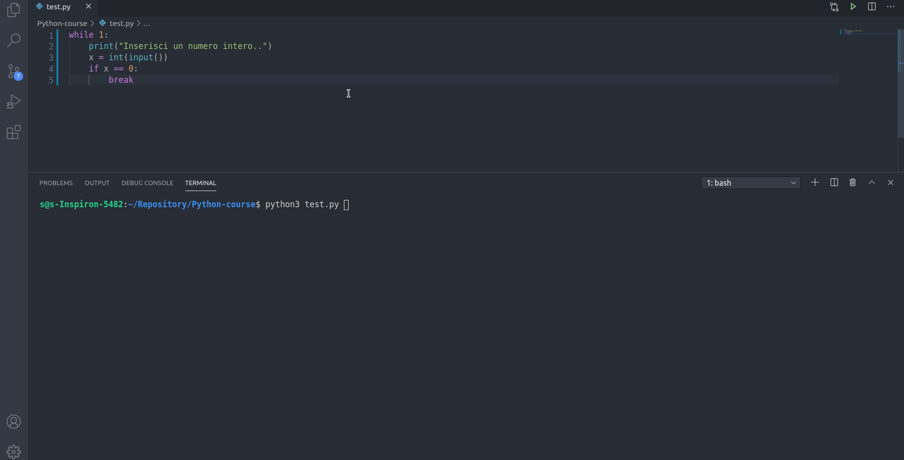
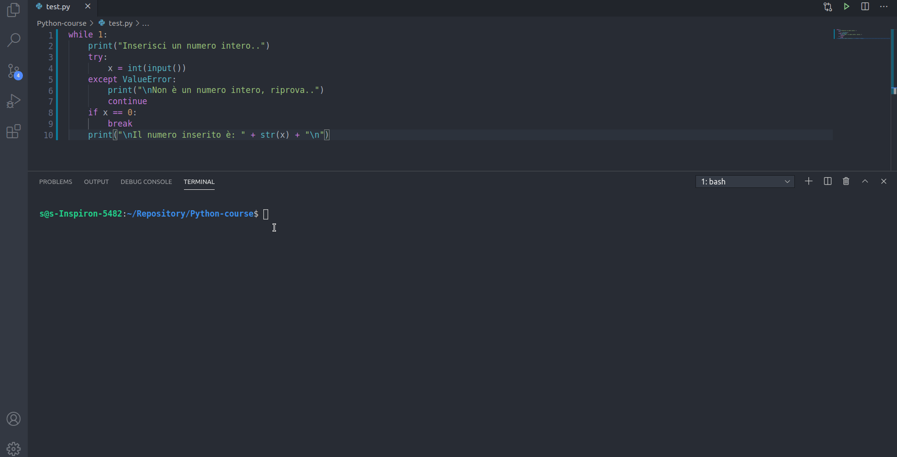

## Costrutto `try Except`

Quando si verifica un errore (o un'eccezione),  Python normalmente si ferma e genera un messaggio di errore.

[w3schools - Python Try Except](https://www.w3schools.com/python/python_try_except.asp)

Nell'esempio chiedo all'utente l'inserimento di un numero intero.. Fintanto che l'utente inserisce numeri interi tutto funziona correttamente ma quando per sbaglio l'utente inserisce un carattere non valido, un numero decimale o altro, che succede?

```py
while 1:
    print("inserisci un numero intero..")
    x = int(input())
    if x == 0
        break
    print(x)

#input() = 1
#1
#input() = 2
#2
#input() = dd
#
#Traceback (most recent call last):
#  File "test.py", line 3, in <module>
#   x = int(input())
#ValueError: invalid literal for int() with base 10: 'dd'
```



Inserendo la stringa `"dd"` la conversione esplicita `int()` fallisce e restituisce un errore:

```py
#Traceback (most recent call last):
#  File "test.py", line 3, in <module>
#   x = int(input())
#ValueError: invalid literal for int() with base 10: 'dd'
```

L'errore è di tipo `ValueError` e la descrizione è: `invalid literal for int() with base 10: 'dd'` che significa che la costante letterale `dd` inserita non è un tipo di dato valido per la conversione in base 10, cioè in un numero decimale.

**Come gestisco queste situazioni di errore?**
Il costrutto `try Except` permette la gestione di queste situazioni.

Sintassi:

```py
try:
    #code1
except #typeError:
    #code2
```

Significa: *prova* (try) ad eseguire `code1`, se rilevi un'eccezione di tipo `typeError` esegui `code2` ed "ignora" `code1` ovvero fai finta che `code1` non sia mai stato eseguito. Se non rilevi nessun errore nella fase di `try` allora esegui `code1`

Esempio:

```py
while 1:
    print("Inserisci un numero intero..")        
    try:
        x = int(input())
    except ValueError:
        print("\nNon è un numero intero, riprova..")
        continue
    if x == 0:
        break
    print("\nIl numero inserito è: " + str(x) + "\n")
```

