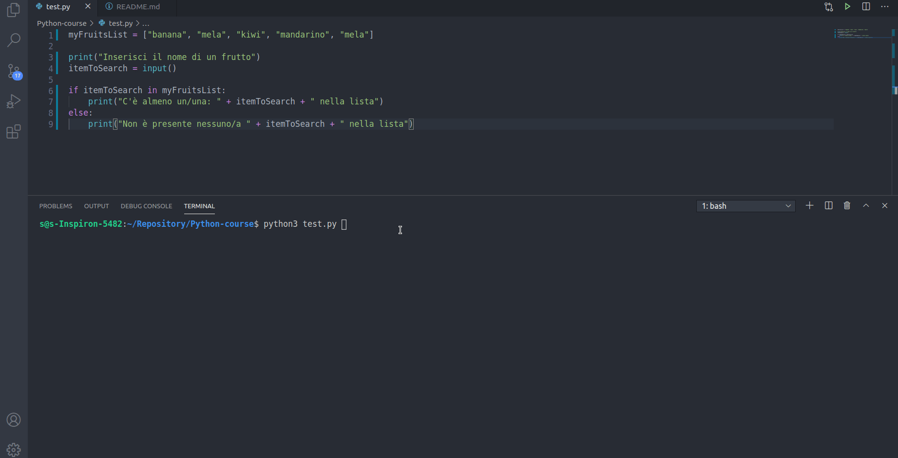

## Costrutto `if ... in`

Analogamente al costrutto `for ... in` il costrutto `if ... in` si applica a collezioni di elementi in cui si richiede la ricerca di un particolare elemento in una lista

```py
if item in list:
    #code
else:
    #code
```

Esempio:

```py
myFruitsList = ["banana", "mela", "kiwi", "mandarino", "mela"]

print("Inserisci il nome di un frutto")
itemToSearch = input()

if itemToSearch in myFruitsList:
    print("C'è almeno un/una: " + itemToSearch + " nella lista")
else:
    print("Non è presente nessuno/a " + itemToSearch + " nella lista")
```



## Esercizio Asta online v3

Il seguente script vuole simulare l'andamento di un'asta online con la seguente regola:
- L'asta verrà aggiudicata da chi avrà fatto un'offerta la più vicina alla media delle offerte degli altri

L'utente dovrà inserire un'offerta in *bit coin* e una *email* che rappresenterà l'identificativo. E' consentita un'unica offerta per utente! In questa terza parte contrellero che la coppia utente/offerta sia unica utilizzando il costrutto `if ... in`

```py
import re
offerte = []
altre_offerte = True

while altre_offerte:
    offerta = input("Inserisci l`offerta pervenuta (0 per terminare): ")

    try:
        offerta = float(offerta)
    except ValueError:
        print("Formato non valido, riprova ...")
        continue

    if offerta == 0:
        altre_offerte = False
        continue

    if offerta < 0:
        print("Non possono essere fatte offerte negative!")
        continue

    email = input("Inserire l`email dell`offerente: ")

    if not re.match("^[a-zA-Z0-9_.+-]+@[a-zA-Z0-9-]+\.[a-zA-Z0-9-.]+$", email):
        print("Email non valida, riprova ...")
        continue

    nuova_offerta = [email, offerta]

    # controllo valido solo se viene fatta la stessa offerta con la stessa mail ... limitato!
    if nuova_offerta in offerte:
        print("Questo utente ha già fatto la sua unica offerta ... respinto!")
        continue
    else:
        offerte.append(nuova_offerta)

print("Le offerte valide sono:")
print(offerte)
```


Come si vede una coppia identica *utente/bit coin* viene catturata e rifiutata ma è ancora permesso che un utente possa fare più offerte