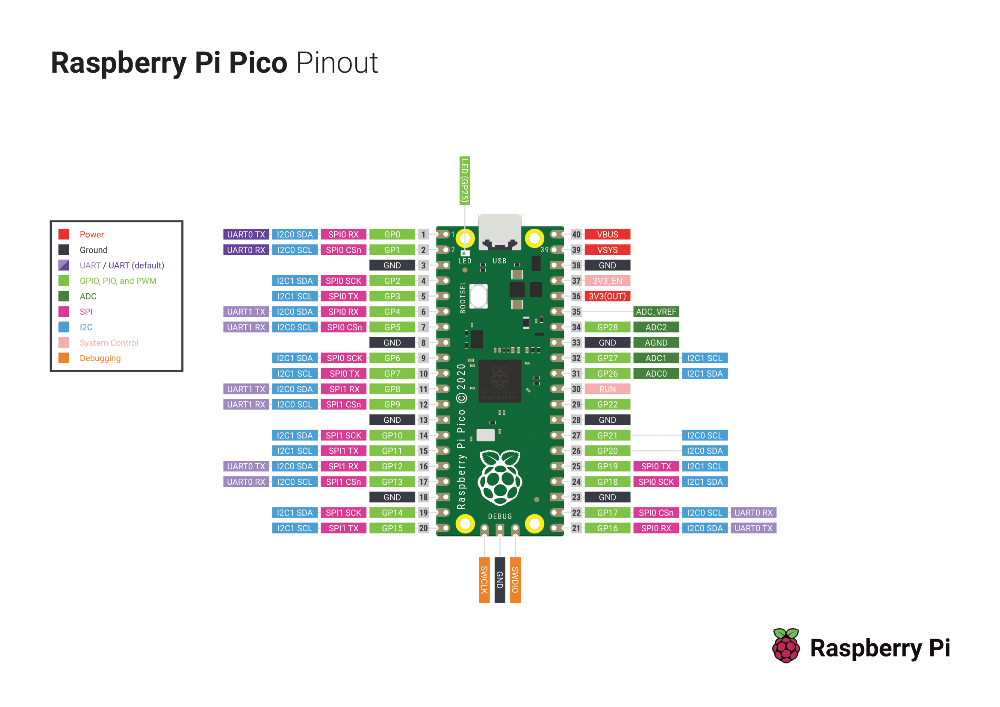

# Raspberry pi pico e Micropython


## Pinout




## Strumenti necessari

Per iniziare con il primo programma e micropython vai su [Getting started with MicroPython](https://www.raspberrypi.org/documentation/pico/getting-started/) e segui le istruzioni, sono complete e fatte bene. 

In pratica dovrai collegare raspberry pi pico al PC in modalità "Mass storage" cioè come una normale chiavetta USB e copiare un particolare file in formato `UF2` che trovi su [Getting started with MicroPython](https://www.raspberrypi.org/documentation/pico/getting-started/).

Per collegare raspberry pi pico al PC in modalità "Mass Storage" dovrai prima premere il tasto presente sulla board poi collegare raspberry all'USB come suggerito dall'immagine


Se sei curioso di conoscere qualcosa di più sul formato `UF2` vai su [uf2](https://github.com/microsoft/uf2)

## Link Utili

- Pagina ufficiale [raspberry pi pico](https://www.raspberrypi.org/documentation/pico/getting-started/)
- Esempi di programmazione in [c/c++](https://github.com/raspberrypi/pico-examples)
- Esempi di programmazione in [micropython](https://github.com/raspberrypi/pico-micropython-examples)
- Micropython [docuementazione ufficiale](https://docs.micropython.org/en/latest/library/index.html)
- Python [documentazione ufficiale](https://docs.python.org/3/library/)
- Python asincrono [Coroutines and Tasks](https://docs.python.org/3/library/asyncio-task.html)

## Primo programma in micropython

```python
async def blink(led, period_ms):
    while True:
        led.on()
        await uasyncio.sleep_ms(500)
        led.off()
        await uasyncio.sleep_ms(period_ms)

async def main(led1, led2):
    uasyncio.create_task(blink(led1, 1000))
    uasyncio.create_task(blink(led2, 2000))
    while True:
        await uasyncio.sleep_ms(20_000)


# Running on a generic board
from machine import Pin
uasyncio.run(main(Pin(25, Pin.OUT), Pin(16, Pin.OUT)))
```