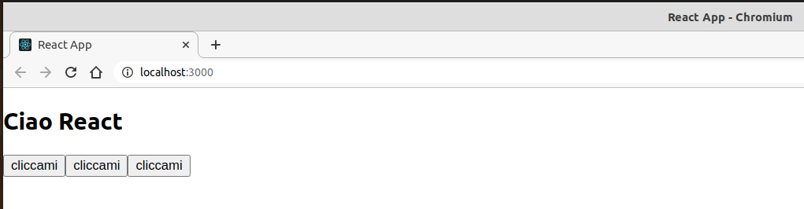
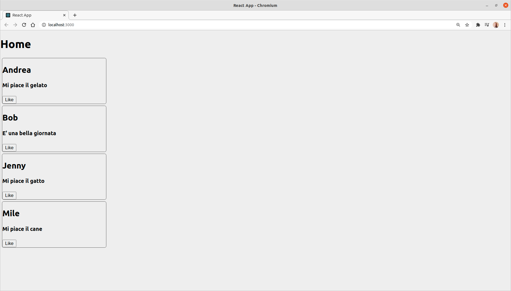
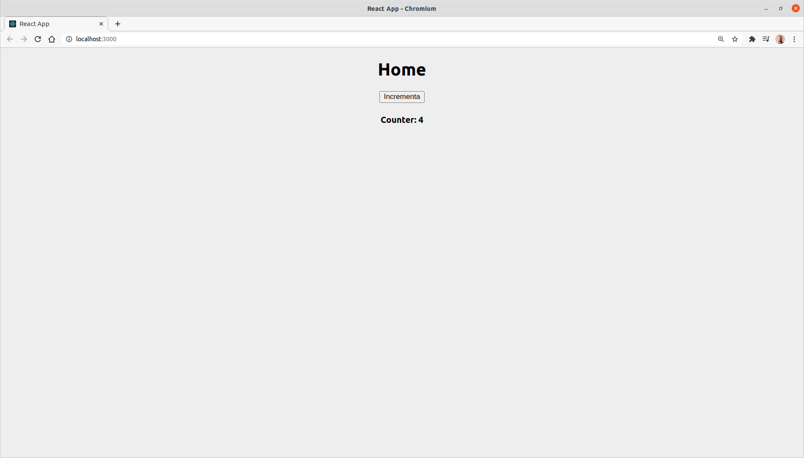

# React.js

- [React.js](#reactjs)
- [React.js in pratica](#reactjs-in-pratica)
- [Folder structure react app](#folder-structure-react-app)
  - [Package.json](#packagejson)
  - [Folder public](#folder-public)
  - [Folder src](#folder-src)
- [React component](#react-component)
- [Partiamo da zero](#partiamo-da-zero)
- [Divertiamoci un po'](#divertiamoci-un-po)
- [Creo un nuovo componente](#creo-un-nuovo-componente)
- [creaiamo Qualcosa di più interessante](#creaiamo-qualcosa-di-più-interessante)
- [Aggiungere stile](#aggiungere-stile)
- [Props](#props)
- [Stato](#stato)
- [Hooks](#hooks)
  - [npx ??](#npx-)
  - [Funzioni o componenti?](#funzioni-o-componenti)

# React.js in pratica

Puoi trovare un tutorial ben fatto sulla pagina ufficiale di [react.js](https://it.reactjs.org/docs/getting-started.html#learn-react). Ti proporrà un tutorial pratico in cui imparerai a costruire il gioco "tris" oppure un tutorial passo passo, dove partirai da zero e sarai poi eventualmente in grado di integrare con l'altro tipo di tutorial.

Per creare una nuova app react devi aver nodejs installato.

Dopodichè dal terminale devi digitare:

```bash
npx create-react-app my-app
```

Una volta finito stamperà tra le altre cose:

```bash
Success! Created my-app at /home/s/Repository/corso-react/my-app
Inside that directory, you can run several commands:

  npm start
    Starts the development server.

  npm run build
    Bundles the app into static files for production.

  npm test
    Starts the test runner.

  npm run eject
    Removes this tool and copies build dependencies, configuration files
    and scripts into the app directory. If you do this, you can’t go back!

We suggest that you begin by typing:

  cd my-app
  npm start

Happy hacking!
```

Suggerendoti quindi di entrare nella cartella appena creata e lanciare il comando:

```bash
npm start
```

Se provi a farlo, partirà un'applicazione react, un'applicazione di default


# Folder structure react app

Una volta lanciato questo comando verranno create le seguenti cartelle


## Package.json
Il file `package.json` è un file di configurazione e contiene tra le altre cose il nome dell'applicazione, la versione, le dipendeze ovvero i pacchetti necessari a react. Puoi vedere infatti, anche durante la fase di installazione che react ha come dipendenze `react`, `react-dom`, `react-scripts`. Contiene inoltre alcuni scripts, cioè dei comandi che puoi lanciare da terminale per abbreviare e accelerare il processo di compilazione dell'app.

```json
{
  "name": "my-app",
  "version": "0.1.0",
  "private": true,
  "dependencies": {
    "@testing-library/jest-dom": "^5.11.9",
    "@testing-library/react": "^11.2.3",
    "@testing-library/user-event": "^12.6.2",
    "react": "^17.0.1",
    "react-dom": "^17.0.1",
    "react-scripts": "4.0.1",
    "web-vitals": "^0.2.4"
  },
  "scripts": {
    "start": "react-scripts start",
    "build": "react-scripts build",
    "test": "react-scripts test",
    "eject": "react-scripts eject"
  },
  "eslintConfig": {
    "extends": [
      "react-app",
      "react-app/jest"
    ]
  },
  "browserslist": {
    "production": [
      ">0.2%",
      "not dead",
      "not op_mini all"
    ],
    "development": [
      "last 1 chrome version",
      "last 1 firefox version",
      "last 1 safari version"
    ]
  }
}

```

## Folder public


Contiene tra gli altri file non fondamentali come icone e logo anche `index.html` ovvero l'entry point dell'applicazione react.

```html
<!DOCTYPE html>
<html lang="en">
  <head>
    <meta charset="utf-8" />
    <link rel="icon" href="%PUBLIC_URL%/favicon.ico" />
    <meta name="viewport" content="width=device-width, initial-scale=1" />
    <meta name="theme-color" content="#000000" />
    <meta
      name="description"
      content="Web site created using create-react-app"
    />
    <link rel="apple-touch-icon" href="%PUBLIC_URL%/logo192.png" />
    <!--
      manifest.json provides metadata used when your web app is installed on a
      user's mobile device or desktop. See https://developers.google.com/web/fundamentals/web-app-manifest/
    -->
    <link rel="manifest" href="%PUBLIC_URL%/manifest.json" />
    <!--
      Notice the use of %PUBLIC_URL% in the tags above.
      It will be replaced with the URL of the `public` folder during the build.
      Only files inside the `public` folder can be referenced from the HTML.

      Unlike "/favicon.ico" or "favicon.ico", "%PUBLIC_URL%/favicon.ico" will
      work correctly both with client-side routing and a non-root public URL.
      Learn how to configure a non-root public URL by running `npm run build`.
    -->
    <title>React App</title>
  </head>
  <body>
    <noscript>You need to enable JavaScript to run this app.</noscript>
    <div id="root"></div>
    <!--
      This HTML file is a template.
      If you open it directly in the browser, you will see an empty page.

      You can add webfonts, meta tags, or analytics to this file.
      The build step will place the bundled scripts into the <body> tag.

      To begin the development, run `npm start` or `yarn start`.
      To create a production bundle, use `npm run build` or `yarn build`.
    -->
  </body>
</html>
```

La cosa da notare è che il body non contiene niente tranne un `div` vuoto con `id="root"`. Questo id lo ritroveremo più avanti

## Folder src


Il vero fulcro è sono i file `App.js` e `index.js`

Se apri `App.js` troverai:

```jsx
import logo from './logo.svg';
import './App.css';

function App() {
  return (
    <div className="App">
      <header className="App-header">
        
        <p>
          Edit <code>src/App.js</code> and save to reload.
        </p>
        <a
          className="App-link"
          href="https://reactjs.org"
          target="_blank"
          rel="noopener noreferrer"
        >
          Learn React
        </a>
      </header>
    </div>
  );
}

export default App;
```

Da qua ti consiglio di notare i seguenti concetti:
- tutto è recchiuso dentro una funzione Javascript chiamata `App`:
  
```jsx
function App() {
  return (
    //..
  );
}
```

- la funzione `App` ha come valore di `return` delle linee di codice simil-html. Ma attenzione questo non è html bensì JSX.

```html
    <div className="App">
      <header className="App-header">
        
        <p>
          Edit <code>src/App.js</code> and save to reload.
        </p>
        <a
          className="App-link"
          href="https://reactjs.org"
          target="_blank"
          rel="noopener noreferrer"
        >
          Learn React
        </a>
      </header>
    </div>
```

- la funzione `App` è esportata esternamente.

```jsx
export default App;
```

Mentre se apri `index.js` troverai:

```jsx
import React from 'react';
import ReactDOM from 'react-dom';
import './index.css';
import App from './App';
import reportWebVitals from './reportWebVitals';

ReactDOM.render(
  <React.StrictMode>
    <App />
  </React.StrictMode>,
  document.getElementById('root')
);

// If you want to start measuring performance in your app, pass a function
// to log results (for example: reportWebVitals(console.log))
// or send to an analytics endpoint. Learn more: https://bit.ly/CRA-vitals
reportWebVitals();
```


8:48

# React component

Un componente è un file e al suo interno c'è html, css, javascript. La forza di react è quella di poter creare un componente e riutilizzarlo a piacimento

# Partiamo da zero

Entra nel file `App.js` e cancella tutto. Scrivi semplicemente

```Javascript
//App.js
import React from 'react';

function App(){
  return(
    <div>
      <h2>Ciao React</h2>
    </div>
  )
}

//Equivale a 
//React.createElement(div)

export default App;
```

Otterrai:


Quello che hai fatto è scrivere codice `JSX` cioè codice simil-html compilato da react in modo che appaia come codice javascript.

Dopocdichè nell' `index.js` ..

```javascript
//index.js
import React from 'react';
import ReactDOM from 'react-dom';
import './index.css';
import App from './App';
import reportWebVitals from './reportWebVitals';

ReactDOM.render(
  <React.StrictMode>
    <App />
  </React.StrictMode>,
  document.getElementById('root')
);

// If you want to start measuring performance in your app, pass a function
// to log results (for example: reportWebVitals(console.log))
// or send to an analytics endpoint. Learn more: https://bit.ly/CRA-vitals
reportWebVitals();
```

Vedi che hai:

- L'importazione di `App.js`
  
```javascript
import App from './App';
```

- Il collegamento con `html` tramite

```javascript
ReactDOM.render(
  <React.StrictMode>
    <App />
  </React.StrictMode>,
  document.getElementById('root')
);
```

perchè la vera pagina è `/public/index.html`

```html
<!DOCTYPE html>
<html lang="en">
  <head>
    <meta charset="utf-8" />
    <link rel="icon" href="%PUBLIC_URL%/favicon.ico" />
    <meta name="viewport" content="width=device-width, initial-scale=1" />
    <meta name="theme-color" content="#000000" />
    <meta
      name="description"
      content="Web site created using create-react-app"
    />
    <link rel="apple-touch-icon" href="%PUBLIC_URL%/logo192.png" />
    <!--
      manifest.json provides metadata used when your web app is installed on a
      user's mobile device or desktop. See https://developers.google.com/web/fundamentals/web-app-manifest/
    -->
    <link rel="manifest" href="%PUBLIC_URL%/manifest.json" />
    <!--
      Notice the use of %PUBLIC_URL% in the tags above.
      It will be replaced with the URL of the `public` folder during the build.
      Only files inside the `public` folder can be referenced from the HTML.

      Unlike "/favicon.ico" or "favicon.ico", "%PUBLIC_URL%/favicon.ico" will
      work correctly both with client-side routing and a non-root public URL.
      Learn how to configure a non-root public URL by running `npm run build`.
    -->
    <title>React App</title>
  </head>
  <body>
    <noscript>You need to enable JavaScript to run this app.</noscript>
    <div id="root"></div>
    <!--
      This HTML file is a template.
      If you open it directly in the browser, you will see an empty page.

      You can add webfonts, meta tags, or analytics to this file.
      The build step will place the bundled scripts into the <body> tag.

      To begin the development, run `npm start` or `yarn start`.
      To create a production bundle, use `npm run build` or `yarn build`.
    -->
  </body>
</html>
```

In particolare ti faccio notare:

```html
<body>
  <noscript>You need to enable JavaScript to run this app.</noscript>
  <div id="root"></div>
  <!--
    This HTML file is a template.
    If you open it directly in the browser, you will see an empty page.

    You can add webfonts, meta tags, or analytics to this file.
    The build step will place the bundled scripts into the <body> tag.

    To begin the development, run `npm start` or `yarn start`.
    To create a production bundle, use `npm run build` or `yarn build`.
  -->
</body>
```

Quello che viene fatto da `ReactDOM.render` è prendere `App` e metterla dentro `<div id="root"></div>`

# Divertiamoci un po'

Adesso aggiungerò un tasto e l'evento `click`

```javascript
import React from 'react';

function App(){
  return(
    <div>
      <h2>Ciao React</h2>
      <button onClick={() => console.log('tasto cliccato')}>cliccami</button>
    </div>
  )
}

//Equivale a 
//React.createElement(div)

export default App;
```

Cliccando il tasto otterrai una stampa su console, `"tasto cliccato"`


Puoi farlo in un modo alternativo facendo uso di un metodo:

```javascript
import React from 'react';

function App(){
  const stampa = () => {
    console.log('tasto cliccato')
  }
  return(
    <div>
      <h2>Ciao React</h2>
      <button onClick={stampa}>cliccami</button>
    </div>
  )
}

//Equivale a 
//React.createElement(div)

export default App;
```

Un altro modo è quello di creare un componente esterno

# Creo un nuovo componente

All'interno di `src` crea un nuovo file ad esempio `Stampa.js`

```javascript
//Stampa.js
import React from 'react'

function Stampa() {
  const stampa = () => {
    console.log('stampa');
  }
  return (
    <button onClick={stampa}>cliccami</button>
  )
}

export default Stampa;
```

A questo punto devo però importarlo in `App.js`

```javascript
import React from 'react';
import Stampa from './Stampa';

//JSX
function App(){
  return(
    <div>
      <h2>Ciao React</h2>
      <Stampa />
    </div>
  )
}

//Equivale a 
//React.createElement(div)

export default App;
```

In questo modo funxionerà tutto come prima


Una volta che ho creato un componente posso riutilizzarlo ovunque, basterà importarlo

```javascript
import React from 'react';
import Stampa from './Stampa';

//JSX
function App(){
  return(
    <div>
      <h2>Ciao React</h2>
      <Stampa />
      <Stampa />
      <Stampa />
    </div>
  )
}

//Equivale a 
//React.createElement(div)

export default App;
```



# creaiamo Qualcosa di più interessante

Creo un componete `FacebookPosts.js` che sarà fatto così:

```javascript
//FacebookPosts.js
import React from 'react';

function Post() {
  return (
    <div>
      <h2>Autore</h2>
      <h4>Questo è il mio post</h4>
      <button>Like</button>
    </div>
  )
}

export default Post;
```

Lo importo nella `App.js`

```javascript
//App.js
import React from 'react';
import Post from './FacebookPosts';

//JSX
function App(){
  return(
    <div>
      <h1>Home</h1>
      <Post />
    </div>
  )
}

//Equivale a 
//React.createElement(div)

export default App;
```
 Apparirà qualcosa del tipo:


# Aggiungere stile

Per aggiungere stile, puoi farlo in moduli `css`. In questo esempio (anche se non è correttissimo) aggiungeremo stile al componente `FacebookPosts.js` attraverso il file `App.css`

```javascript
//FacebookPosts.js
import React from 'react';
import './App.css';

function Post() {
  return (
    <div className="Post">
      <h2>Autore</h2>
      <h4>Questo è il mio post</h4>
      <button>Like</button>
    </div>
  )
}

export default Post;
```

```css
/*App.css*/
.Post{
  border: 1px solid #555;
  border-radius: 5px;
  margin: 5px 5px 0px 5px;
  display: flexbox;
  flex-direction: column;
  justify-content: center;
  width: 300px;
};
```

Apparirà qualcosa del tipo:


Puoi modificare anche il file `index.css` che rappresenta lo stile generale di tutta la pagina `html`


# Props

Per passare valori tra i componenti puoi usare `props`

Ti faccio vedere un esempio in cui aggiungo dei Post e a ogni Post passo l'autore del post

```javascript
//App.js

import React from 'react';
import Post from './FacebookPosts';

//JSX
function App(){
  return(
    <div>
      <h1>Home</h1>
      <Post autore="Andrea" />
      <Post autore="Bob" />
      <Post autore="Jenny" />
      <Post autore="Mile" />
    </div>
  )
}

//Equivale a 
//React.createElement(div)

export default App;
```

```javascript
//FacebookPost.js

import React from 'react';
import './App.css';

function Post(props) {
  return (
    <div className="Post">
      <h2>{props.autore}</h2>
      <h4>Questo è il mio post</h4>
      <button>Like</button>
    </div>
  )
}

export default Post;
```

Otterrai:


`props` è un oggetto che come property contiene quelle che noi definiamo

Vediamo un altro esempio

```javascript
//App.js

import React from 'react';
import Post from './FacebookPosts';

//JSX
function App(){
  return(
    <div>
      <h1>Home</h1>
      <Post autore="Andrea" description="Mi piace il gelato"/>
      <Post autore="Bob" description="E' una bella giornata"/>
      <Post autore="Jenny" description="Mi piace il gatto"/>
      <Post autore="Mile" description="Mi piace il cane"/>
    </div>
  )
}

//Equivale a 
//React.createElement(div)

export default App;
```

```javascript
//FacebookPost.js

import React from 'react';
import './App.css';

function Post(props) {
  return (
    <div className="Post">
      <h2>{props.autore}</h2>
      <h4>{props.description}</h4>
      <button>Like</button>
    </div>
  )
}

export default Post;
```



# Stato

Immagina queso problema semplice. Con un tasto voglio cambiare il valore di una varibile



```javascript
//App.js

import React from 'react';
import Post from './FacebookPosts';

//JSX
function App(){
  return(
    <div className="Container">
      <h1>Home</h1>
      <button>Incrementa</button>
      <h4>Counter: 4</h4>
    </div>
  )
}

//Equivale a 
//React.createElement(div)

export default App;
```

In particolare, quello che vorrei fare è far sì che premendo il tasto `Incrementa` si incrementasse il valore che adesso è fisso a `4`

Come si fa?

Dobbiamo introdurre il concetto di `Stato`.

Mostro la discussione poi ne parliamo

```javascript
//App.js

import React from 'react';
import Post from './FacebookPosts';

//JSX
class App extends React.Component{ 
  state = {
    number: 0
  }
  increment = () => {
    this.setState({
      number: this.state.number + 1
    })
  }
  render(){
    return(
    <div className="Container">
      <h1>Home</h1>
      <button onClick={this.increment}>Incrementa</button>
      <h4>Counter: {this.state.number}</h4>
    </div>
  );
  }

}

export default App;
```

- Ho dovuto fare il passaggio da funzione a classe estendendo la classe `React.Component`

```javascript
class App extends React.Component{ 
  render(){
    return(

    )
  );
}
```

- Ho definito l'oggetto `state` che conterrà le property che io inserisco

```javascript
class App extends React.Component{ 
  state = {
    number: 0
  }
  render(){
    return(

    )
  );
}
```

- Ho usato le property definite accedendo al campo `this.state.nomeProperty`
  
```javascript
class App extends React.Component{ 
  state = {
    number: 0
  }
  render(){
    return(
    <div className="Container">
      <h1>Home</h1>
      <button>Incrementa</button>
      <h4>Counter: {this.state.number}</h4>
    </div>
  );
}
```

- Ho definito un metodo che potesse incrementare la property definita

```javascript
increment = () => {
  this.setState({
    number: this.state.number + 1
  })
}
```

# Hooks

Con gli Hooks è possibile cambiare lo stato con la notazione a funzione

Vediamo come si fa

```javascript
//App.js
import React, {useState} from 'react';

//JSX
function App(){ 

  const [count, setCount] = useState(0);
  const increment = () => {
    setCount(count + 1);
  }
  return(
    <div className="Cnt">
      <h1>Home</h1>
      <button onClick={increment}>Incrementa</button>
      <h4>Counter: {count}</h4>
    </div>
  );
}

//Equivale a 
//React.createElement(div)

export default App;
```

## npx ??

Serve per installare script in modo locale quindi senza il bisogno di installare dei pacchetti globalmente e consente di avere la versione più aggiornata. 

In questo caso può essere utilizzato per lo script `create-react-app` senza il bisogno di installare lo script globalmente. Alternativamente avrei dovuto fare `npm install - g create-react-app`. Dopodichè per creare una nuova applicazione react bata digitare `create-react-app my-app` e creerà una nuova applicazione react all'interno della folder `my-app`

## Funzioni o componenti?

Per gestire lo stato dell'applicazione, tempo fa era necessario l'uso delle classi.. Da quando sono stati introdotti gli `HOOCKS` è possibile gestire lo stato con le funzioni. Sarebbe comunque meglio vedere entrambi i modi poichè alcuni pezzi di codici sono scritti con le classi, altri con gli `HOOCKS`