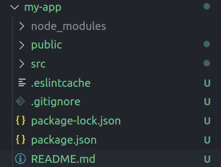
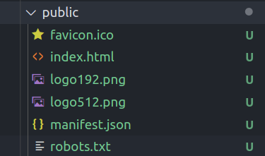
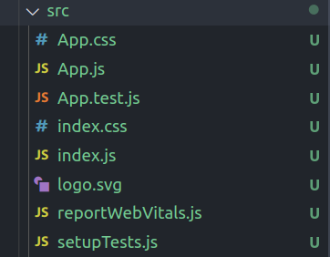

## Corso react

Puoi trovare un tutorial ben fatto sulla pagina ufficiale di [react.js](https://it.reactjs.org/docs/getting-started.html#learn-react). Ti proporrà un tutorial pratico in cui imparerai a costruire il gioco "tris" oppure un tutorial passo passo, dove partirai da zero e sarai poi eventualmente in grado di integrare con l'altro tipo di tutorial.

Per creare una nuova app react devi aver nodejs installato.

Dopodichè dal terminale devi digitare:

```bash
npx create-react-app my-app
```

Una volta finito stamperà tra le altre cose:

```bash
Success! Created my-app at /home/s/Repository/corso-react/my-app
Inside that directory, you can run several commands:

  npm start
    Starts the development server.

  npm run build
    Bundles the app into static files for production.

  npm test
    Starts the test runner.

  npm run eject
    Removes this tool and copies build dependencies, configuration files
    and scripts into the app directory. If you do this, you can’t go back!

We suggest that you begin by typing:

  cd my-app
  npm start

Happy hacking!
```

Suggerendoti quindi di entrare nella cartella appena creata e lanciare il comando:

```bash
npm start
```

Se provi a farlo, partirà un'applicazione react, un'applicazione di default


### Folder structure react app

Una volta lanciato questo comando verranno create le seguenti cartelle



Il file `package.json` è un file di configurazione e contiene tra le altre cose il nome dell'applicazione, la versione, le dipendeze ovvero i pacchetti necessari a react. Puoi vedere infatti, anche durante la fase di installazione che react ha come dipendenze `react`, `react-dom`, `react-scripts`. Contiene inoltre alcuni scripts, cioè dei comandi che puoi lanciare da terminale per abbreviare e accelerare il processo di compilazione dell'app.

```json
{
  "name": "my-app",
  "version": "0.1.0",
  "private": true,
  "dependencies": {
    "@testing-library/jest-dom": "^5.11.9",
    "@testing-library/react": "^11.2.3",
    "@testing-library/user-event": "^12.6.2",
    "react": "^17.0.1",
    "react-dom": "^17.0.1",
    "react-scripts": "4.0.1",
    "web-vitals": "^0.2.4"
  },
  "scripts": {
    "start": "react-scripts start",
    "build": "react-scripts build",
    "test": "react-scripts test",
    "eject": "react-scripts eject"
  },
  "eslintConfig": {
    "extends": [
      "react-app",
      "react-app/jest"
    ]
  },
  "browserslist": {
    "production": [
      ">0.2%",
      "not dead",
      "not op_mini all"
    ],
    "development": [
      "last 1 chrome version",
      "last 1 firefox version",
      "last 1 safari version"
    ]
  }
}

```

### public



Contiene tra gli altri file non fondamentali come icone e logo anche `index.html` ovvero l'entry point dell'applicazione react.

```html
<!DOCTYPE html>
<html lang="en">
  <head>
    <meta charset="utf-8" />
    <link rel="icon" href="%PUBLIC_URL%/favicon.ico" />
    <meta name="viewport" content="width=device-width, initial-scale=1" />
    <meta name="theme-color" content="#000000" />
    <meta
      name="description"
      content="Web site created using create-react-app"
    />
    <link rel="apple-touch-icon" href="%PUBLIC_URL%/logo192.png" />
    <!--
      manifest.json provides metadata used when your web app is installed on a
      user's mobile device or desktop. See https://developers.google.com/web/fundamentals/web-app-manifest/
    -->
    <link rel="manifest" href="%PUBLIC_URL%/manifest.json" />
    <!--
      Notice the use of %PUBLIC_URL% in the tags above.
      It will be replaced with the URL of the `public` folder during the build.
      Only files inside the `public` folder can be referenced from the HTML.

      Unlike "/favicon.ico" or "favicon.ico", "%PUBLIC_URL%/favicon.ico" will
      work correctly both with client-side routing and a non-root public URL.
      Learn how to configure a non-root public URL by running `npm run build`.
    -->
    <title>React App</title>
  </head>
  <body>
    <noscript>You need to enable JavaScript to run this app.</noscript>
    <div id="root"></div>
    <!--
      This HTML file is a template.
      If you open it directly in the browser, you will see an empty page.

      You can add webfonts, meta tags, or analytics to this file.
      The build step will place the bundled scripts into the <body> tag.

      To begin the development, run `npm start` or `yarn start`.
      To create a production bundle, use `npm run build` or `yarn build`.
    -->
  </body>
</html>
```

La cosa da notare è che il body non contiene niente tranne un `div` vuoto con `id="root"`. Questo id lo ritroveremo più avanti

### src



Il vero fulcro è sono i file `App.js` e `index.js`

Se apri `App.js` troverai:

```jsx
import logo from './logo.svg';
import './App.css';

function App() {
  return (
    <div className="App">
      <header className="App-header">
        
        <p>
          Edit <code>src/App.js</code> and save to reload.
        </p>
        <a
          className="App-link"
          href="https://reactjs.org"
          target="_blank"
          rel="noopener noreferrer"
        >
          Learn React
        </a>
      </header>
    </div>
  );
}

export default App;
```

Da qua ti consiglio di notare i seguenti concetti:
- tutto è recchiuso dentro una funzione Javascript chiamata `App`:
  
```jsx
function App() {
  return (
    //..
  );
}
```

- la funzione `App` ha come valore di `return` delle linee di codice simil-html. Ma attenzione questo non è html bensì JSX.

```html
    <div className="App">
      <header className="App-header">
        
        <p>
          Edit <code>src/App.js</code> and save to reload.
        </p>
        <a
          className="App-link"
          href="https://reactjs.org"
          target="_blank"
          rel="noopener noreferrer"
        >
          Learn React
        </a>
      </header>
    </div>
```

- la funzione `App` è esportata esternamente.

```jsx
export default App;
```

Mentre se apri `index.js` troverai:

```jsx
import React from 'react';
import ReactDOM from 'react-dom';
import './index.css';
import App from './App';
import reportWebVitals from './reportWebVitals';

ReactDOM.render(
  <React.StrictMode>
    <App />
  </React.StrictMode>,
  document.getElementById('root')
);

// If you want to start measuring performance in your app, pass a function
// to log results (for example: reportWebVitals(console.log))
// or send to an analytics endpoint. Learn more: https://bit.ly/CRA-vitals
reportWebVitals();
```

8:48